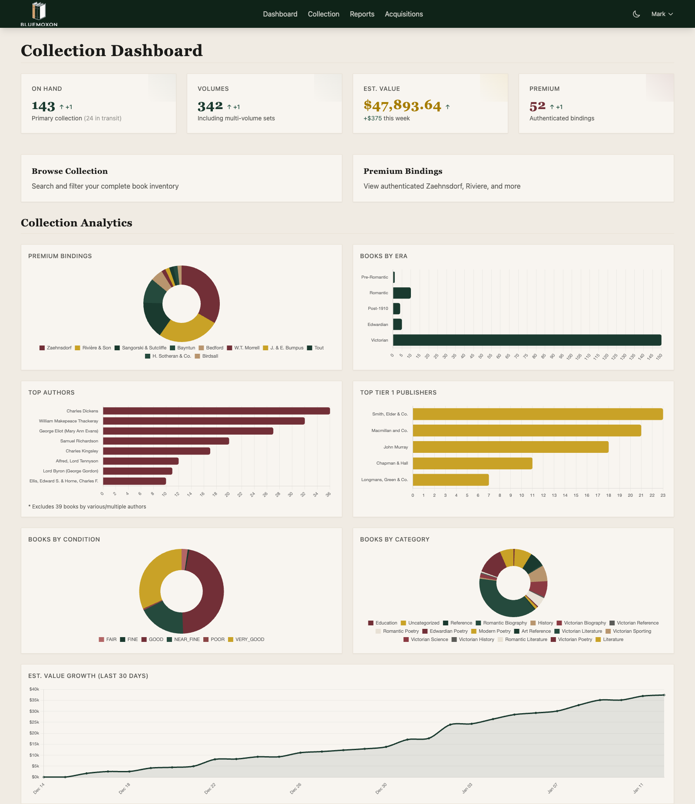
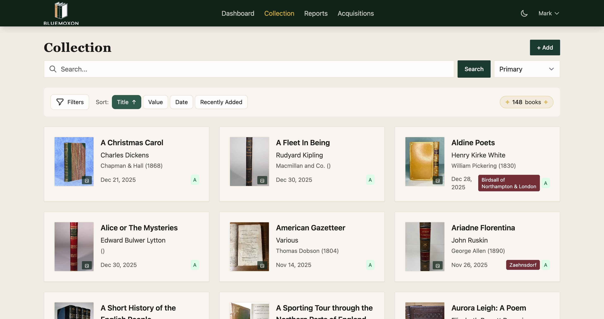
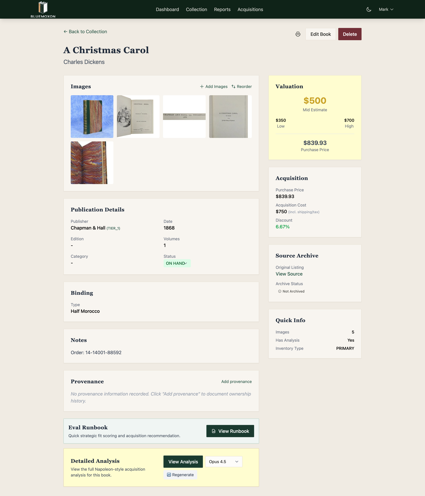
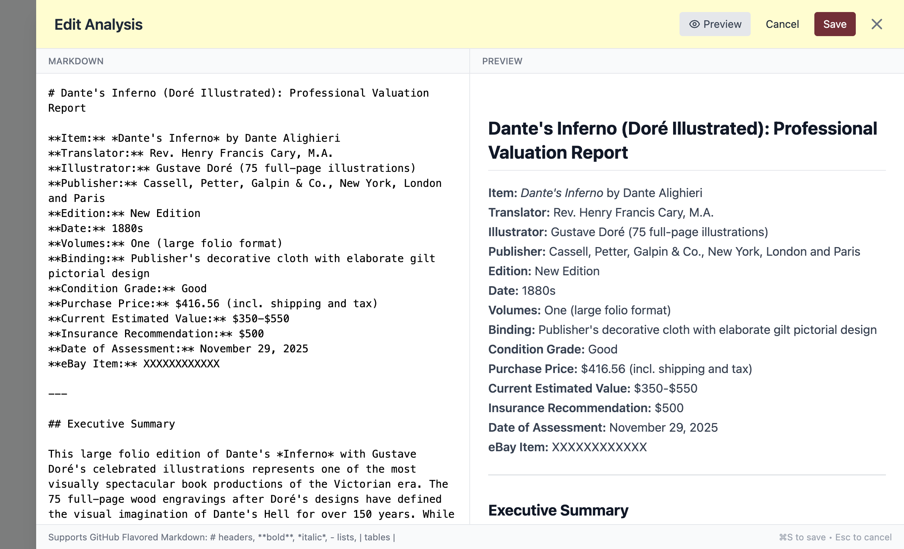
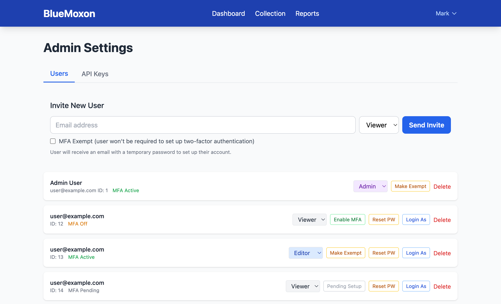
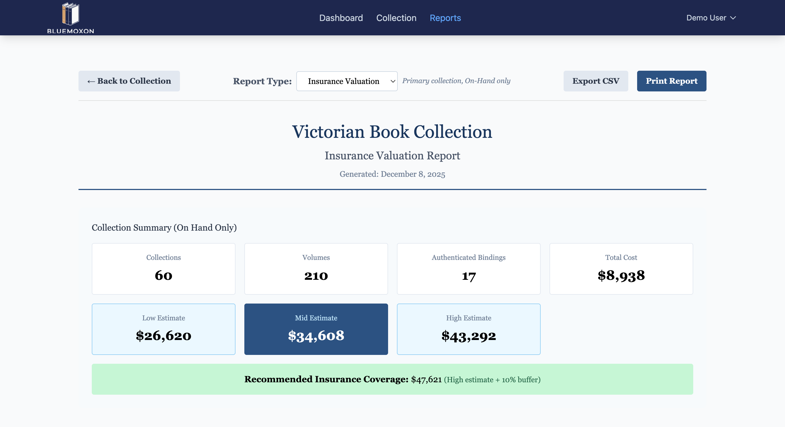

# BlueMoxon (bmx)

[](https://github.com/markthebest12/bluemoxon/actions/workflows/ci.yml)
[](https://github.com/markthebest12/bluemoxon/actions/workflows/deploy.yml)
[](https://opensource.org/licenses/Apache-2.0)

Victorian Book Collection Management Web Application

**Short Name:** bmx (used in shell aliases, scripts, and conversation)

### Why "BlueMoxon"?

**Moxon** honors [Edward Moxon](https://en.wikipedia.org/wiki/Edward_Moxon) (1801-1858), the distinguished Victorian publisher who brought Tennyson, Wordsworth, Shelley, and Keats to the reading public. His Dover Street publishing house produced the very editions this platform now catalogs—a fitting tribute to the heritage of Victorian literature.

**Blue** represents dependability and quiet excellence—the steady hand that preserves, catalogs, and protects. In rare book circles, "blue chip" denotes items of enduring value. BlueMoxon aspires to be that reliable foundation: always available, carefully organized, built to last.

### The Problem It Solves

Managing a collection of 100+ rare Victorian books across spreadsheets, folders, and paper notes created:
- **No single source of truth** for collection value and inventory
- **Scattered images** across devices with no connection to metadata
- **Lost provenance**—acquisition history, pricing, and seller information fragmented
- **Manual delivery tracking** leading to missed or forgotten shipments
- **Analysis documents** disconnected from the books they describe

BlueMoxon unifies everything: books, images, valuations, analyses, and acquisition workflow in one searchable, exportable platform.

## Overview

BlueMoxon is a web application for managing a Victorian book collection with:
- Browse and search across inventory with full-text search
- Detailed book analysis documents with markdown rendering
- In-app analysis editor for creating and updating book valuations (editor role)
- Image gallery for book photos with drag-and-drop reordering
- CSV and PDF export capabilities
- Role-based access control with 2FA (admin/editor/viewer)

## Screenshots

<p align="center">
  
  <br><em>Dashboard with collection analytics and quick stats</em>
</p>

<p align="center">
  
  <br><em>Browse and search the book collection</em>
</p>

<p align="center">
  
  <br><em>Detailed book view with images, valuation, and metadata</em>
</p>

<p align="center">
  
  <br><em>Markdown analysis editor with live preview</em>
</p>

<p align="center">
  
  <br><em>User management with role assignment and MFA status</em>
</p>

<p align="center">
  
  <br><em>Insurance valuation report with collection summary</em>
</p>

## Tech Stack

- **Frontend:** Vue 3 + Vite + TypeScript + TailwindCSS
- **Backend:** Python FastAPI + SQLAlchemy + Alembic
- **Database:** PostgreSQL (Aurora Serverless v2)
- **Auth:** AWS Cognito with MFA
- **Infrastructure:** AWS CDK (Python)
- **CI/CD:** GitHub Actions

## Project Structure

```
bluemoxon/
├── frontend/          # Vue 3 SPA
├── backend/           # FastAPI application
├── infra/             # AWS CDK infrastructure
├── scripts/           # Migration and utility scripts
├── .github/workflows/ # GitHub Actions CI/CD
└── docs/              # Documentation
```

## Quick Start

### Prerequisites
- Python 3.11+
- Node.js 20+
- Poetry (`curl -sSL https://install.python-poetry.org | python3 -`)
- Docker (optional - only for local database debugging)

### Local Development (Minimal)

**No Docker required for daily work.** Tests use SQLite, auth is mocked.

```bash
# Frontend (hot reload)
cd frontend && npm install && npm run dev

# Backend tests (uses SQLite in-memory)
cd backend && poetry install && poetry run pytest

# Linting (runs automatically via pre-commit)
poetry run ruff check . && npm run lint
```

Push to a branch and let CI validate against real AWS services.

### Full Local Stack (Optional)

Only needed when debugging PostgreSQL-specific issues:

```bash
docker-compose up -d postgres
cd backend
poetry run alembic upgrade head
poetry run uvicorn app.main:app --reload
```

### Local URLs
- **Frontend:** http://localhost:5173
- **Backend API:** http://localhost:8000
- **Swagger UI:** http://localhost:8000/docs (interactive API explorer)
- **ReDoc:** http://localhost:8000/redoc (alternative API docs)
- **OpenAPI Spec:** http://localhost:8000/openapi.json

### Infrastructure Deployment

```bash
cd infra
poetry install
cdk bootstrap
cdk deploy --all
```

## Documentation

- [Architecture](docs/ARCHITECTURE.md) - System design and decisions
- [API](docs/API.md) - API endpoint documentation
- [Database](docs/DATABASE.md) - Schema and migrations
- [Deployment](docs/DEPLOYMENT.md) - AWS setup guide
- [Development](docs/DEVELOPMENT.md) - Local dev setup
- [Migration](docs/MIGRATION.md) - Data migration from legacy system
- [Validation](docs/VALIDATION.md) - CI/CD validation blueprint

## Contributing

Contributions are welcome! Please read our [Contributing Guide](CONTRIBUTING.md) and [Code of Conduct](CODE_OF_CONDUCT.md) before submitting a PR.

## License

Licensed under the Apache License, Version 2.0. See [LICENSE](LICENSE) for details.
