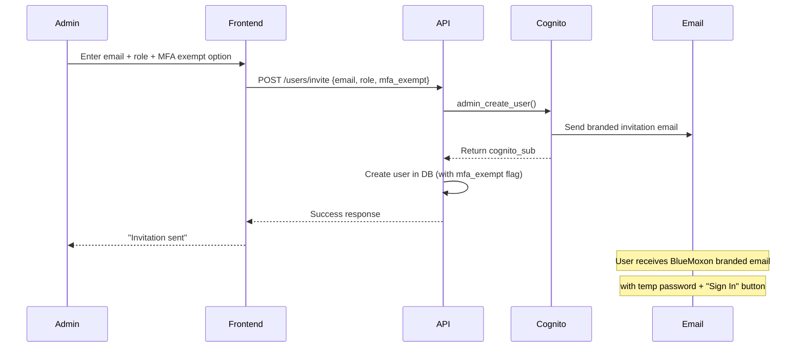
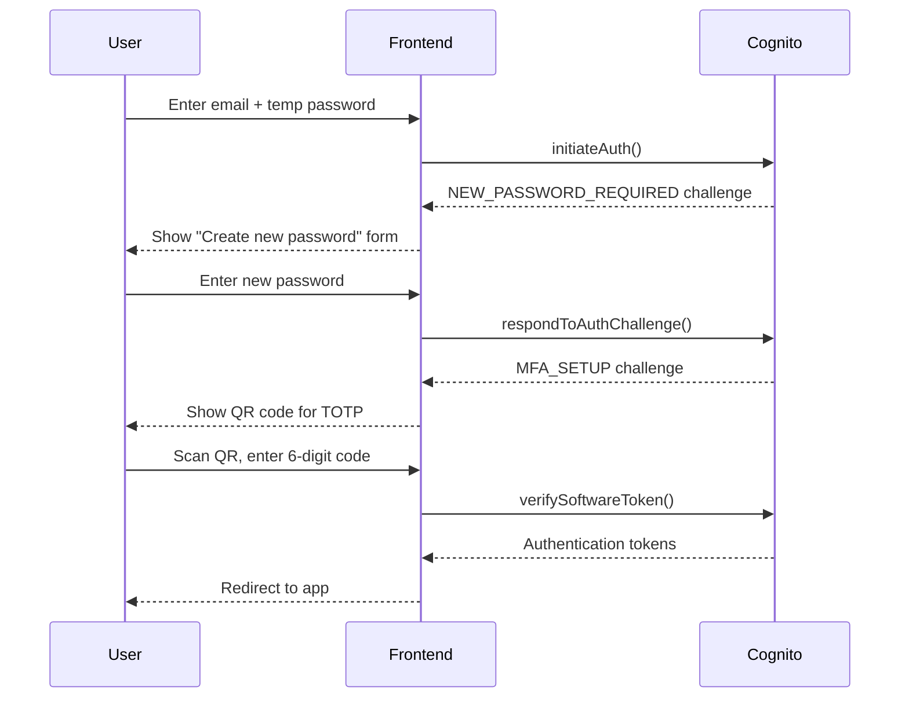
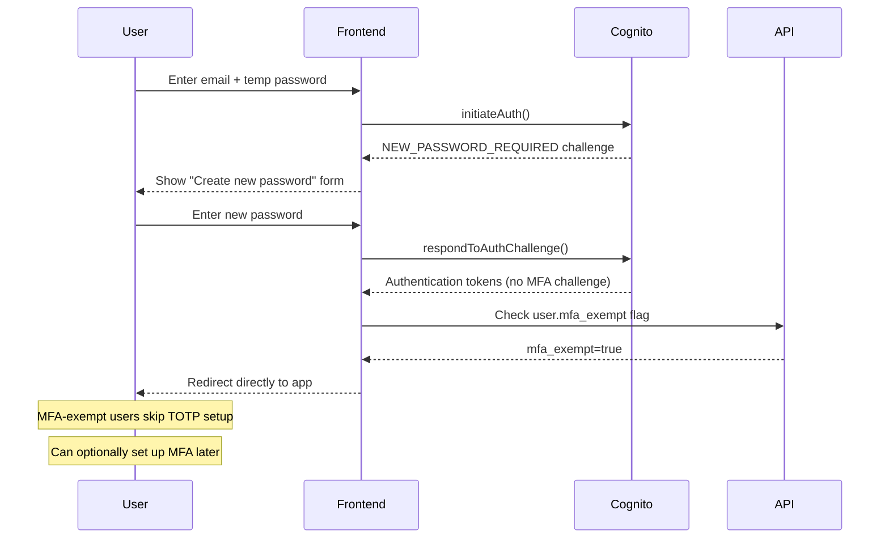
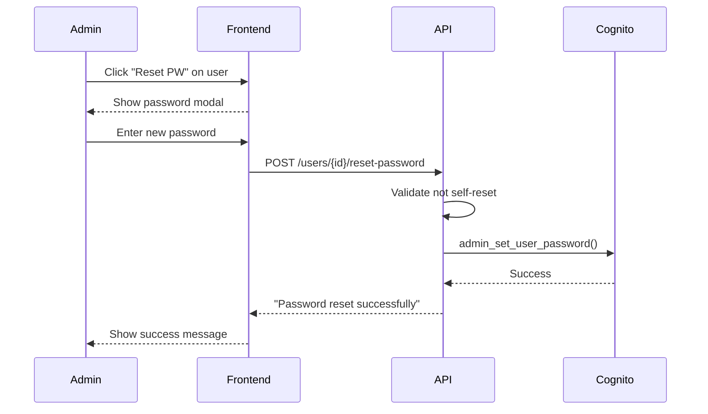
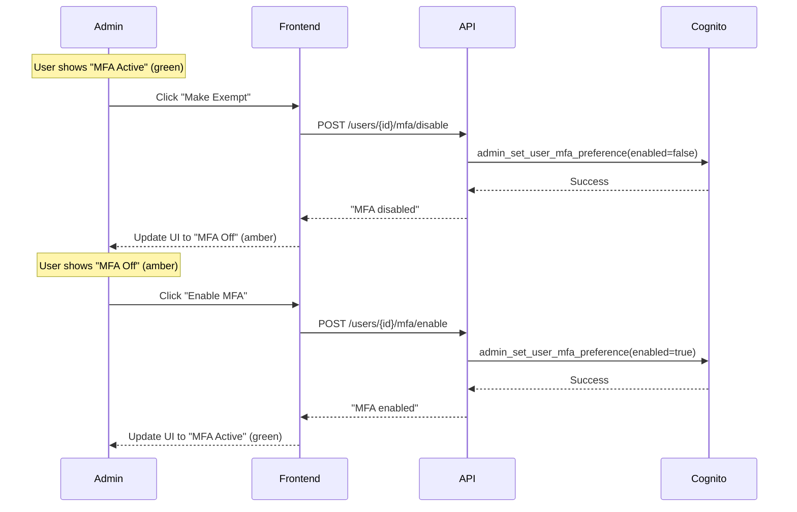
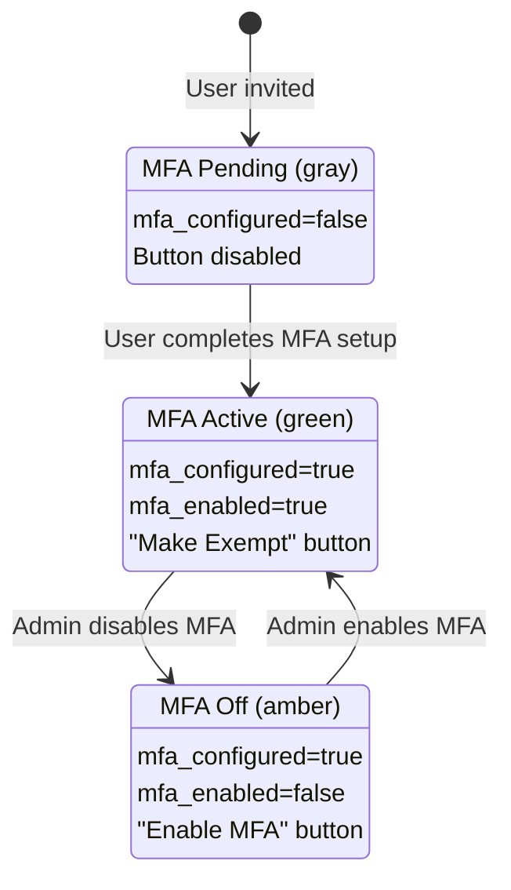
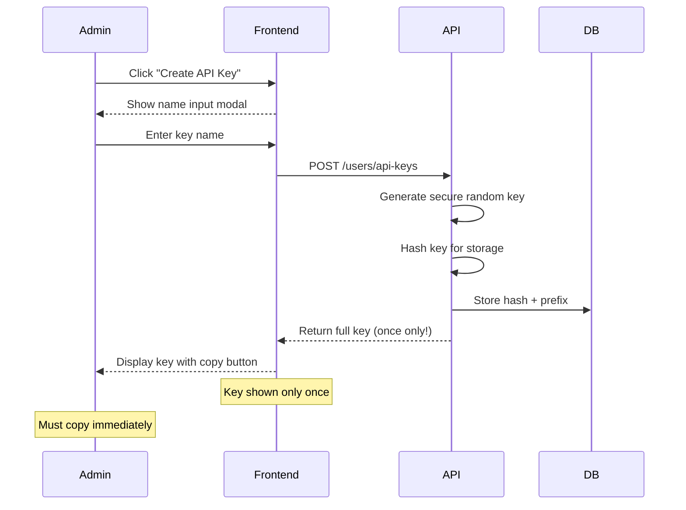
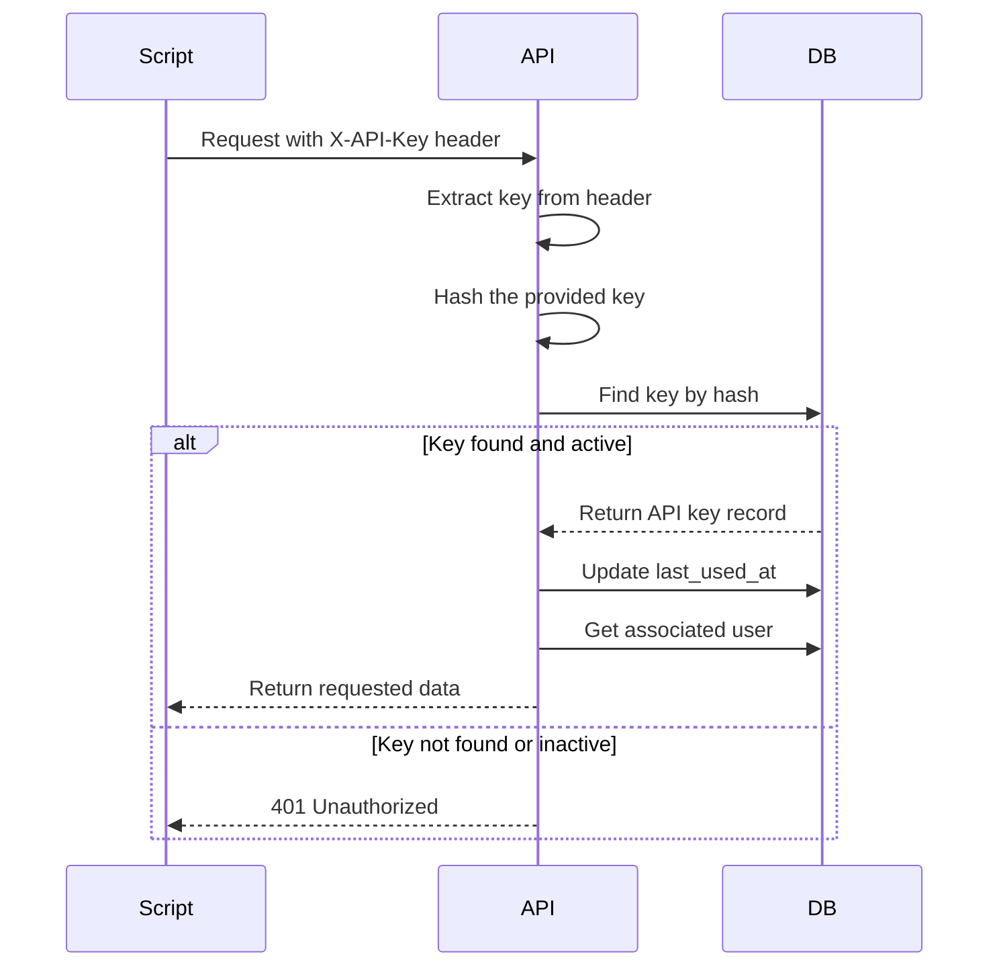
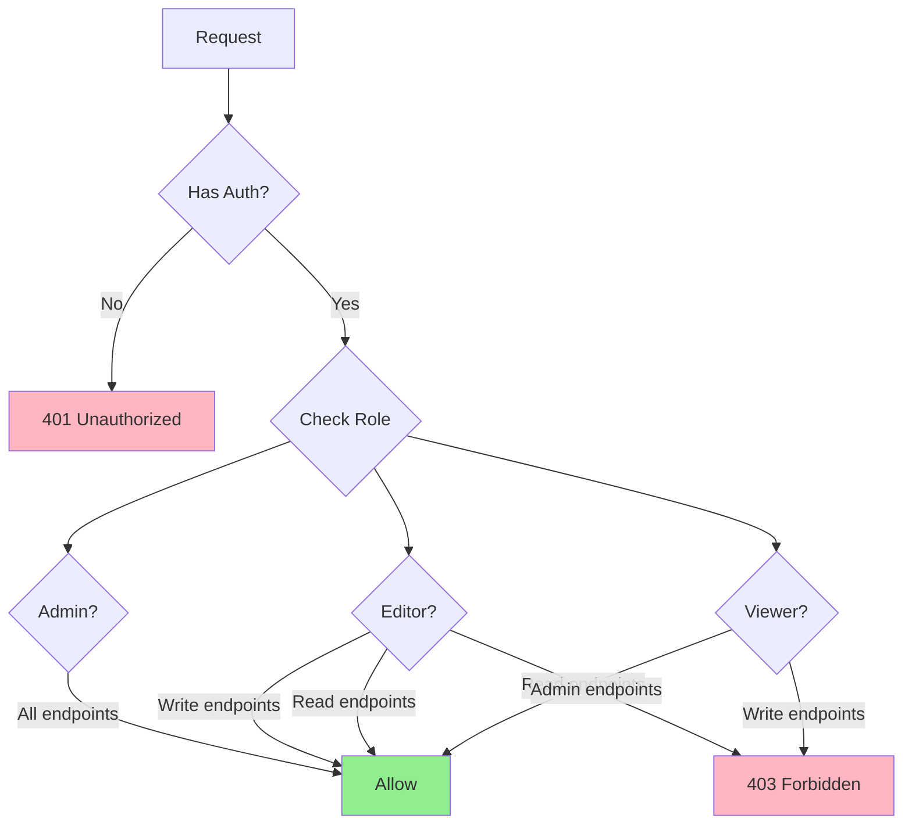

# Bluemoxon API Reference

Base URL: `/api/v1`

## Authentication

All endpoints (except health checks) require authentication. Two methods are supported:

### JWT Authentication (Web App)

Include the Cognito JWT token in the Authorization header:

```text
Authorization: Bearer <jwt_token>
```

### API Key Authentication (CLI/Automation)

Include the API key in the X-API-Key header:

```text
X-API-Key: <api_key>
```

### Role Requirements

| Role | Access |
|------|--------|
| **Viewer** | Read-only access to books, stats, exports |
| **Editor** | Viewer + create/update books, analyses |
| **Admin** | Editor + user management, config, costs |

### Endpoint Auth Summary

| Endpoint Pattern | Required Role |
|------------------|---------------|
| `GET /books/*` | Viewer |
| `GET /stats/*` | Viewer |
| `GET /export/*` | Viewer |
| `POST/PUT/PATCH/DELETE /books/*` | Editor |
| `GET /social-circles/*` | Viewer |
| `GET /entity/*/profile` | Viewer |
| `POST /entity/*/regenerate` | Editor |
| `PUT /entity/*/portrait` | Admin |
| `POST /entity/profiles/generate-all` | Admin |
| `GET /admin/model-config` | Admin |
| `PUT /admin/model-config/*` | Admin |
| `GET /admin/config` | Admin |
| `GET /admin/system-info` | Admin |
| `GET /admin/costs` | Admin |
| `GET /users/me/notifications` | Viewer |
| `POST /users/me/notifications/*/read` | Viewer |
| `PATCH /users/me/preferences` | Viewer |
| `POST /listings/extract` | Editor |
| `POST /listings/extract-async` | Editor |
| `GET /listings/extract/*/status` | Viewer |
| `GET /books/*/eval-runbook` | Editor |
| `PATCH /books/*/eval-runbook/price` | Editor |
| `POST /books/*/eval-runbook/refresh` | Editor |
| `POST /orders/extract` | Editor |
| `GET /health/*` | None (public) |

---

## Books API

### List Books

```text
GET /books
```

Query Parameters:

- `page` (int, default: 1) - Page number
- `per_page` (int, default: 20, max: 100) - Items per page
- `q` (string) - **Search query** for title, author, notes, binding description
- `inventory_type` (string) - Filter: PRIMARY, EXTENDED, FLAGGED
- `category` (string) - Filter by category
- `status` (string) - Filter: ON_HAND, IN_TRANSIT, SOLD, REMOVED
- `publisher_id` (int) - Filter by publisher
- `publisher_tier` (string) - Filter: "Tier 1", "Tier 2", "Tier 3"
- `author_id` (int) - Filter by author
- `binder_id` (int) - Filter by binder
- `binding_authenticated` (bool) - Filter authenticated bindings
- `binding_type` (string) - Filter: Full leather, Half leather, etc.
- `condition_grade` (string) - Filter: Fine, Very Good, Good, Fair, Poor
- `min_value` / `max_value` (float) - Value range filter
- `year_start` / `year_end` (int) - Publication year range filter
- `has_images` (bool) - Filter books with/without images
- `has_analysis` (bool) - Filter books with/without analysis
- `has_provenance` (bool) - Filter books with/without provenance
- `sort_by` (string, default: "title") - Sort field
- `sort_order` (string, default: "asc") - asc or desc

Example:

```bash
curl "http://localhost:8000/api/v1/books?inventory_type=PRIMARY&binding_authenticated=true&per_page=10"
```

Response:

```json
{
  "items": [
    {
      "id": 1,
      "title": "Vanity Fair",
      "author": {"id": 1, "name": "William Makepeace Thackeray"},
      "publisher": {"id": 1, "name": "Bradbury & Evans", "tier": "TIER_1"},
      "binder": {"id": 1, "name": "Zaehnsdorf"},
      "publication_date": "1848",
      "volumes": 2,
      "value_mid": 450.00,
      "has_analysis": true,
      "image_count": 4,
      "primary_image_url": "https://api.bluemoxon.com/api/v1/books/1/images/1/file"
    }
  ],
  "total": 71,
  "page": 1,
  "per_page": 10,
  "pages": 8
}
```

**Note:** `primary_image_url` is included directly in list response for efficient thumbnail loading. Returns `null` for books without images.

---

### Get Single Book

```text
GET /books/{book_id}
```

Example:

```bash
curl "http://localhost:8000/api/v1/books/407"
```

Response:

```json
{
  "id": 407,
  "title": "The Virginians",
  "author": {"id": 5, "name": "William Makepeace Thackeray"},
  "publisher": {"id": 3, "name": "Bradbury & Evans", "tier": "TIER_1"},
  "binder": null,
  "publication_date": "1857-1859",
  "edition": "First Edition",
  "volumes": 2,
  "category": "Fiction",
  "inventory_type": "PRIMARY",
  "binding_type": "Half calf",
  "binding_authenticated": false,
  "binding_description": "Contemporary half calf, marbled boards",
  "condition_grade": "Good",
  "value_low": 150,
  "value_mid": 200,
  "value_high": 275,
  "purchase_price": 85,
  "discount_pct": 57,
  "roi_pct": 135,
  "status": "ON_HAND",
  "has_analysis": true,
  "image_count": 3,
  "primary_image_url": "https://api.bluemoxon.com/api/v1/books/407/images/1/file"
}
```

---

### Create Book

```text
POST /books
```

Request Body:

```json
{
  "title": "Pride and Prejudice",
  "author_id": 12,
  "publisher_id": 5,
  "publication_date": "1894",
  "volumes": 2,
  "category": "Fiction",
  "inventory_type": "PRIMARY",
  "binding_type": "Full morocco",
  "binder_id": 1,
  "value_low": 300,
  "value_mid": 400,
  "value_high": 550,
  "purchase_price": 180,
  "status": "IN_TRANSIT"
}
```

Example:

```bash
curl -X POST "http://localhost:8000/api/v1/books" \
  -H "Content-Type: application/json" \
  -d '{"title": "Pride and Prejudice", "author_id": 12, "inventory_type": "PRIMARY"}'
```

---

### Update Book

```text
PUT /books/{book_id}
```

Example:

```bash
curl -X PUT "http://localhost:8000/api/v1/books/407" \
  -H "Content-Type: application/json" \
  -d '{"status": "ON_HAND", "condition_grade": "Very Good"}'
```

---

### Delete Book

```text
DELETE /books/{book_id}
```

Deletes a book and CASCADE deletes all associated images and analysis.

Example:

```bash
curl -X DELETE "http://localhost:8000/api/v1/books/407"
```

Response: 204 No Content

---

### Update Book Status

```text
PATCH /books/{book_id}/status?status={status}
```

Valid statuses: IN_TRANSIT, ON_HAND, SOLD, REMOVED

Example:

```bash
curl -X PATCH "http://localhost:8000/api/v1/books/407/status?status=ON_HAND"
```

Response:

```json
{"message": "Status updated", "status": "ON_HAND"}
```

---

### Add Shipment Tracking

```text
PATCH /books/{book_id}/tracking
```

**Authentication Required:** Editor or Admin role

Add or update shipment tracking information for an IN_TRANSIT book. Auto-detects carrier from tracking number format and generates tracking URL.

Request Body:

```json
{
  "tracking_number": "9400111899223033005436",
  "tracking_carrier": "usps",
  "tracking_url": null
}
```

Fields:

- `tracking_number` (optional) - Carrier tracking number
- `tracking_carrier` (optional) - Carrier name: `usps`, `ups`, `fedex`, `dhl`, `royal_mail`, `parcelforce`
- `tracking_url` (optional) - Direct tracking URL (for unsupported carriers)

**Carrier Auto-Detection:**

| Pattern | Carrier |
|---------|---------|
| 20-22 digits starting with 9 | USPS |
| 1Z followed by alphanumeric | UPS |
| 12-15 digits | FedEx |
| 10 digits | DHL |
| 13 chars ending in GB | Royal Mail |

Example:

```bash
curl -X PATCH "https://api.bluemoxon.com/api/v1/books/407/tracking" \
  -H "X-API-Key: $BMX_API_KEY" \
  -H "Content-Type: application/json" \
  -d '{"tracking_number": "9400111899223033005436"}'
```

Response: Returns full BookResponse with updated tracking fields.

Error Responses:

- 400 Bad Request - Book not IN_TRANSIT or missing tracking data
- 404 Not Found - Book not found

---

### Refresh Tracking Status

```text
POST /books/{book_id}/tracking/refresh
```

**Authentication Required:** Editor or Admin role

Fetches latest tracking status from carrier API and updates estimated delivery date.

Example:

```bash
curl -X POST "https://api.bluemoxon.com/api/v1/books/407/tracking/refresh" \
  -H "X-API-Key: $BMX_API_KEY"
```

Response:

```json
{
  "tracking_status": "in_transit",
  "tracking_status_detail": "In Transit to Next Facility",
  "estimated_delivery": "2026-01-05",
  "last_updated": "2026-01-02T12:30:00Z"
}
```

Tracking Status Values:

- `pending` - Label created, not yet received by carrier
- `in_transit` - Package in transit
- `out_for_delivery` - Out for delivery today
- `delivered` - Package delivered
- `exception` - Delivery exception (delay, failed attempt)
- `unknown` - Status not available

Error Responses:

- 400 Bad Request - Book not IN_TRANSIT or no tracking number set
- 404 Not Found - Book not found

---

### Update Inventory Type

```text
PATCH /books/{book_id}/inventory-type?inventory_type={type}
```

Valid types: PRIMARY, EXTENDED, FLAGGED

Example:

```bash
curl -X PATCH "http://localhost:8000/api/v1/books/407/inventory-type?inventory_type=FLAGGED"
```

---

### Bulk Status Update

```text
POST /books/bulk/status?status={status}
```

Request Body: Array of book IDs

```json
[1, 2, 3, 4, 5]
```

Example:

```bash
curl -X POST "http://localhost:8000/api/v1/books/bulk/status?status=ON_HAND" \
  -H "Content-Type: application/json" \
  -d '[101, 102, 103]'
```

---

### Check Duplicate Titles

```text
GET /books/duplicates/check?title={title}
```

Example:

```bash
curl "http://localhost:8000/api/v1/books/duplicates/check?title=Vanity%20Fair"
```

Response:

```json
{
  "query": "Vanity Fair",
  "matches_found": 2,
  "matches": [
    {"id": 1, "title": "Vanity Fair Vol I", "author": "Thackeray", "binder": "Zaehnsdorf", "value_mid": 450}
  ]
}
```

---

## Book Analysis API

Book analyses are detailed markdown documents providing professional valuations,
historical context, and collection significance for each book. Analyses are
generated using **AWS Bedrock** (Opus, Sonnet, or Haiku via the configurable model registry)
with the **Napoleon Framework** prompt, which produces comprehensive valuations following
a standardized format.

The Napoleon Framework prompt is stored in S3 (`s3://bluemoxon-images/prompts/napoleon-framework/v3.md`)
and loaded with 5-minute caching. See [BEDROCK.md](BEDROCK.md) for details.

Analyses can be viewed by all authenticated users but only created/edited by users with the
**editor** or **admin** role.

### Get Book Analysis (Parsed)

```text
GET /books/{book_id}/analysis
```

Returns a structured JSON object with parsed analysis fields.

Example:

```bash
curl "http://localhost:8000/api/v1/books/407/analysis"
```

Response:

```json
{
  "id": 123,
  "book_id": 407,
  "executive_summary": "First edition of Thackeray's sequel to Henry Esmond...",
  "condition_assessment": {"grade": "Good", "notes": "Minor foxing to prelims"},
  "binding_elaborateness_tier": 3,
  "market_analysis": {"comparables": [], "trend": "stable"},
  "historical_significance": "Important American historical novel...",
  "recommendations": "Hold for appreciation",
  "risk_factors": ["Rebinding reduces value", "Common title"],
  "source_filename": "Virginians_Thackeray_analysis.md"
}
```

Returns 404 if no analysis exists for the book.

---

### Get Raw Analysis Markdown

```text
GET /books/{book_id}/analysis/raw
```

Returns the raw markdown content of the analysis file as plain text.

Example:

```bash
curl "http://localhost:8000/api/v1/books/407/analysis/raw"
```

Response: Plain text markdown content.

Returns 404 if no analysis exists for the book.

---

### Create or Update Analysis

```text
PUT /books/{book_id}/analysis
```

**Authentication Required:** Editor or Admin role

Creates a new analysis or updates an existing one. The request body should be
raw markdown text (not JSON).

Headers:

- `Content-Type: text/plain`
- `Authorization: Bearer <token>`

Request Body: Raw markdown string

Example:

```bash
curl -X PUT "http://localhost:8000/api/v1/books/407/analysis" \
  -H "Content-Type: text/plain" \
  -H "Authorization: Bearer $TOKEN" \
  -d '# Book Analysis

## Executive Summary

This is a first edition of...

## Historical Significance

Published in 1848...'
```

Response:

```json
{
  "message": "Analysis updated successfully"
}
```

Error Responses:

- 401 Unauthorized - Not authenticated
- 403 Forbidden - User does not have editor or admin role
- 404 Not Found - Book not found

**Frontend Usage:**

The analysis can be edited directly in the BlueMoxon web interface:

1. Navigate to a book's detail page
2. Click the document icon to open the Analysis Viewer
3. Click the **Edit** button in the header (visible only to editors/admins)
4. Edit markdown in the **split-pane editor** with live preview
5. Click **Save** to persist changes (or press ⌘S)

Features:

- **Split-pane editor**: Left side for markdown, right side for live preview
- **Toggle preview**: Click the eye icon to hide/show preview pane
- **Full GFM support**: Tables, code blocks, lists, and all GitHub Flavored Markdown
- **Keyboard shortcuts**: ⌘S to save, Esc to cancel

For books without an analysis, editors will see a **Create Analysis** button.

---

### Delete Analysis

```text
DELETE /books/{book_id}/analysis
```

**Authentication Required:** Editor or Admin role

Permanently deletes the analysis for a book.

Example:

```bash
curl -X DELETE "http://localhost:8000/api/v1/books/407/analysis" \
  -H "Authorization: Bearer $TOKEN"
```

Response:

```json
{
  "message": "Analysis deleted"
}
```

Error Responses:

- 401 Unauthorized - Not authenticated
- 403 Forbidden - User does not have editor or admin role
- 404 Not Found - Book not found or no analysis to delete

**Frontend Usage:**

In the Analysis Viewer panel, editors/admins will see a trash icon button next to the Edit button. Clicking it shows a confirmation modal before deletion.

---

### Re-extract Structured Data (Single Book)

```text
POST /books/{book_id}/re-extract
```

Re-runs Stage 2 structured data extraction for a book using its existing analysis text. Does NOT regenerate the full analysis - only re-extracts the structured fields (valuations, condition, binding type, provenance, etc.).

Useful for fixing 'degraded' extractions that occurred due to AI service throttling.

**Requires:** Editor role

Example:

```bash
curl -X POST "http://localhost:8000/api/v1/books/407/re-extract" \
  -H "Authorization: Bearer $TOKEN"
```

Response (success):

```json
{
  "message": "Extraction successful",
  "book_id": 407,
  "fields_updated": ["value_low", "value_mid", "value_high", "condition_grade", "binding_type"],
  "extraction_status": "success"
}
```

Error Responses:

- 401 Unauthorized - Not authenticated
- 403 Forbidden - User does not have editor role
- 404 Not Found - Book not found or no analysis exists
- 503 Service Unavailable - AI service throttled, try again later

---

### Re-extract All Degraded (Bulk)

```text
POST /books/re-extract-degraded
```

Re-runs Stage 2 extraction for ALL books with `extraction_status = 'degraded'`. Processes books sequentially to avoid overwhelming the AI service quota.

**Requires:** Admin role

Example:

```bash
curl -X POST "http://localhost:8000/api/v1/books/re-extract-degraded" \
  -H "Authorization: Bearer $TOKEN"
```

Response:

```json
{
  "message": "Re-extracted 15/20 degraded analyses",
  "total": 20,
  "succeeded": 15,
  "failed": 5,
  "results": [
    {"book_id": 407, "title": "The Virginians", "status": "success", "fields_updated": ["value_low", "value_mid"]},
    {"book_id": 412, "title": "Vanity Fair", "status": "failed", "reason": "Extraction returned no data (likely throttled)"}
  ]
}
```

**Note:** This endpoint saves progress after each successful extraction, so partial results are preserved if the operation is interrupted.

---

### Generate Analysis (Async)

```text
POST /books/{book_id}/analysis/generate-async
```

**Authentication Required:** Admin role

Starts asynchronous analysis generation via SQS queue. Returns immediately with a job ID for polling. This is the preferred method for generating analyses as it doesn't block the API.

Request Body:

```json
{
  "model": "sonnet",
  "force": false
}
```

Fields:

- `model` (optional, default: "sonnet") - AI model: `sonnet` or `opus`
- `force` (optional, default: false) - Replace existing analysis if present

Example:

```bash
curl -X POST "https://api.bluemoxon.com/api/v1/books/407/analysis/generate-async" \
  -H "X-API-Key: $BMX_API_KEY" \
  -H "Content-Type: application/json" \
  -d '{"model": "opus"}'
```

Response (202 Accepted):

```json
{
  "id": 123,
  "book_id": 407,
  "status": "pending",
  "model": "opus",
  "created_at": "2026-01-02T15:30:00Z"
}
```

Job Statuses:

- `pending` - Job queued, waiting for worker
- `running` - Worker processing analysis
- `completed` - Analysis generated successfully
- `failed` - Generation failed (see error message)

Error Responses:

- 400 Bad Request - Analysis exists and force=false
- 404 Not Found - Book not found
- 409 Conflict - Active job already exists for this book

---

### Get Analysis Job Status

```text
GET /books/{book_id}/analysis/status
```

Returns the status of the latest analysis job for a book.

Example:

```bash
curl "https://api.bluemoxon.com/api/v1/books/407/analysis/status" \
  -H "X-API-Key: $BMX_API_KEY"
```

Response:

```json
{
  "id": 123,
  "book_id": 407,
  "status": "completed",
  "model": "opus",
  "model_version": "anthropic.claude-opus-4-5-20250514-v1:0",
  "created_at": "2026-01-02T15:30:00Z",
  "completed_at": "2026-01-02T15:31:45Z",
  "duration_seconds": 105,
  "error_message": null
}
```

---

## Images API

### List Book Images

```text
GET /books/{book_id}/images
```

Example:

```bash
curl "http://localhost:8000/api/v1/books/407/images"
```

Response:

```json
[
  {
    "id": 1,
    "s3_key": "407_abc123.jpg",
    "url": "/api/v1/books/407/images/1/file",
    "thumbnail_url": "/api/v1/books/407/images/1/thumbnail",
    "image_type": "cover",
    "display_order": 0,
    "is_primary": true,
    "caption": "Front cover showing gilt spine"
  }
]
```

---

### Get Primary Image

```text
GET /books/{book_id}/images/primary
```

Returns the primary image or first image by display order.

---

### Get Image File

```text
GET /books/{book_id}/images/{image_id}/file
```

In production: Returns a 302 redirect to a presigned S3 URL (valid for 1 hour).
In development: Returns the actual image file (binary).

**Note:** The presigned URL approach avoids Lambda payload size limits for large images.

---

### Get Thumbnail

```text
GET /books/{book_id}/images/{image_id}/thumbnail
```

Returns thumbnail version of image.

---

### Upload Image

```text
POST /books/{book_id}/images
```

Form data:

- `file` (required) - Image file
- `image_type` (string, default: "detail") - cover, spine, interior, detail
- `is_primary` (bool, default: false)
- `caption` (string)

Example:

```bash
curl -X POST "http://localhost:8000/api/v1/books/407/images" \
  -F "file=@cover.jpg" \
  -F "image_type=cover" \
  -F "is_primary=true"
```

---

### Update Image Metadata

```text
PUT /books/{book_id}/images/{image_id}
```

Query Parameters:

- `image_type`
- `is_primary`
- `caption`
- `display_order`

---

### Reorder Images

```text
PUT /books/{book_id}/images/reorder
```

**Authentication Required:** Editor or Admin role

Reorders images by providing an ordered list of image IDs. The first image in the list automatically becomes the primary image.

Request Body: Array of image IDs in desired order

```json
[5, 3, 1, 4, 2]
```

Example:

```bash
curl -X PUT "http://localhost:8000/api/v1/books/407/images/reorder" \
  -H "Content-Type: application/json" \
  -H "Authorization: Bearer $TOKEN" \
  -d '[5, 3, 1, 4, 2]'
```

Response:

```json
{
  "message": "Images reordered successfully",
  "order": [5, 3, 1, 4, 2]
}
```

Error Responses:

- 400 Bad Request - Some image IDs do not belong to this book
- 401 Unauthorized - Not authenticated
- 403 Forbidden - User does not have editor role
- 404 Not Found - Book not found

---

### Delete Image

```text
DELETE /books/{book_id}/images/{image_id}
```

Deletes image file and database record.

---

### Regenerate Thumbnails

```text
POST /books/{book_id}/images/regenerate-thumbnails
```

**Authentication Required:** Editor or Admin role

Regenerates thumbnails for all images of a book. Useful when:

- Images were uploaded without thumbnails (e.g., via direct S3 upload)
- Thumbnails are corrupted or missing
- Thumbnail quality needs to be updated

Example:

```bash
curl -X POST "https://api.bluemoxon.com/api/v1/books/56/images/regenerate-thumbnails" \
  -H "X-API-Key: $BMX_API_KEY"
```

Response:

```json
{
  "message": "Regenerated 14 thumbnails",
  "regenerated": 14,
  "s3_keys": ["56_abc123.jpeg", "56_def456.jpeg"],
  "errors": []
}
```

**Error Response (partial failure):**

```json
{
  "message": "Regenerated 1 thumbnails",
  "regenerated": 1,
  "s3_keys": ["56_abc123.jpeg"],
  "errors": [
    "56_def456.jpg: cannot identify image file '/tmp/bluemoxon-images/56_def456.jpg'"
  ]
}
```

**Common Error:** `cannot identify image file` means the S3 object is not a valid image (often HTML error pages from failed downloads).

---

### Image Troubleshooting

**Symptom: Images return `Content-Type: text/html` instead of `image/jpeg`**

This means the S3 objects contain HTML error pages, not actual images. Common causes:

1. eBay hotlink protection served error pages during download
2. Source images expired or were deleted
3. Upload script saved HTTP error responses as files

**Diagnosis:**

```bash
# Check image content-type via CloudFront
curl -sI "https://app.bluemoxon.com/book-images/books/{s3_key}" | grep content-type

# Expected: content-type: image/jpeg
# Problem:  content-type: text/html
```

**Fix:**

1. Delete corrupted images from the book
2. Re-fetch from source using Playwright (bypasses hotlink protection)
3. Upload valid images

```bash
# Delete corrupted images
curl -X DELETE "https://api.bluemoxon.com/api/v1/books/{book_id}/images/{image_id}" \
  -H "X-API-Key: $BMX_API_KEY"

# Upload valid images
curl -X POST "https://api.bluemoxon.com/api/v1/books/{book_id}/images" \
  -H "X-API-Key: $BMX_API_KEY" \
  -F "file=@valid_image.jpeg"
```

See `book-collection/documentation/Screenshot_Processing_Protocol.md` for the full image validation workflow.

---

## Search API

### Full-Text Search

```text
GET /search?q={query}
```

Query Parameters:

- `q` (required) - Search query
- `scope` (string, default: "all") - all, books, analyses
- `page` (int, default: 1)
- `per_page` (int, default: 20)

Example:

```bash
curl "http://localhost:8000/api/v1/search?q=Thackeray&scope=all"
```

Response:

```json
{
  "query": "Thackeray",
  "scope": "all",
  "total": 15,
  "results": [
    {"type": "book", "id": 1, "title": "Vanity Fair", "author": "Thackeray", "snippet": "..."},
    {"type": "analysis", "id": 5, "book_id": 1, "title": "Vanity Fair", "snippet": "..."}
  ]
}
```

---

## Statistics API

### Collection Overview

```text
GET /stats/overview
```

Response:

```json
{
  "primary": {
    "count": 71,
    "volumes": 253,
    "value_low": 28500,
    "value_mid": 37220,
    "value_high": 48900
  },
  "extended": {"count": 45},
  "flagged": {"count": 3},
  "total_items": 119,
  "authenticated_bindings": 24,
  "in_transit": 5
}
```

---

### Collection Metrics

```text
GET /stats/metrics
```

Response:

```json
{
  "victorian_percentage": 85.2,
  "average_discount": 42.5,
  "average_roi": 156.3,
  "tier_1_count": 35,
  "tier_1_percentage": 49.3,
  "total_purchase_cost": 12450.00,
  "total_current_value": 37220.00,
  "total_items": 71
}
```

---

### By Category

```text
GET /stats/by-category
```

Response:

```json
[
  {"category": "Fiction", "count": 28, "value": 15200},
  {"category": "Poetry", "count": 18, "value": 9800}
]
```

---

### By Publisher

```text
GET /stats/by-publisher
```

Response:

```json
[
  {"publisher": "Chapman & Hall", "tier": "TIER_1", "count": 6, "value": 3200, "volumes": 12}
]
```

---

### By Author

```text
GET /stats/by-author
```

---

### Authenticated Bindings

```text
GET /stats/bindings
```

Response:

```json
[
  {"binder": "Zaehnsdorf", "full_name": "Zaehnsdorf Ltd", "count": 10, "value": 5800},
  {"binder": "Rivière", "full_name": "Rivière & Son", "count": 8, "value": 4200}
]
```

---

### By Era

```text
GET /stats/by-era
```

Response:

```json
[
  {"era": "Victorian (1837-1901)", "count": 58, "value": 31500},
  {"era": "Romantic (1800-1837)", "count": 8, "value": 4200}
]
```

---

### Pending Deliveries

```text
GET /stats/pending-deliveries
```

Response:

```json
{
  "count": 5,
  "items": [
    {"id": 105, "title": "In Memoriam", "author": "Tennyson", "purchase_date": "2025-11-28", "value_mid": 230}
  ]
}
```

---

## Health Check API

Health check endpoints for monitoring, Kubernetes probes, and CI/CD validation.

### Liveness Probe

```text
GET /health/live
```

Simple check that the service is running. Use for Kubernetes liveness probes.

Response:

```json
{"status": "ok"}
```

---

### Readiness Probe

```text
GET /health/ready
```

Checks if the service is ready to accept traffic. Validates database connectivity.

Response:

```json
{
  "status": "ready",
  "checks": {
    "database": {
      "status": "healthy",
      "latency_ms": 12.5,
      "book_count": 71
    }
  }
}
```

Possible status values: `ready`, `not_ready`

---

### Deep Health Check

```text
GET /health/deep
```

Comprehensive health check that validates all system dependencies:

- **Database**: PostgreSQL connectivity and query execution
- **S3**: Images bucket accessibility
- **Cognito**: User pool availability (if configured)
- **Config**: Critical configuration validation

Use this endpoint for:

- CI/CD deployment validation
- Monitoring dashboards
- Troubleshooting connectivity issues

Response:

```json
{
  "status": "healthy",
  "timestamp": "2025-12-02T15:30:00Z",
  "version": "0.1.0",
  "environment": "production",
  "total_latency_ms": 145.2,
  "checks": {
    "database": {
      "status": "healthy",
      "latency_ms": 12.5,
      "book_count": 71
    },
    "s3": {
      "status": "healthy",
      "bucket": "bluemoxon-images",
      "latency_ms": 85.3,
      "has_objects": true
    },
    "cognito": {
      "status": "healthy",
      "user_pool": "bluemoxon-users",
      "latency_ms": 45.1
    },
    "config": {
      "status": "healthy",
      "environment": "production",
      "debug": false,
      "issues": null
    }
  }
}
```

Possible status values:

- `healthy`: All checks passed
- `degraded`: Some non-critical checks failed
- `unhealthy`: Critical checks failed

---

### Service Info

```text
GET /health/info
```

Returns service metadata, version, and configuration summary.

Response:

```json
{
  "service": "bluemoxon-api",
  "version": "0.1.0",
  "environment": "production",
  "region": "us-west-2",
  "features": {
    "cognito_auth": true,
    "s3_images": true,
    "api_key_auth": true
  },
  "endpoints": {
    "docs": null,
    "redoc": null,
    "health": "/health",
    "api": "/api/v1"
  }
}
```

Note: `docs` and `redoc` are only available when `debug=true`.

---

### Root Health Check

```text
GET /health
```

Simple liveness check at the root level (outside `/api/v1`).

Response:

```json
{"status": "healthy", "version": "0.1.0"}
```

---

## Export API

### Export to CSV

```text
GET /export/csv?inventory_type={type}
```

Returns downloadable CSV file.

Example:

```bash
curl -o collection.csv "http://localhost:8000/api/v1/export/csv?inventory_type=PRIMARY"
```

---

### Export to JSON

```text
GET /export/json?inventory_type={type}
```

Returns full JSON export with all book details.

---

## Reference Data APIs

Reference entities (Authors, Publishers, Binders) support CRUD operations and entity reassignment.

### Common Entity Fields

All reference entities include:

- `id` (int) - Unique identifier
- `name` (string) - Entity name
- `tier` (string, optional) - Quality tier: `TIER_1`, `TIER_2`, `TIER_3`
- `preferred` (bool, default: false) - Marks entity as preferred (+10 scoring bonus)
- `book_count` (int, computed) - Number of associated books

### Authors

| Endpoint | Method | Description |
|----------|--------|-------------|
| `/authors` | GET | List all authors |
| `/authors/{id}` | GET | Get author by ID |
| `/authors` | POST | Create author |
| `/authors/{id}` | PUT | Update author |
| `/authors/{id}` | DELETE | Delete author |
| `/authors/{id}/reassign` | POST | Reassign books to another author |

**Author-specific fields:**

- `birth_year` (int, optional)
- `death_year` (int, optional)
- `era` (string, optional) - e.g., "Victorian", "Romantic"
- `first_acquired_date` (date, optional)
- `priority_score` (int, default: 0)

### Publishers

| Endpoint | Method | Description |
|----------|--------|-------------|
| `/publishers` | GET | List all publishers |
| `/publishers/{id}` | GET | Get publisher by ID |
| `/publishers` | POST | Create publisher |
| `/publishers/{id}` | PUT | Update publisher |
| `/publishers/{id}` | DELETE | Delete publisher |
| `/publishers/{id}/reassign` | POST | Reassign books to another publisher |

**Publisher-specific fields:**

- `founded_year` (int, optional)
- `description` (string, optional)

### Binders

| Endpoint | Method | Description |
|----------|--------|-------------|
| `/binders` | GET | List all binders |
| `/binders/{id}` | GET | Get binder by ID |
| `/binders` | POST | Create binder |
| `/binders/{id}` | PUT | Update binder |
| `/binders/{id}` | DELETE | Delete binder |
| `/binders/{id}/reassign` | POST | Reassign books to another binder |

**Binder-specific fields:**

- `full_name` (string, optional) - e.g., "Rivière & Son"
- `authentication_markers` (string, optional) - Identifying characteristics

---

### Reassign Entity Books

```text
POST /{entity_type}/{id}/reassign
```

**Authentication Required:** Editor or Admin role

Reassigns all books from one entity to another, then deletes the source entity. Useful for merging duplicate entries.

Entity types: `authors`, `publishers`, `binders`

Request Body:

```json
{
  "target_id": 42
}
```

Example:

```bash
curl -X POST "https://api.bluemoxon.com/api/v1/authors/15/reassign" \
  -H "X-API-Key: $BMX_API_KEY" \
  -H "Content-Type: application/json" \
  -d '{"target_id": 3}'
```

Response:

```json
{
  "reassigned_count": 5,
  "deleted_entity": "W.M. Thackeray",
  "target_entity": "William Makepeace Thackeray"
}
```

Error Responses:

- 400 Bad Request - Cannot reassign to same entity / Target not found
- 404 Not Found - Source entity not found

---

## User Management API

### Get Current User

```text
GET /users/me
```

Returns the currently authenticated user's information including profile data.

Response:

```json
{
  "cognito_sub": "abc123-...",
  "email": "user@example.com",
  "role": "editor",
  "id": 5,
  "first_name": "John",
  "last_name": "Smith"
}
```

---

### Update User Profile

```text
PUT /users/me
```

Update your own profile (first name, last name). Any authenticated user can update their own profile.

Request Body:

```json
{
  "first_name": "John",
  "last_name": "Smith"
}
```

Response:

```json
{
  "id": 5,
  "email": "user@example.com",
  "role": "editor",
  "first_name": "John",
  "last_name": "Smith"
}
```

---

## Admin User Management (Admin Only)

All endpoints in this section require **admin** role.

---

### List All Users

```text
GET /users
```

Response:

```json
[
  {
    "id": 1,
    "cognito_sub": "...",
    "email": "admin@example.com",
    "role": "admin",
    "first_name": "Mark",
    "last_name": "Smith",
    "mfa_configured": true,
    "mfa_enabled": true
  },
  {
    "id": 2,
    "cognito_sub": "...",
    "email": "editor@example.com",
    "role": "editor",
    "first_name": null,
    "last_name": null,
    "mfa_configured": false,
    "mfa_enabled": false
  }
]
```

**MFA Status Fields (included in user list):**

- `mfa_configured` - Whether user has completed MFA setup
- `mfa_enabled` - Whether MFA is currently active

---

### Invite User

```text
POST /users/invite
```

Sends an email invitation with a temporary password via AWS Cognito. The invitation email is branded with BlueMoxon styling and includes a "Sign In" button.

Request Body:

```json
{
  "email": "newuser@example.com",
  "role": "viewer",
  "mfa_exempt": false
}
```

Fields:

- `email` (required) - User's email address
- `role` (optional, default: "viewer") - Valid roles: `viewer`, `editor`, `admin`
- `mfa_exempt` (optional, default: false) - If true, user won't be required to set up two-factor authentication

Response:

```json
{
  "message": "Invitation sent to newuser@example.com",
  "user_id": 5,
  "cognito_sub": "abc123-..."
}
```

**Note:** MFA-exempt users can still set up MFA voluntarily, but won't be blocked from accessing the app without it.

---

### Update User Role

```text
PUT /users/{user_id}/role?role={role}
```

Valid roles: `viewer`, `editor`, `admin`

Response:

```json
{"message": "User 5 role updated to editor"}
```

---

### Delete User

```text
DELETE /users/{user_id}
```

Cannot delete yourself. Also deletes associated API keys.

Response:

```json
{"message": "User 5 deleted"}
```

---

### Get User MFA Status

```text
GET /users/{user_id}/mfa
```

Response:

```json
{
  "user_id": 5,
  "email": "user@example.com",
  "mfa_configured": true,
  "mfa_enabled": true,
  "mfa_methods": ["SOFTWARE_TOKEN_MFA"]
}
```

MFA Status Fields:

- `mfa_configured` - Whether user has ever set up MFA (TOTP registered in Cognito)
- `mfa_enabled` - Whether MFA is currently active for this user
- `mfa_methods` - List of active MFA methods (e.g., `SOFTWARE_TOKEN_MFA`)

**Three MFA States:**

| State | `mfa_configured` | `mfa_enabled` | UI Display | Description |
|-------|------------------|---------------|------------|-------------|
| MFA Active | true | true | Green "MFA Active" | User has MFA set up and it's enabled |
| MFA Off | true | false | Amber "MFA Off" | User has MFA set up but admin disabled it |
| MFA Pending | false | false | Gray "MFA Pending" | User hasn't completed MFA setup yet |

---

### Enable User MFA

```text
POST /users/{user_id}/mfa/enable
```

Re-enables MFA for a user who has previously configured it (i.e., `mfa_configured=true`). This is only applicable when a user's MFA was previously disabled by an admin.

**Requirements:**

- User must have already completed MFA setup (`mfa_configured=true`)
- This endpoint does NOT work for users who never set up MFA

Response:

```json
{"message": "MFA enabled for user@example.com"}
```

---

### Disable User MFA

```text
POST /users/{user_id}/mfa/disable
```

Disables MFA for a user without removing their TOTP configuration. The user's MFA state changes from "MFA Active" to "MFA Off". They can still log in without MFA until an admin re-enables it.

**Note:** This does NOT delete the user's TOTP configuration. Use "Enable MFA" to re-enable it.

Response:

```json
{"message": "MFA disabled for user@example.com"}
```

---

### Impersonate User

```text
POST /users/{user_id}/impersonate
```

Generates temporary credentials for testing as another user. Resets user's password.

Response:

```json
{
  "message": "Temporary credentials generated for user@example.com",
  "email": "user@example.com",
  "temp_password": "RandomSecurePass123!",
  "note": "Log out and use these credentials. User should reset password after."
}
```

---

### Reset User Password

```text
POST /users/{user_id}/reset-password
```

Reset another user's password. Cannot reset your own password this way.

Request Body:

```json
{
  "new_password": "NewSecurePass123"
}
```

Response:

```json
{
  "message": "Password reset successfully for user@example.com"
}
```

Error Responses:

- 400 Bad Request - Cannot reset your own password / Password doesn't meet requirements
- 404 Not Found - User not found
- 500 Internal Server Error - Cognito error

**Password Requirements:**

- Minimum 8 characters
- At least one uppercase letter
- At least one lowercase letter
- At least one number

---

## Admin Dashboard API (Editor+)

Endpoints for the Admin Config Dashboard. Requires **Editor** or **Admin** role.

---

### Get Dashboard Batch (New in 1.2)

```text
GET /admin/dashboard/batch
```

Fetches all dashboard data in a single request, replacing 6 individual API calls. Returns data for all dashboard tabs.

Response:

```json
{
  "system_info": { /* same as /admin/system-info */ },
  "collection_stats": { /* same as /books/stats */ },
  "monthly_metrics": { /* same as /admin/monthly-metrics */ },
  "authors": [ /* same as /authors */ ],
  "publishers": [ /* same as /publishers */ ],
  "binders": [ /* same as /binders */ ]
}
```

**Performance benefit:** Reduces 6 round trips to 1, with ~40% faster dashboard load time.

---

### Get System Info

```text
GET /admin/system-info
```

Returns comprehensive system information including version, health checks, infrastructure config, scoring settings, and tiered entities.

Response:

```json
{
  "is_cold_start": false,
  "timestamp": "2025-12-22T16:00:00+00:00",
  "system": {
    "version": "2025.12.22-abc1234",
    "git_sha": "abc1234def5678",
    "deploy_time": "2025-12-22T15:30:00+00:00",
    "environment": "staging"
  },
  "health": {
    "overall": "healthy",
    "total_latency_ms": 125.5,
    "checks": {
      "database": {"status": "healthy", "latency_ms": 45.2, "book_count": 450},
      "s3": {"status": "healthy", "latency_ms": 32.1, "bucket": "bluemoxon-images"},
      "cognito": {"status": "healthy", "latency_ms": 48.2, "user_pool": "us-west-2_abc123"}
    }
  },
  "models": {
    "sonnet": {"model_id": "anthropic.claude-sonnet-4-5-20250514-v1:0", "usage": "Primary analysis model"},
    "haiku": {"model_id": "anthropic.claude-3-haiku-20240307-v1:0", "usage": "Fast extraction tasks"}
  },
  "infrastructure": {
    "aws_region": "us-west-2",
    "images_bucket": "bluemoxon-images",
    "backup_bucket": "bluemoxon-backup",
    "images_cdn_url": "https://images.bluemoxon.com",
    "analysis_queue": "bluemoxon-analysis-queue",
    "eval_runbook_queue": "bluemoxon-eval-runbook-queue"
  },
  "limits": {
    "bedrock_read_timeout_sec": 540,
    "bedrock_connect_timeout_sec": 10,
    "image_max_bytes": 5242880,
    "image_safe_bytes": 3932160,
    "prompt_cache_ttl_sec": 300,
    "presigned_url_expiry_sec": 3600
  },
  "scoring_config": {
    "quality_points": {
      "publisher_tier_1": 15,
      "publisher_tier_2": 10,
      "binder_tier_1": 15,
      "binder_tier_2": 10,
      "double_tier_1_bonus": 5,
      "era_bonus": 5,
      "condition_fine": 10,
      "condition_good": 5,
      "complete_set": 10,
      "author_priority_cap": 10,
      "duplicate_penalty": -15,
      "large_volume_penalty": -5
    },
    "strategic_points": {
      "publisher_match": 10,
      "new_author": 15,
      "second_work": 10,
      "completes_set": 20
    },
    "thresholds": {
      "price_excellent": 0.6,
      "price_good": 0.75,
      "price_fair": 0.85,
      "strategic_floor": 50,
      "quality_floor": 40
    },
    "weights": {
      "quality": 0.5,
      "strategic_fit": 0.5
    },
    "offer_discounts": {"70-79": 0.15, "60-69": 0.2, "50-59": 0.25, "40-49": 0.3, "0-39": 0.35},
    "era_boundaries": {"romantic_start": 1780, "romantic_end": 1850, "victorian_start": 1837, "victorian_end": 1901}
  },
  "entity_tiers": {
    "authors": [
      {"name": "Charles Darwin", "tier": "TIER_1"},
      {"name": "Charles Dickens", "tier": "TIER_2"}
    ],
    "publishers": [
      {"name": "John Murray", "tier": "TIER_1"},
      {"name": "Chapman & Hall", "tier": "TIER_2"}
    ],
    "binders": [
      {"name": "Zaehnsdorf", "tier": "TIER_1"},
      {"name": "Riviere & Son", "tier": "TIER_1"}
    ]
  }
}
```

---

### Get AWS Costs

```text
GET /admin/costs
```

Returns AWS Bedrock usage costs for the current month with daily trend data. **Cached for 1 hour** to minimize Cost Explorer API calls.

Response:

```json
{
  "period_start": "2025-12-01",
  "period_end": "2025-12-23",
  "bedrock_models": [
    {"model_name": "Sonnet 4.5", "usage": "Primary analysis model", "mtd_cost": 52.53},
    {"model_name": "Opus 4.5", "usage": "Complex reasoning tasks", "mtd_cost": 1.43},
    {"model_name": "Claude 3.5 Sonnet v2", "usage": "Legacy analysis", "mtd_cost": 0.94},
    {"model_name": "Claude 3.5 Sonnet", "usage": "Legacy analysis", "mtd_cost": 0.69},
    {"model_name": "Claude 3 Haiku", "usage": "Fast extraction tasks", "mtd_cost": 0.15}
  ],
  "bedrock_total": 55.74,
  "daily_trend": [
    {"date": "2025-12-20", "cost": 2.45},
    {"date": "2025-12-21", "cost": 3.12},
    {"date": "2025-12-22", "cost": 1.89}
  ],
  "other_costs": {
    "Amazon Simple Storage Service": 1.25,
    "Amazon CloudFront": 0.89,
    "Amazon Relational Database Service": 28.50
  },
  "total_aws_cost": 92.60,
  "cached_at": "2025-12-22T16:00:00+00:00",
  "error": null
}
```

**Notes:**

- Cost Explorer API requires `us-east-1` region regardless of resource location
- Data is MTD (month-to-date) costs
- `error` field contains message if Cost Explorer API fails

---

### Get Config

```text
GET /admin/config
```

Returns currency exchange rates for acquisition cost conversion.

Response:

```json
{
  "gbp_to_usd_rate": 1.28,
  "eur_to_usd_rate": 1.10
}
```

---

### Update Config (Admin Only)

```text
PUT /admin/config
```

Update currency exchange rates. Requires **Admin** role.

Request Body:

```json
{
  "gbp_to_usd_rate": 1.27,
  "eur_to_usd_rate": 1.09
}
```

Response: Same as GET /admin/config

---

## API Keys (Admin Only)

### List API Keys

```text
GET /users/api-keys
```

Response:

```json
[
  {
    "id": 1,
    "name": "Data Import",
    "key_prefix": "abc12345",
    "created_by_email": "admin@example.com",
    "is_active": true,
    "last_used_at": "2025-12-01T12:00:00",
    "created_at": "2025-11-15T10:30:00"
  }
]
```

---

### Create API Key

```text
POST /users/api-keys
```

Request Body:

```json
{"name": "Data Import Script"}
```

Response (**key only shown once!**):

```json
{
  "id": 2,
  "name": "Data Import Script",
  "key": "abc12345defghijk...",
  "key_prefix": "abc12345",
  "message": "Save this key now - it won't be shown again"
}
```

---

### Revoke API Key

```text
DELETE /users/api-keys/{key_id}
```

Response:

```json
{"message": "API key 2 revoked"}
```

---

## Authentication & Authorization

### Roles

| Role | Read | Create/Edit | Delete | Admin |
|------|------|-------------|--------|-------|
| viewer | ✓ | ✗ | ✗ | ✗ |
| editor | ✓ | ✓ | ✓ | ✗ |
| admin | ✓ | ✓ | ✓ | ✓ |

### Protected Endpoints

Most write operations require **editor** or **admin** role:

- `POST /books` - Create book
- `PUT /books/{id}` - Update book
- `DELETE /books/{id}` - Delete book
- `POST /books/{id}/images` - Upload image
- `PUT /books/{id}/images/reorder` - Reorder images
- `PUT /books/{id}/analysis` - Create/update analysis
- `DELETE /books/{id}/analysis` - Delete analysis

Admin-only operations:

- All `/users/*` endpoints
- All `/users/api-keys/*` endpoints

### API Key Authentication

For programmatic access (scripts, integrations), use API key in header:

```bash
curl -H "X-API-Key: your-api-key-here" \
  "https://api.bluemoxon.com/api/v1/books"
```

---

## Social Circles API

### Get Social Circles Graph

```text
GET /social-circles/
```

Returns a network graph of connections between authors, publishers, and binders based on the book collection. Connections include both data-derived relationships (publisher, shared_publisher, binder) and AI-discovered personal connections (family, friendship, influence, collaboration, scandal).

Query Parameters:

- `include_binders` (bool, default: true) - Include binder nodes and edges
- `min_book_count` (int, default: 1, max: 100) - Minimum books for an entity to be included
- `max_books` (int, default: 5000, range: 100-10000) - Maximum books to process
- `era` (string[], optional) - Filter by era: `pre_romantic`, `romantic`, `victorian`, `edwardian`, `post_1910`

Example:

```bash
curl "https://api.bluemoxon.com/api/v1/social-circles/?era=victorian&min_book_count=2" \
  -H "Authorization: Bearer $TOKEN"
```

Response:

```json
{
  "nodes": [
    {
      "id": "author:5",
      "type": "author",
      "label": "Charles Dickens",
      "era": "victorian",
      "book_count": 12,
      "image_url": "https://images.bluemoxon.com/entities/author/5/portrait.jpg"
    },
    {
      "id": "publisher:3",
      "type": "publisher",
      "label": "Chapman & Hall",
      "tier": "TIER_1",
      "book_count": 8
    }
  ],
  "edges": [
    {
      "source": "author:5",
      "target": "publisher:3",
      "type": "publisher",
      "book_count": 8
    },
    {
      "source": "author:5",
      "target": "author:12",
      "type": "friendship",
      "confidence": 0.95,
      "evidence": "Close friends and literary collaborators"
    }
  ],
  "stats": {
    "total_nodes": 45,
    "total_edges": 120,
    "build_time_ms": 85.3
  }
}
```

**Node types:** `author`, `publisher`, `binder`

**Edge types (data-derived):** `publisher`, `shared_publisher`, `binder`

**Edge types (AI-discovered):** `family`, `friendship`, `influence`, `collaboration`, `scandal`

---

### Social Circles Health Check

```text
GET /social-circles/health
```

Validates data integrity and query performance for the social circles feature.

Response:

```json
{
  "status": "healthy",
  "latency_ms": 85.3,
  "checks": {
    "node_counts": {
      "status": "healthy",
      "authors": 42,
      "publishers": 15,
      "binders": 8
    },
    "edge_counts": {
      "status": "healthy",
      "publisher": 65,
      "shared_publisher": 45,
      "binder": 10
    },
    "query_performance": {
      "status": "healthy",
      "build_time_ms": 85.3,
      "threshold_ms": 500
    }
  }
}
```

Status values: `healthy` (data present, under 500ms), `degraded` (data present, over 500ms), `unhealthy` (no data or error).

---

## Entity Profile API

### Get Entity Profile

```text
GET /entity/{entity_type}/{entity_id}/profile
```

Returns the full profile for an entity including AI-generated bio, personal stories, connection narratives, books, and stats.

Path Parameters:

- `entity_type` (string) - `author`, `publisher`, or `binder`
- `entity_id` (int) - Entity database ID

Example:

```bash
curl "https://api.bluemoxon.com/api/v1/entity/author/5/profile" \
  -H "Authorization: Bearer $TOKEN"
```

Response:

```json
{
  "entity_type": "author",
  "entity_id": 5,
  "name": "Charles Dickens",
  "image_url": "https://images.bluemoxon.com/entities/author/5/portrait.jpg",
  "bio_summary": "Charles John Huffam Dickens (1812-1870) was the most popular English novelist...",
  "personal_stories": [
    {
      "year": 1836,
      "text": "Published The Pickwick Papers, catapulting him to literary fame.",
      "significance": "career_milestone",
      "tone": "triumph"
    }
  ],
  "connection_narratives": {
    "publisher:3": "Chapman & Hall published the majority of Dickens' novels..."
  },
  "relationship_stories": {
    "author:12": "Dickens and Wilkie Collins shared a deep friendship..."
  },
  "connections": [
    {
      "entity_type": "publisher",
      "entity_id": 3,
      "name": "Chapman & Hall",
      "relationship": "publisher",
      "book_count": 8,
      "confidence": null
    }
  ],
  "books": [
    {"id": 101, "title": "A Tale of Two Cities", "publication_date": "1859"}
  ],
  "stats": {
    "book_count": 12,
    "total_value_mid": 4500.00,
    "era": "victorian"
  },
  "generated_at": "2026-02-05T10:30:00Z",
  "model_version": "anthropic.claude-3-5-haiku-20241022-v1:0"
}
```

Returns 404 if entity not found. Returns profile with `null` AI fields if no cached profile exists.

---

### Regenerate Entity Profile

```text
POST /entity/{entity_type}/{entity_id}/profile/regenerate
```

**Authentication Required:** Editor or Admin role

Deletes the cached profile and enqueues async regeneration via SQS. Returns 202 Accepted immediately. The caller should poll the GET profile endpoint until the profile reappears.

Example:

```bash
curl -X POST "https://api.bluemoxon.com/api/v1/entity/author/5/profile/regenerate" \
  -H "Authorization: Bearer $TOKEN"
```

Response (202 Accepted):

```json
{"status": "queued", "message": "Profile regeneration queued"}
```

---

### Upload Entity Portrait

```text
PUT /entity/{entity_type}/{entity_id}/portrait
```

**Authentication Required:** Admin role

Upload or replace the portrait image for an entity. The image is resized to 400x400 JPEG and uploaded to S3 with CloudFront CDN URL.

Form data:

- `file` (required) - Image file (JPEG, PNG, WEBP). Max 10 MB.

Example:

```bash
curl -X PUT "https://api.bluemoxon.com/api/v1/entity/author/5/portrait" \
  -H "Authorization: Bearer $TOKEN" \
  -F "file=@dickens-portrait.jpg"
```

Response:

```json
{
  "image_url": "https://images.bluemoxon.com/entities/author/5/portrait.jpg",
  "s3_key": "entities/author/5/portrait.jpg"
}
```

---

### Generate All Entity Profiles (Batch)

```text
POST /entity/profiles/generate-all
```

**Authentication Required:** Admin role

Enqueues async profile generation for all entities (authors, publishers, binders) via SQS. Returns a job ID for progress tracking. If an in-progress job already exists, returns that job instead of creating a new one.

Example:

```bash
curl -X POST "https://api.bluemoxon.com/api/v1/entity/profiles/generate-all" \
  -H "Authorization: Bearer $TOKEN"
```

Response:

```json
{
  "job_id": 42,
  "total_entities": 264,
  "status": "in_progress"
}
```

---

### Cancel Profile Generation Job

```text
POST /entity/profiles/generate-all/{job_id}/cancel
```

**Authentication Required:** Admin role

Cancel an in-progress or pending profile generation job.

Response:

```json
{
  "job_id": "42",
  "status": "cancelled",
  "completed_at": "2026-02-05T12:00:00+00:00"
}
```

Error Responses:

- 404 Not Found - Job not found
- 409 Conflict - Job already in terminal state

---

### Get Profile Generation Job Status

```text
GET /entity/profiles/generate-all/status/{job_id}
```

**Authentication Required:** Admin role

Get progress of a batch profile generation job.

Response:

```json
{
  "job_id": 42,
  "status": "in_progress",
  "total_entities": 264,
  "succeeded": 180,
  "failed": 2,
  "created_at": "2026-02-05T10:00:00+00:00",
  "completed_at": null
}
```

Job Statuses: `pending`, `in_progress`, `completed`, `failed`, `cancelled`

---

## Model Configuration API

### Get Model Configuration

```text
GET /admin/model-config
```

**Authentication Required:** Admin role

Returns the current AI model assignment for each workflow (flow), along with available models.

Response:

```json
{
  "flows": [
    {
      "key": "model.napoleon_analysis",
      "label": "Napoleon Analysis",
      "description": "Full book analysis using the Napoleon framework",
      "current_model": "opus",
      "default_model": "opus",
      "is_default": true
    },
    {
      "key": "model.entity_profiles",
      "label": "Entity Profiles",
      "description": "AI-generated biographical profiles for authors, publishers, and binders",
      "current_model": "haiku",
      "default_model": "haiku",
      "is_default": true
    },
    {
      "key": "model.order_extraction",
      "label": "Order Extraction",
      "description": "Extract structured data from order confirmation emails (not yet wired)",
      "current_model": "haiku",
      "default_model": "haiku",
      "is_default": true
    }
  ],
  "available_models": ["sonnet", "opus", "haiku"]
}
```

---

### Update Model for Flow

```text
PUT /admin/model-config/{flow_key}
```

**Authentication Required:** Admin role

Update the AI model assigned to a specific workflow.

Path Parameters:

- `flow_key` (string) - Flow key, e.g., `model.napoleon_analysis`

Request Body:

```json
{"model": "sonnet"}
```

Response:

```json
{
  "key": "model.napoleon_analysis",
  "model": "sonnet",
  "is_default": false
}
```

Error Responses:

- 404 Not Found - Unknown flow key
- 400 Bad Request - Invalid model name

---

## Notifications API

### List Notifications

```text
GET /users/me/notifications
```

Returns paginated list of notifications for the current user, ordered by most recent first.

Query Parameters:

- `limit` (int, default: 20) - Maximum notifications to return
- `offset` (int, default: 0) - Offset for pagination

Response:

```json
{
  "items": [
    {
      "id": 1,
      "user_id": 5,
      "book_id": 407,
      "message": "Your book 'Vanity Fair' has been delivered",
      "read": false,
      "created_at": "2026-01-15T10:30:00"
    }
  ],
  "unread_count": 3
}
```

---

### Mark Notification as Read

```text
POST /users/me/notifications/{notification_id}/read
```

Only the notification owner can mark it as read.

Response: Returns the updated notification object.

Error Responses:

- 404 Not Found - Notification not found or not owned by user

---

### Update Notification Preferences

```text
PATCH /users/me/preferences
```

Update notification preferences for the current user. Supports partial updates.

Request Body:

```json
{
  "notify_tracking_email": true,
  "notify_tracking_sms": false,
  "phone_number": "+14155551234"
}
```

Fields:

- `notify_tracking_email` (bool, optional) - Enable email notifications for tracking updates
- `notify_tracking_sms` (bool, optional) - Enable SMS notifications for tracking updates
- `phone_number` (string, optional) - Phone number in E.164 format (e.g., `+14155551234`)

Response:

```json
{
  "notify_tracking_email": true,
  "notify_tracking_sms": false,
  "phone_number": "+14155551234"
}
```

---

## Listings API

### Extract Listing Data (Sync)

```text
POST /listings/extract
```

**Authentication Required:** Editor or Admin role

Scrapes an eBay listing, extracts structured book data using AI, uploads images to S3, and matches against existing authors/publishers/binders.

Request Body:

```json
{
  "url": "https://www.ebay.com/itm/123456789"
}
```

Response:

```json
{
  "ebay_url": "https://www.ebay.com/itm/123456789",
  "ebay_item_id": "123456789",
  "listing_data": {
    "title": "Vanity Fair by Thackeray",
    "author": "Thackeray",
    "publisher": "Bradbury & Evans",
    "price": 150.00
  },
  "images": [
    {
      "s3_key": "listings/123456789/image_00.webp",
      "presigned_url": "https://..."
    }
  ],
  "image_urls": ["https://i.ebayimg.com/..."],
  "matches": {
    "author": {"id": 5, "name": "William Makepeace Thackeray", "similarity": 0.95}
  }
}
```

Error Responses:

- 400 Bad Request - Invalid eBay URL
- 422 Unprocessable Entity - Failed to extract listing data
- 429 Too Many Requests - eBay rate limit

---

### Extract Listing Data (Async)

```text
POST /listings/extract-async
```

**Authentication Required:** Editor or Admin role

Starts async extraction by invoking the scraper Lambda asynchronously. Returns immediately. Poll the status endpoint for results. Does not support short URLs (`ebay.us`).

Request Body:

```json
{
  "url": "https://www.ebay.com/itm/123456789"
}
```

Response (202 Accepted):

```json
{
  "item_id": "123456789",
  "status": "started",
  "message": "Scraper started. Poll /extract/{item_id}/status for results."
}
```

---

### Get Extraction Status

```text
GET /listings/extract/{item_id}/status
```

Returns status of an async extraction job.

Response:

```json
{
  "item_id": "123456789",
  "status": "ready",
  "ebay_url": "https://www.ebay.com/itm/123456789",
  "listing_data": { ... },
  "images": [ ... ],
  "matches": { ... }
}
```

Status values: `pending` (scraper still running), `scraped` (images exist, not extracted), `ready` (extraction complete), `error`.

---

## Eval Runbook API

### Get Eval Runbook

```text
GET /books/{book_id}/eval-runbook
```

**Authentication Required:** Editor or Admin role

Returns the evaluation runbook for a book, including AI-generated scoring breakdown and acquisition recommendation.

Error Responses:

- 404 Not Found - Book or eval runbook not found

---

### Update Eval Runbook Price

```text
PATCH /books/{book_id}/eval-runbook/price
```

**Authentication Required:** Editor or Admin role

Update the asking price and recalculate the acquisition score. Creates a price history record for tracking negotiations.

Request Body:

```json
{
  "new_price": 120.00,
  "discount_code": "SAVE10",
  "notes": "Seller accepted counteroffer"
}
```

Response:

```json
{
  "previous_price": 150.00,
  "new_price": 120.00,
  "score_before": 72,
  "score_after": 85,
  "recommendation_before": "PASS",
  "recommendation_after": "ACQUIRE",
  "runbook": { ... }
}
```

---

### Get Price History

```text
GET /books/{book_id}/eval-runbook/history
```

**Authentication Required:** Editor or Admin role

Returns price change history for an eval runbook, ordered by most recent first.

---

### Refresh Eval Runbook

```text
POST /books/{book_id}/eval-runbook/refresh
```

**Authentication Required:** Editor or Admin role

Re-runs full AI analysis and FMV lookup for an existing eval runbook. May take 30-60 seconds.

Response:

```json
{
  "status": "completed",
  "score_before": 65,
  "score_after": 82,
  "message": "Full AI analysis and FMV lookup completed successfully",
  "runbook": { ... }
}
```

---

## Order Extraction API

### Extract Order Details

```text
POST /orders/extract
```

**Authentication Required:** Editor or Admin role

Extract order details from pasted order confirmation text (typically from eBay emails). Uses regex extraction first, falls back to Bedrock Haiku for low-confidence results.

Request Body:

```json
{
  "text": "Order #12-345-678\nItem: Vanity Fair\nTotal: $150.00 USD\n..."
}
```

Response:

```json
{
  "order_number": "12-345-678",
  "item_price": 130.00,
  "shipping": 20.00,
  "total": 150.00,
  "currency": "USD",
  "total_usd": 150.00,
  "purchase_date": "2026-01-15",
  "platform": "eBay",
  "estimated_delivery": "Jan 20-25",
  "tracking_number": null,
  "confidence": 0.92,
  "used_llm": false,
  "field_confidence": {
    "order_number": 0.95,
    "total": 0.90,
    "currency": 0.85
  }
}
```

---

## Common Response Codes

| Code | Description |
|------|-------------|
| 200 | Success |
| 201 | Created |
| 204 | No Content (successful delete) |
| 400 | Bad Request (invalid parameters) |
| 404 | Not Found |
| 422 | Validation Error |
| 500 | Server Error |

---

## Database Relationships

```text
Book
├── Author (many-to-one)
├── Publisher (many-to-one)
├── Binder (many-to-one)
├── BookAnalysis (one-to-one, CASCADE DELETE)
└── BookImage[] (one-to-many, CASCADE DELETE)
```

When a Book is deleted, all associated BookAnalysis and BookImage records are automatically deleted via CASCADE.

---

## Admin Panel Flow Diagrams

### User Invitation Flow



**Invitation Email Features:**

- BlueMoxon branded header with blue gradient
- Credentials displayed in clear monospace boxes
- "Sign In to BlueMoxon" button linking to app.bluemoxon.com
- 7-day expiration notice

### New User First Login Flow (Standard)



### New User First Login Flow (MFA Exempt)



### Admin Password Reset Flow



### MFA Toggle Flow



### MFA State Diagram



### API Key Creation Flow



### User Authentication with API Key



### Role-Based Access Control


