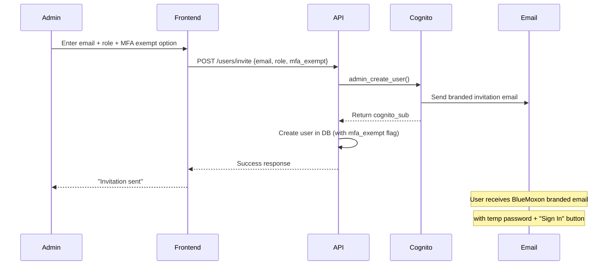
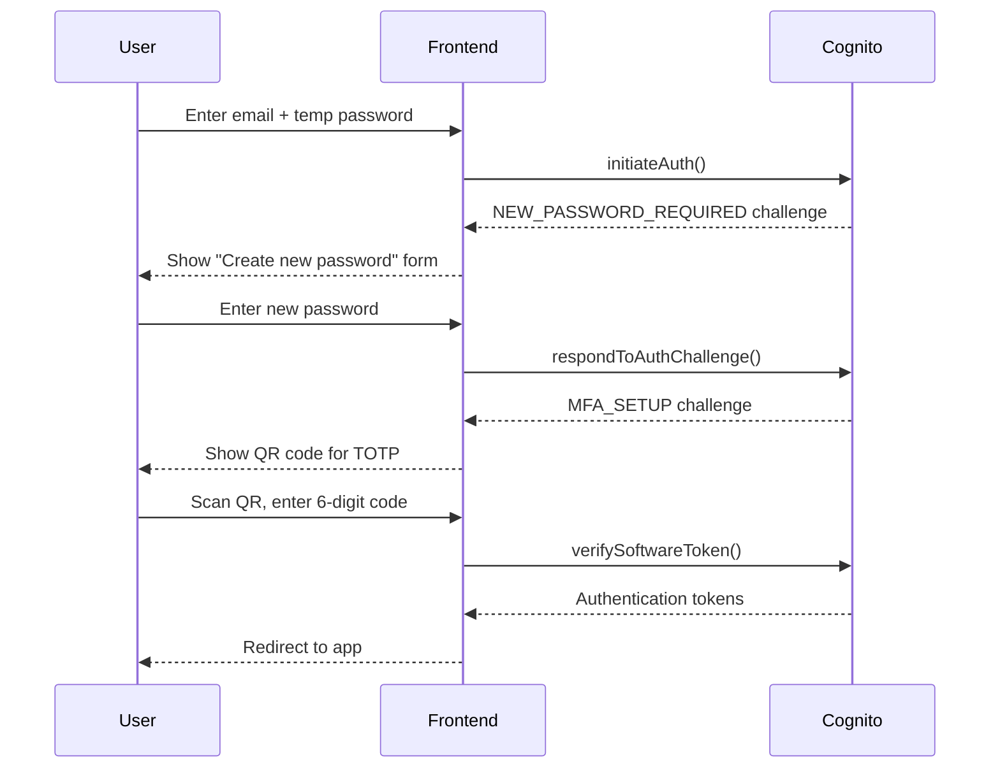
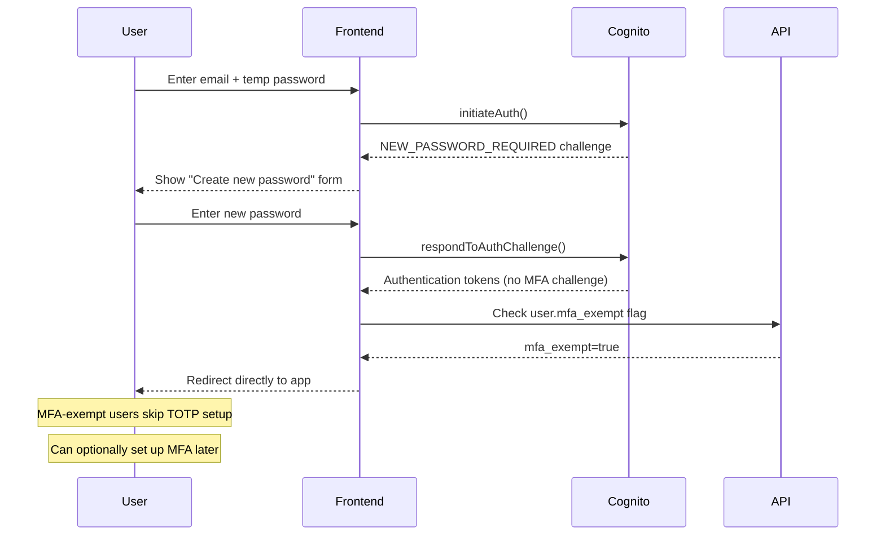
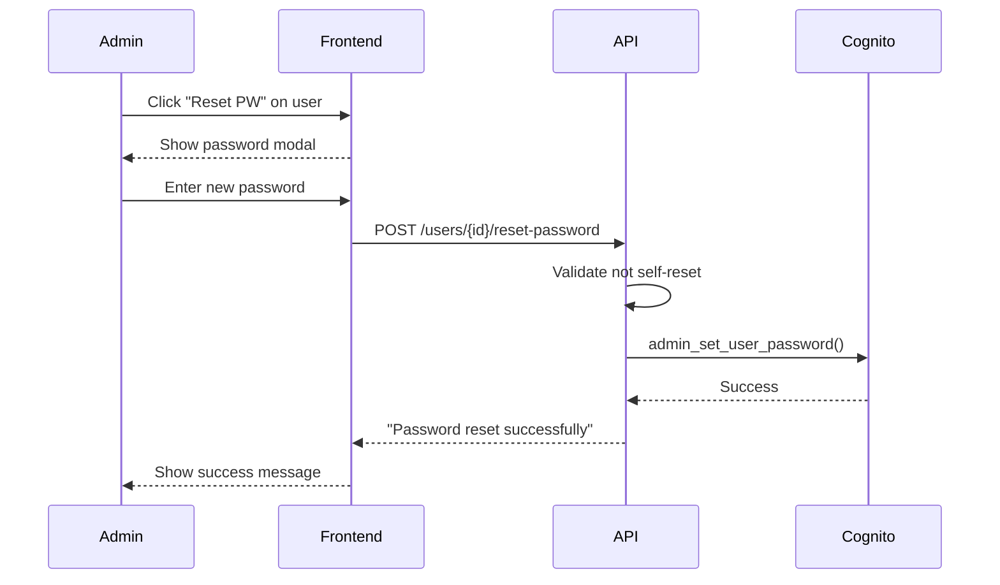
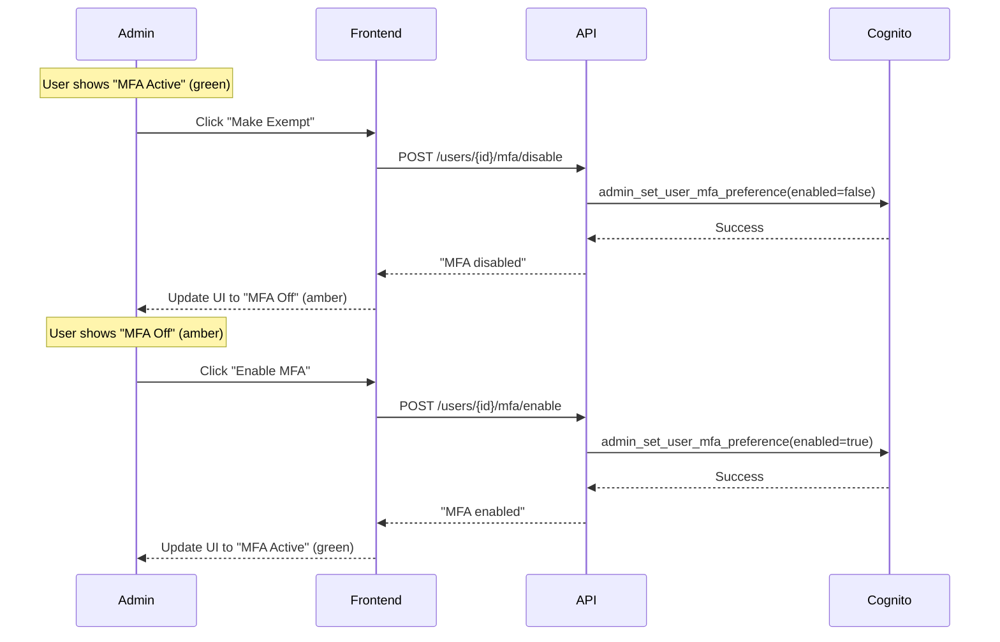
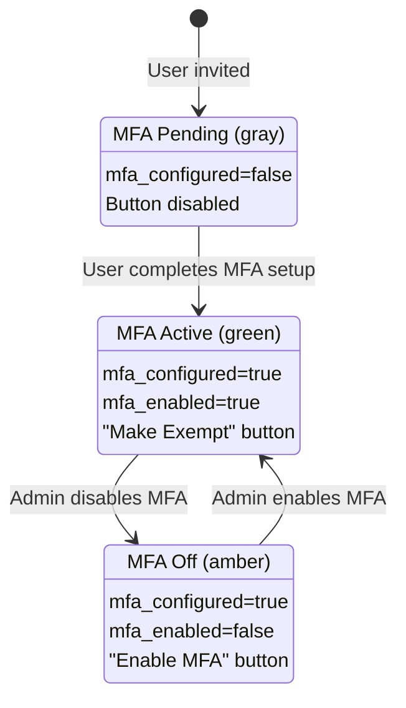
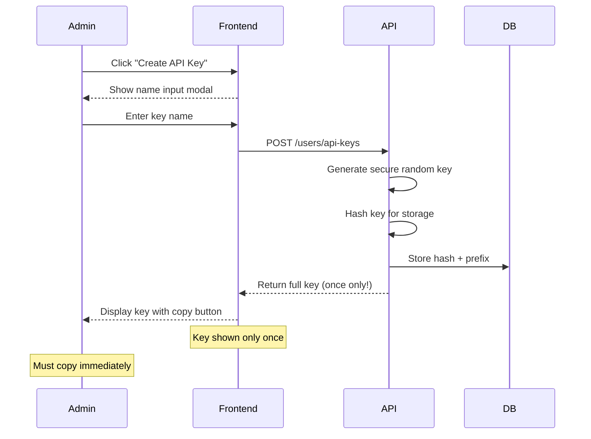
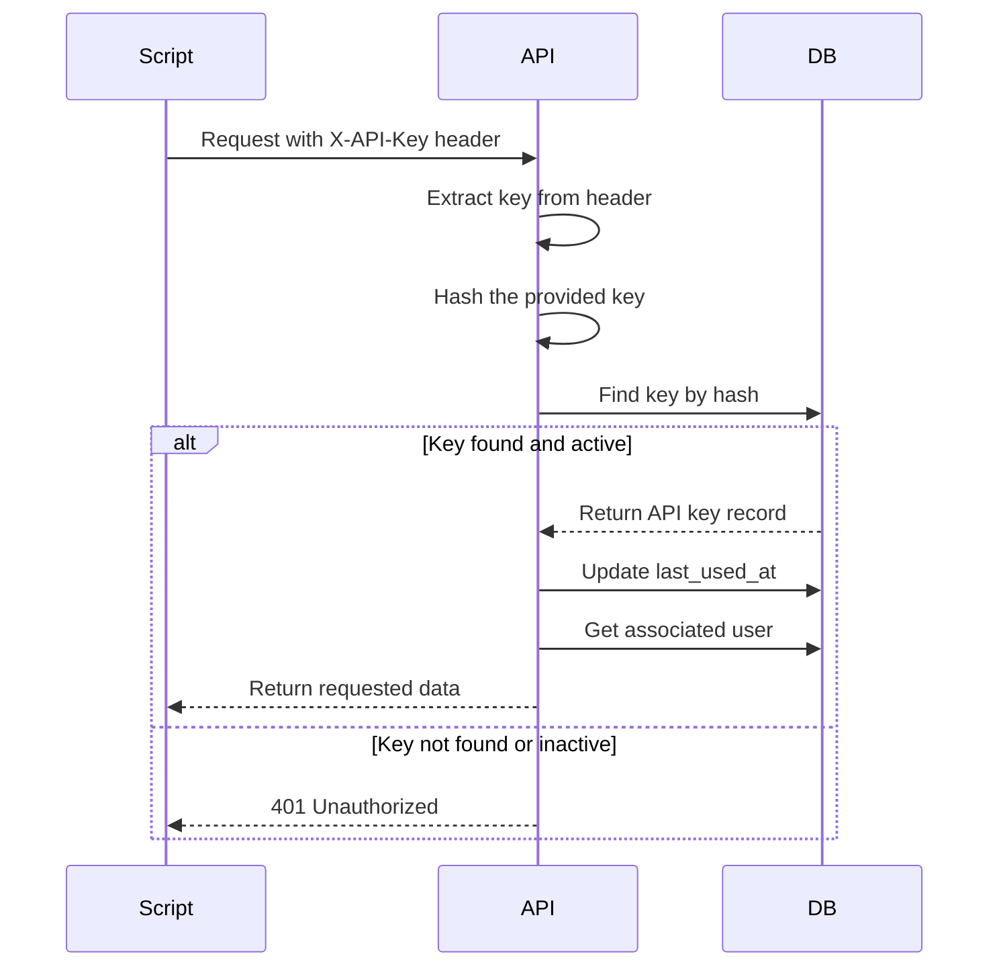
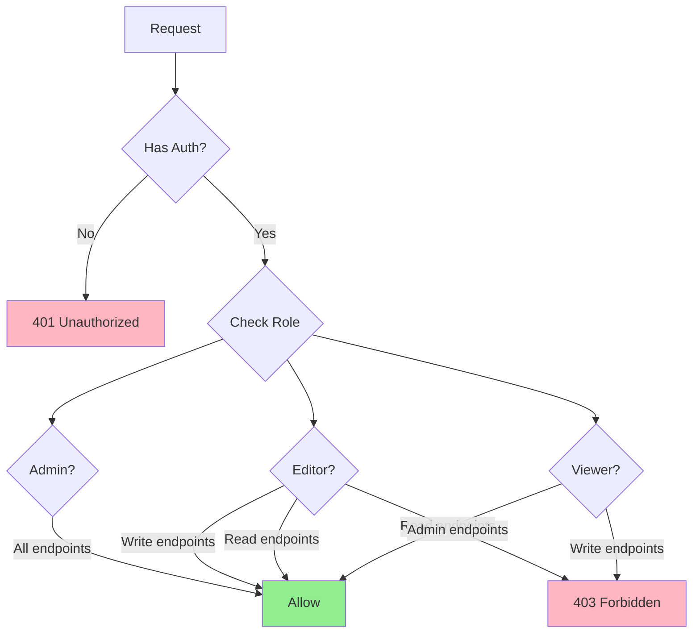

# Bluemoxon API Reference

Base URL: `/api/v1`

## Books API

### List Books
```
GET /books
```

Query Parameters:
- `page` (int, default: 1) - Page number
- `per_page` (int, default: 20, max: 100) - Items per page
- `q` (string) - **Search query** for title, author, notes, binding description
- `inventory_type` (string) - Filter: PRIMARY, EXTENDED, FLAGGED
- `category` (string) - Filter by category
- `status` (string) - Filter: ON_HAND, IN_TRANSIT, SOLD, REMOVED
- `publisher_id` (int) - Filter by publisher
- `publisher_tier` (string) - Filter: "Tier 1", "Tier 2", "Tier 3"
- `author_id` (int) - Filter by author
- `binder_id` (int) - Filter by binder
- `binding_authenticated` (bool) - Filter authenticated bindings
- `binding_type` (string) - Filter: Full leather, Half leather, etc.
- `condition_grade` (string) - Filter: Fine, Very Good, Good, Fair, Poor
- `min_value` / `max_value` (float) - Value range filter
- `year_start` / `year_end` (int) - Publication year range filter
- `has_images` (bool) - Filter books with/without images
- `has_analysis` (bool) - Filter books with/without analysis
- `has_provenance` (bool) - Filter books with/without provenance
- `sort_by` (string, default: "title") - Sort field
- `sort_order` (string, default: "asc") - asc or desc

Example:
```bash
curl "http://localhost:8000/api/v1/books?inventory_type=PRIMARY&binding_authenticated=true&per_page=10"
```

Response:
```json
{
  "items": [
    {
      "id": 1,
      "title": "Vanity Fair",
      "author": {"id": 1, "name": "William Makepeace Thackeray"},
      "publisher": {"id": 1, "name": "Bradbury & Evans", "tier": "TIER_1"},
      "binder": {"id": 1, "name": "Zaehnsdorf"},
      "publication_date": "1848",
      "volumes": 2,
      "value_mid": 450.00,
      "has_analysis": true,
      "image_count": 4,
      "primary_image_url": "https://api.bluemoxon.com/api/v1/books/1/images/1/file"
    }
  ],
  "total": 71,
  "page": 1,
  "per_page": 10,
  "pages": 8
}
```

**Note:** `primary_image_url` is included directly in list response for efficient thumbnail loading. Returns `null` for books without images.

---

### Get Single Book
```
GET /books/{book_id}
```

Example:
```bash
curl "http://localhost:8000/api/v1/books/407"
```

Response:
```json
{
  "id": 407,
  "title": "The Virginians",
  "author": {"id": 5, "name": "William Makepeace Thackeray"},
  "publisher": {"id": 3, "name": "Bradbury & Evans", "tier": "TIER_1"},
  "binder": null,
  "publication_date": "1857-1859",
  "edition": "First Edition",
  "volumes": 2,
  "category": "Fiction",
  "inventory_type": "PRIMARY",
  "binding_type": "Half calf",
  "binding_authenticated": false,
  "binding_description": "Contemporary half calf, marbled boards",
  "condition_grade": "Good",
  "value_low": 150,
  "value_mid": 200,
  "value_high": 275,
  "purchase_price": 85,
  "discount_pct": 57,
  "roi_pct": 135,
  "status": "ON_HAND",
  "has_analysis": true,
  "image_count": 3,
  "primary_image_url": "https://api.bluemoxon.com/api/v1/books/407/images/1/file"
}
```

---

### Create Book
```
POST /books
```

Request Body:
```json
{
  "title": "Pride and Prejudice",
  "author_id": 12,
  "publisher_id": 5,
  "publication_date": "1894",
  "volumes": 2,
  "category": "Fiction",
  "inventory_type": "PRIMARY",
  "binding_type": "Full morocco",
  "binder_id": 1,
  "value_low": 300,
  "value_mid": 400,
  "value_high": 550,
  "purchase_price": 180,
  "status": "IN_TRANSIT"
}
```

Example:
```bash
curl -X POST "http://localhost:8000/api/v1/books" \
  -H "Content-Type: application/json" \
  -d '{"title": "Pride and Prejudice", "author_id": 12, "inventory_type": "PRIMARY"}'
```

---

### Update Book
```
PUT /books/{book_id}
```

Example:
```bash
curl -X PUT "http://localhost:8000/api/v1/books/407" \
  -H "Content-Type: application/json" \
  -d '{"status": "ON_HAND", "condition_grade": "Very Good"}'
```

---

### Delete Book
```
DELETE /books/{book_id}
```

Deletes a book and CASCADE deletes all associated images and analysis.

Example:
```bash
curl -X DELETE "http://localhost:8000/api/v1/books/407"
```

Response: 204 No Content

---

### Update Book Status
```
PATCH /books/{book_id}/status?status={status}
```

Valid statuses: IN_TRANSIT, ON_HAND, SOLD, REMOVED

Example:
```bash
curl -X PATCH "http://localhost:8000/api/v1/books/407/status?status=ON_HAND"
```

Response:
```json
{"message": "Status updated", "status": "ON_HAND"}
```

---

### Update Inventory Type
```
PATCH /books/{book_id}/inventory-type?inventory_type={type}
```

Valid types: PRIMARY, EXTENDED, FLAGGED

Example:
```bash
curl -X PATCH "http://localhost:8000/api/v1/books/407/inventory-type?inventory_type=FLAGGED"
```

---

### Bulk Status Update
```
POST /books/bulk/status?status={status}
```

Request Body: Array of book IDs
```json
[1, 2, 3, 4, 5]
```

Example:
```bash
curl -X POST "http://localhost:8000/api/v1/books/bulk/status?status=ON_HAND" \
  -H "Content-Type: application/json" \
  -d '[101, 102, 103]'
```

---

### Check Duplicate Titles
```
GET /books/duplicates/check?title={title}
```

Example:
```bash
curl "http://localhost:8000/api/v1/books/duplicates/check?title=Vanity%20Fair"
```

Response:
```json
{
  "query": "Vanity Fair",
  "matches_found": 2,
  "matches": [
    {"id": 1, "title": "Vanity Fair Vol I", "author": "Thackeray", "binder": "Zaehnsdorf", "value_mid": 450}
  ]
}
```

---

## Book Analysis API

Book analyses are detailed markdown documents providing professional valuations,
historical context, and collection significance for each book. Analyses can be
viewed by all authenticated users but only created/edited by users with the
**editor** or **admin** role.

### Get Book Analysis (Parsed)
```
GET /books/{book_id}/analysis
```

Returns a structured JSON object with parsed analysis fields.

Example:
```bash
curl "http://localhost:8000/api/v1/books/407/analysis"
```

Response:
```json
{
  "id": 123,
  "book_id": 407,
  "executive_summary": "First edition of Thackeray's sequel to Henry Esmond...",
  "condition_assessment": {"grade": "Good", "notes": "Minor foxing to prelims"},
  "binding_elaborateness_tier": 3,
  "market_analysis": {"comparables": [], "trend": "stable"},
  "historical_significance": "Important American historical novel...",
  "recommendations": "Hold for appreciation",
  "risk_factors": ["Rebinding reduces value", "Common title"],
  "source_filename": "Virginians_Thackeray_analysis.md"
}
```

Returns 404 if no analysis exists for the book.

---

### Get Raw Analysis Markdown
```
GET /books/{book_id}/analysis/raw
```

Returns the raw markdown content of the analysis file as plain text.

Example:
```bash
curl "http://localhost:8000/api/v1/books/407/analysis/raw"
```

Response: Plain text markdown content.

Returns 404 if no analysis exists for the book.

---

### Create or Update Analysis
```
PUT /books/{book_id}/analysis
```

**Authentication Required:** Editor or Admin role

Creates a new analysis or updates an existing one. The request body should be
raw markdown text (not JSON).

Headers:
- `Content-Type: text/plain`
- `Authorization: Bearer <token>`

Request Body: Raw markdown string

Example:
```bash
curl -X PUT "http://localhost:8000/api/v1/books/407/analysis" \
  -H "Content-Type: text/plain" \
  -H "Authorization: Bearer $TOKEN" \
  -d '# Book Analysis

## Executive Summary

This is a first edition of...

## Historical Significance

Published in 1848...'
```

Response:
```json
{
  "message": "Analysis updated successfully"
}
```

Error Responses:
- 401 Unauthorized - Not authenticated
- 403 Forbidden - User does not have editor or admin role
- 404 Not Found - Book not found

**Frontend Usage:**

The analysis can be edited directly in the BlueMoxon web interface:

1. Navigate to a book's detail page
2. Click the document icon to open the Analysis Viewer
3. Click the **Edit** button in the header (visible only to editors/admins)
4. Edit markdown in the **split-pane editor** with live preview
5. Click **Save** to persist changes (or press ⌘S)

Features:
- **Split-pane editor**: Left side for markdown, right side for live preview
- **Toggle preview**: Click the eye icon to hide/show preview pane
- **Full GFM support**: Tables, code blocks, lists, and all GitHub Flavored Markdown
- **Keyboard shortcuts**: ⌘S to save, Esc to cancel

For books without an analysis, editors will see a **Create Analysis** button.

---

### Delete Analysis
```
DELETE /books/{book_id}/analysis
```

**Authentication Required:** Editor or Admin role

Permanently deletes the analysis for a book.

Example:
```bash
curl -X DELETE "http://localhost:8000/api/v1/books/407/analysis" \
  -H "Authorization: Bearer $TOKEN"
```

Response:
```json
{
  "message": "Analysis deleted"
}
```

Error Responses:
- 401 Unauthorized - Not authenticated
- 403 Forbidden - User does not have editor or admin role
- 404 Not Found - Book not found or no analysis to delete

**Frontend Usage:**

In the Analysis Viewer panel, editors/admins will see a trash icon button next to the Edit button. Clicking it shows a confirmation modal before deletion.

---

## Images API

### List Book Images
```
GET /books/{book_id}/images
```

Example:
```bash
curl "http://localhost:8000/api/v1/books/407/images"
```

Response:
```json
[
  {
    "id": 1,
    "s3_key": "407_abc123.jpg",
    "url": "/api/v1/books/407/images/1/file",
    "thumbnail_url": "/api/v1/books/407/images/1/thumbnail",
    "image_type": "cover",
    "display_order": 0,
    "is_primary": true,
    "caption": "Front cover showing gilt spine"
  }
]
```

---

### Get Primary Image
```
GET /books/{book_id}/images/primary
```

Returns the primary image or first image by display order.

---

### Get Image File
```
GET /books/{book_id}/images/{image_id}/file
```

In production: Returns a 302 redirect to a presigned S3 URL (valid for 1 hour).
In development: Returns the actual image file (binary).

**Note:** The presigned URL approach avoids Lambda payload size limits for large images.

---

### Get Thumbnail
```
GET /books/{book_id}/images/{image_id}/thumbnail
```

Returns thumbnail version of image.

---

### Upload Image
```
POST /books/{book_id}/images
```

Form data:
- `file` (required) - Image file
- `image_type` (string, default: "detail") - cover, spine, interior, detail
- `is_primary` (bool, default: false)
- `caption` (string)

Example:
```bash
curl -X POST "http://localhost:8000/api/v1/books/407/images" \
  -F "file=@cover.jpg" \
  -F "image_type=cover" \
  -F "is_primary=true"
```

---

### Update Image Metadata
```
PUT /books/{book_id}/images/{image_id}
```

Query Parameters:
- `image_type`
- `is_primary`
- `caption`
- `display_order`

---

### Reorder Images
```
PUT /books/{book_id}/images/reorder
```

**Authentication Required:** Editor or Admin role

Reorders images by providing an ordered list of image IDs. The first image in the list automatically becomes the primary image.

Request Body: Array of image IDs in desired order
```json
[5, 3, 1, 4, 2]
```

Example:
```bash
curl -X PUT "http://localhost:8000/api/v1/books/407/images/reorder" \
  -H "Content-Type: application/json" \
  -H "Authorization: Bearer $TOKEN" \
  -d '[5, 3, 1, 4, 2]'
```

Response:
```json
{
  "message": "Images reordered successfully",
  "order": [5, 3, 1, 4, 2]
}
```

Error Responses:
- 400 Bad Request - Some image IDs do not belong to this book
- 401 Unauthorized - Not authenticated
- 403 Forbidden - User does not have editor role
- 404 Not Found - Book not found

---

### Delete Image
```
DELETE /books/{book_id}/images/{image_id}
```

Deletes image file and database record.

---

### Regenerate Thumbnails
```
POST /books/{book_id}/images/regenerate-thumbnails
```

**Authentication Required:** Editor or Admin role

Regenerates thumbnails for all images of a book. Useful when:
- Images were uploaded without thumbnails (e.g., via direct S3 upload)
- Thumbnails are corrupted or missing
- Thumbnail quality needs to be updated

Example:
```bash
curl -X POST "https://api.bluemoxon.com/api/v1/books/56/images/regenerate-thumbnails" \
  -H "X-API-Key: $BMX_API_KEY"
```

Response:
```json
{
  "message": "Regenerated 14 thumbnails",
  "regenerated": 14,
  "s3_keys": ["56_abc123.jpeg", "56_def456.jpeg"],
  "errors": []
}
```

**Error Response (partial failure):**
```json
{
  "message": "Regenerated 1 thumbnails",
  "regenerated": 1,
  "s3_keys": ["56_abc123.jpeg"],
  "errors": [
    "56_def456.jpg: cannot identify image file '/tmp/bluemoxon-images/56_def456.jpg'"
  ]
}
```

**Common Error:** `cannot identify image file` means the S3 object is not a valid image (often HTML error pages from failed downloads).

---

### Image Troubleshooting

**Symptom: Images return `Content-Type: text/html` instead of `image/jpeg`**

This means the S3 objects contain HTML error pages, not actual images. Common causes:
1. eBay hotlink protection served error pages during download
2. Source images expired or were deleted
3. Upload script saved HTTP error responses as files

**Diagnosis:**
```bash
# Check image content-type via CloudFront
curl -sI "https://app.bluemoxon.com/book-images/books/{s3_key}" | grep content-type

# Expected: content-type: image/jpeg
# Problem:  content-type: text/html
```

**Fix:**
1. Delete corrupted images from the book
2. Re-fetch from source using Playwright (bypasses hotlink protection)
3. Upload valid images

```bash
# Delete corrupted images
curl -X DELETE "https://api.bluemoxon.com/api/v1/books/{book_id}/images/{image_id}" \
  -H "X-API-Key: $BMX_API_KEY"

# Upload valid images
curl -X POST "https://api.bluemoxon.com/api/v1/books/{book_id}/images" \
  -H "X-API-Key: $BMX_API_KEY" \
  -F "file=@valid_image.jpeg"
```

See `book-collection/documentation/Screenshot_Processing_Protocol.md` for the full image validation workflow.

---

## Search API

### Full-Text Search
```
GET /search?q={query}
```

Query Parameters:
- `q` (required) - Search query
- `scope` (string, default: "all") - all, books, analyses
- `page` (int, default: 1)
- `per_page` (int, default: 20)

Example:
```bash
curl "http://localhost:8000/api/v1/search?q=Thackeray&scope=all"
```

Response:
```json
{
  "query": "Thackeray",
  "scope": "all",
  "total": 15,
  "results": [
    {"type": "book", "id": 1, "title": "Vanity Fair", "author": "Thackeray", "snippet": "..."},
    {"type": "analysis", "id": 5, "book_id": 1, "title": "Vanity Fair", "snippet": "..."}
  ]
}
```

---

## Statistics API

### Collection Overview
```
GET /stats/overview
```

Response:
```json
{
  "primary": {
    "count": 71,
    "volumes": 253,
    "value_low": 28500,
    "value_mid": 37220,
    "value_high": 48900
  },
  "extended": {"count": 45},
  "flagged": {"count": 3},
  "total_items": 119,
  "authenticated_bindings": 24,
  "in_transit": 5
}
```

---

### Collection Metrics
```
GET /stats/metrics
```

Response:
```json
{
  "victorian_percentage": 85.2,
  "average_discount": 42.5,
  "average_roi": 156.3,
  "tier_1_count": 35,
  "tier_1_percentage": 49.3,
  "total_purchase_cost": 12450.00,
  "total_current_value": 37220.00,
  "total_items": 71
}
```

---

### By Category
```
GET /stats/by-category
```

Response:
```json
[
  {"category": "Fiction", "count": 28, "value": 15200},
  {"category": "Poetry", "count": 18, "value": 9800}
]
```

---

### By Publisher
```
GET /stats/by-publisher
```

Response:
```json
[
  {"publisher": "Chapman & Hall", "tier": "TIER_1", "count": 6, "value": 3200, "volumes": 12}
]
```

---

### By Author
```
GET /stats/by-author
```

---

### Authenticated Bindings
```
GET /stats/bindings
```

Response:
```json
[
  {"binder": "Zaehnsdorf", "full_name": "Zaehnsdorf Ltd", "count": 10, "value": 5800},
  {"binder": "Rivière", "full_name": "Rivière & Son", "count": 8, "value": 4200}
]
```

---

### By Era
```
GET /stats/by-era
```

Response:
```json
[
  {"era": "Victorian (1837-1901)", "count": 58, "value": 31500},
  {"era": "Romantic (1800-1837)", "count": 8, "value": 4200}
]
```

---

### Pending Deliveries
```
GET /stats/pending-deliveries
```

Response:
```json
{
  "count": 5,
  "items": [
    {"id": 105, "title": "In Memoriam", "author": "Tennyson", "purchase_date": "2025-11-28", "value_mid": 230}
  ]
}
```

---

## Health Check API

Health check endpoints for monitoring, Kubernetes probes, and CI/CD validation.

### Liveness Probe
```
GET /health/live
```

Simple check that the service is running. Use for Kubernetes liveness probes.

Response:
```json
{"status": "ok"}
```

---

### Readiness Probe
```
GET /health/ready
```

Checks if the service is ready to accept traffic. Validates database connectivity.

Response:
```json
{
  "status": "ready",
  "checks": {
    "database": {
      "status": "healthy",
      "latency_ms": 12.5,
      "book_count": 71
    }
  }
}
```

Possible status values: `ready`, `not_ready`

---

### Deep Health Check
```
GET /health/deep
```

Comprehensive health check that validates all system dependencies:
- **Database**: PostgreSQL connectivity and query execution
- **S3**: Images bucket accessibility
- **Cognito**: User pool availability (if configured)
- **Config**: Critical configuration validation

Use this endpoint for:
- CI/CD deployment validation
- Monitoring dashboards
- Troubleshooting connectivity issues

Response:
```json
{
  "status": "healthy",
  "timestamp": "2025-12-02T15:30:00Z",
  "version": "0.1.0",
  "environment": "production",
  "total_latency_ms": 145.2,
  "checks": {
    "database": {
      "status": "healthy",
      "latency_ms": 12.5,
      "book_count": 71
    },
    "s3": {
      "status": "healthy",
      "bucket": "bluemoxon-images",
      "latency_ms": 85.3,
      "has_objects": true
    },
    "cognito": {
      "status": "healthy",
      "user_pool": "bluemoxon-users",
      "latency_ms": 45.1
    },
    "config": {
      "status": "healthy",
      "environment": "production",
      "debug": false,
      "issues": null
    }
  }
}
```

Possible status values:
- `healthy`: All checks passed
- `degraded`: Some non-critical checks failed
- `unhealthy`: Critical checks failed

---

### Service Info
```
GET /health/info
```

Returns service metadata, version, and configuration summary.

Response:
```json
{
  "service": "bluemoxon-api",
  "version": "0.1.0",
  "environment": "production",
  "region": "us-west-2",
  "features": {
    "cognito_auth": true,
    "s3_images": true,
    "api_key_auth": true
  },
  "endpoints": {
    "docs": null,
    "redoc": null,
    "health": "/health",
    "api": "/api/v1"
  }
}
```

Note: `docs` and `redoc` are only available when `debug=true`.

---

### Root Health Check
```
GET /health
```

Simple liveness check at the root level (outside `/api/v1`).

Response:
```json
{"status": "healthy", "version": "0.1.0"}
```

---

## Export API

### Export to CSV
```
GET /export/csv?inventory_type={type}
```

Returns downloadable CSV file.

Example:
```bash
curl -o collection.csv "http://localhost:8000/api/v1/export/csv?inventory_type=PRIMARY"
```

---

### Export to JSON
```
GET /export/json?inventory_type={type}
```

Returns full JSON export with all book details.

---

## Reference Data APIs

### Authors
- `GET /authors` - List all authors
- `GET /authors/{id}` - Get author by ID
- `POST /authors` - Create author
- `PUT /authors/{id}` - Update author
- `DELETE /authors/{id}` - Delete author

### Publishers
- `GET /publishers` - List all publishers
- `GET /publishers/{id}` - Get publisher by ID
- `POST /publishers` - Create publisher
- `PUT /publishers/{id}` - Update publisher
- `DELETE /publishers/{id}` - Delete publisher

### Binders
- `GET /binders` - List all binders
- `GET /binders/{id}` - Get binder by ID
- `POST /binders` - Create binder
- `PUT /binders/{id}` - Update binder
- `DELETE /binders/{id}` - Delete binder

---

## User Management API

### Get Current User
```
GET /users/me
```

Returns the currently authenticated user's information including profile data.

Response:
```json
{
  "cognito_sub": "abc123-...",
  "email": "user@example.com",
  "role": "editor",
  "id": 5,
  "first_name": "John",
  "last_name": "Smith"
}
```

---

### Update User Profile
```
PUT /users/me
```

Update your own profile (first name, last name). Any authenticated user can update their own profile.

Request Body:
```json
{
  "first_name": "John",
  "last_name": "Smith"
}
```

Response:
```json
{
  "id": 5,
  "email": "user@example.com",
  "role": "editor",
  "first_name": "John",
  "last_name": "Smith"
}
```

---

## Admin User Management (Admin Only)

All endpoints in this section require **admin** role.

---

### List All Users
```
GET /users
```

Response:
```json
[
  {
    "id": 1,
    "cognito_sub": "...",
    "email": "admin@example.com",
    "role": "admin",
    "first_name": "Mark",
    "last_name": "Smith",
    "mfa_configured": true,
    "mfa_enabled": true
  },
  {
    "id": 2,
    "cognito_sub": "...",
    "email": "editor@example.com",
    "role": "editor",
    "first_name": null,
    "last_name": null,
    "mfa_configured": false,
    "mfa_enabled": false
  }
]
```

**MFA Status Fields (included in user list):**
- `mfa_configured` - Whether user has completed MFA setup
- `mfa_enabled` - Whether MFA is currently active

---

### Invite User
```
POST /users/invite
```

Sends an email invitation with a temporary password via AWS Cognito. The invitation email is branded with BlueMoxon styling and includes a "Sign In" button.

Request Body:
```json
{
  "email": "newuser@example.com",
  "role": "viewer",
  "mfa_exempt": false
}
```

Fields:
- `email` (required) - User's email address
- `role` (optional, default: "viewer") - Valid roles: `viewer`, `editor`, `admin`
- `mfa_exempt` (optional, default: false) - If true, user won't be required to set up two-factor authentication

Response:
```json
{
  "message": "Invitation sent to newuser@example.com",
  "user_id": 5,
  "cognito_sub": "abc123-..."
}
```

**Note:** MFA-exempt users can still set up MFA voluntarily, but won't be blocked from accessing the app without it.

---

### Update User Role
```
PUT /users/{user_id}/role?role={role}
```

Valid roles: `viewer`, `editor`, `admin`

Response:
```json
{"message": "User 5 role updated to editor"}
```

---

### Delete User
```
DELETE /users/{user_id}
```

Cannot delete yourself. Also deletes associated API keys.

Response:
```json
{"message": "User 5 deleted"}
```

---

### Get User MFA Status
```
GET /users/{user_id}/mfa
```

Response:
```json
{
  "user_id": 5,
  "email": "user@example.com",
  "mfa_configured": true,
  "mfa_enabled": true,
  "mfa_methods": ["SOFTWARE_TOKEN_MFA"]
}
```

MFA Status Fields:
- `mfa_configured` - Whether user has ever set up MFA (TOTP registered in Cognito)
- `mfa_enabled` - Whether MFA is currently active for this user
- `mfa_methods` - List of active MFA methods (e.g., `SOFTWARE_TOKEN_MFA`)

**Three MFA States:**

| State | `mfa_configured` | `mfa_enabled` | UI Display | Description |
|-------|------------------|---------------|------------|-------------|
| MFA Active | true | true | Green "MFA Active" | User has MFA set up and it's enabled |
| MFA Off | true | false | Amber "MFA Off" | User has MFA set up but admin disabled it |
| MFA Pending | false | false | Gray "MFA Pending" | User hasn't completed MFA setup yet |

---

### Enable User MFA
```
POST /users/{user_id}/mfa/enable
```

Re-enables MFA for a user who has previously configured it (i.e., `mfa_configured=true`). This is only applicable when a user's MFA was previously disabled by an admin.

**Requirements:**
- User must have already completed MFA setup (`mfa_configured=true`)
- This endpoint does NOT work for users who never set up MFA

Response:
```json
{"message": "MFA enabled for user@example.com"}
```

---

### Disable User MFA
```
POST /users/{user_id}/mfa/disable
```

Disables MFA for a user without removing their TOTP configuration. The user's MFA state changes from "MFA Active" to "MFA Off". They can still log in without MFA until an admin re-enables it.

**Note:** This does NOT delete the user's TOTP configuration. Use "Enable MFA" to re-enable it.

Response:
```json
{"message": "MFA disabled for user@example.com"}
```

---

### Impersonate User
```
POST /users/{user_id}/impersonate
```

Generates temporary credentials for testing as another user. Resets user's password.

Response:
```json
{
  "message": "Temporary credentials generated for user@example.com",
  "email": "user@example.com",
  "temp_password": "RandomSecurePass123!",
  "note": "Log out and use these credentials. User should reset password after."
}
```

---

### Reset User Password
```
POST /users/{user_id}/reset-password
```

Reset another user's password. Cannot reset your own password this way.

Request Body:
```json
{
  "new_password": "NewSecurePass123"
}
```

Response:
```json
{
  "message": "Password reset successfully for user@example.com"
}
```

Error Responses:
- 400 Bad Request - Cannot reset your own password / Password doesn't meet requirements
- 404 Not Found - User not found
- 500 Internal Server Error - Cognito error

**Password Requirements:**
- Minimum 8 characters
- At least one uppercase letter
- At least one lowercase letter
- At least one number

---

## API Keys (Admin Only)

### List API Keys
```
GET /users/api-keys
```

Response:
```json
[
  {
    "id": 1,
    "name": "Data Import",
    "key_prefix": "abc12345",
    "created_by_email": "admin@example.com",
    "is_active": true,
    "last_used_at": "2025-12-01T12:00:00",
    "created_at": "2025-11-15T10:30:00"
  }
]
```

---

### Create API Key
```
POST /users/api-keys
```

Request Body:
```json
{"name": "Data Import Script"}
```

Response (**key only shown once!**):
```json
{
  "id": 2,
  "name": "Data Import Script",
  "key": "abc12345defghijk...",
  "key_prefix": "abc12345",
  "message": "Save this key now - it won't be shown again"
}
```

---

### Revoke API Key
```
DELETE /users/api-keys/{key_id}
```

Response:
```json
{"message": "API key 2 revoked"}
```

---

## Authentication & Authorization

### Roles

| Role | Read | Create/Edit | Delete | Admin |
|------|------|-------------|--------|-------|
| viewer | ✓ | ✗ | ✗ | ✗ |
| editor | ✓ | ✓ | ✓ | ✗ |
| admin | ✓ | ✓ | ✓ | ✓ |

### Protected Endpoints

Most write operations require **editor** or **admin** role:
- `POST /books` - Create book
- `PUT /books/{id}` - Update book
- `DELETE /books/{id}` - Delete book
- `POST /books/{id}/images` - Upload image
- `PUT /books/{id}/images/reorder` - Reorder images
- `PUT /books/{id}/analysis` - Create/update analysis
- `DELETE /books/{id}/analysis` - Delete analysis

Admin-only operations:
- All `/users/*` endpoints
- All `/users/api-keys/*` endpoints

### API Key Authentication

For programmatic access (scripts, integrations), use API key in header:

```bash
curl -H "X-API-Key: your-api-key-here" \
  "https://api.bluemoxon.com/api/v1/books"
```

---

## Common Response Codes

| Code | Description |
|------|-------------|
| 200 | Success |
| 201 | Created |
| 204 | No Content (successful delete) |
| 400 | Bad Request (invalid parameters) |
| 404 | Not Found |
| 422 | Validation Error |
| 500 | Server Error |

---

## Database Relationships

```
Book
├── Author (many-to-one)
├── Publisher (many-to-one)
├── Binder (many-to-one)
├── BookAnalysis (one-to-one, CASCADE DELETE)
└── BookImage[] (one-to-many, CASCADE DELETE)
```

When a Book is deleted, all associated BookAnalysis and BookImage records are automatically deleted via CASCADE.

---

## Admin Panel Flow Diagrams

### User Invitation Flow



**Invitation Email Features:**
- BlueMoxon branded header with blue gradient
- Credentials displayed in clear monospace boxes
- "Sign In to BlueMoxon" button linking to app.bluemoxon.com
- 7-day expiration notice

### New User First Login Flow (Standard)



### New User First Login Flow (MFA Exempt)



### Admin Password Reset Flow



### MFA Toggle Flow



### MFA State Diagram



### API Key Creation Flow



### User Authentication with API Key



### Role-Based Access Control


