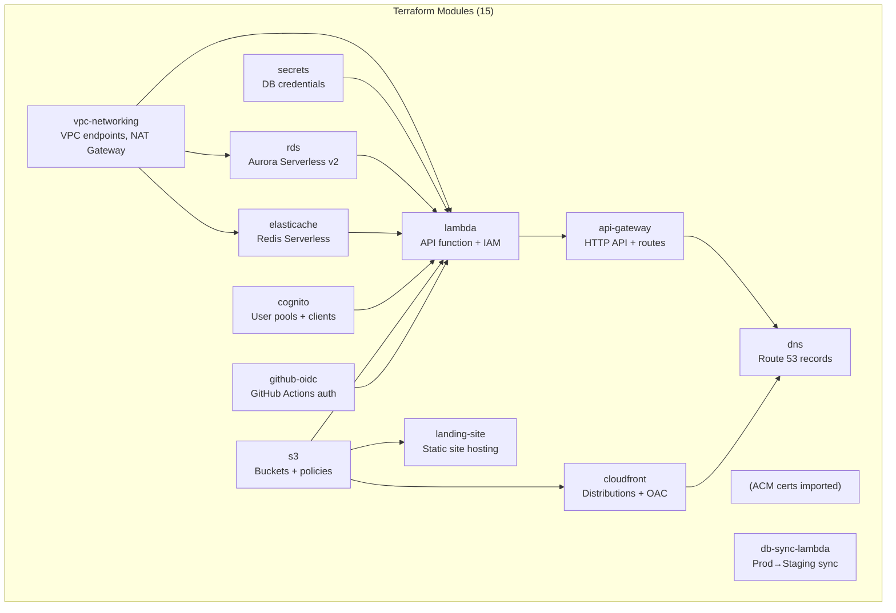
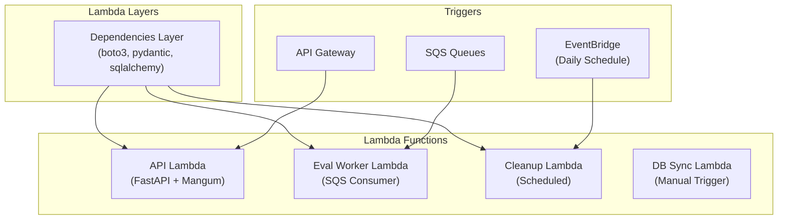
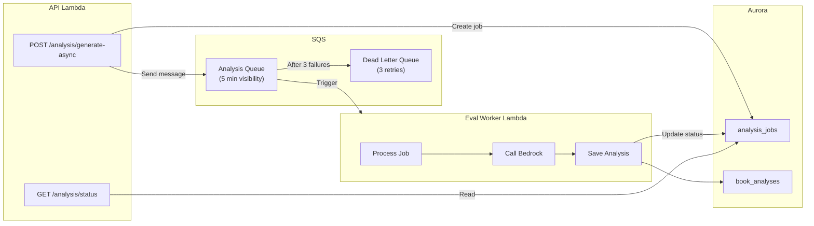
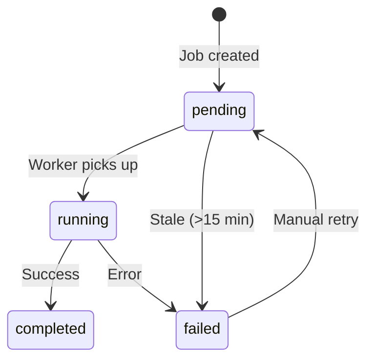
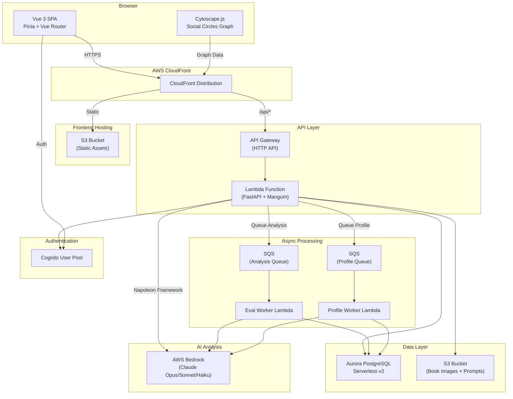
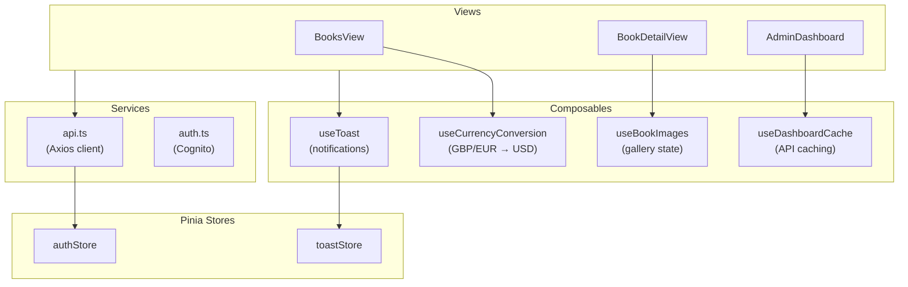
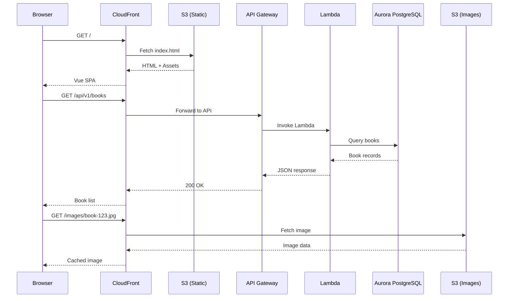
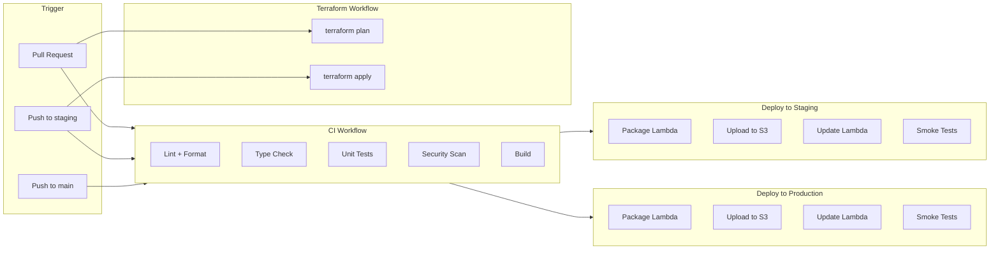
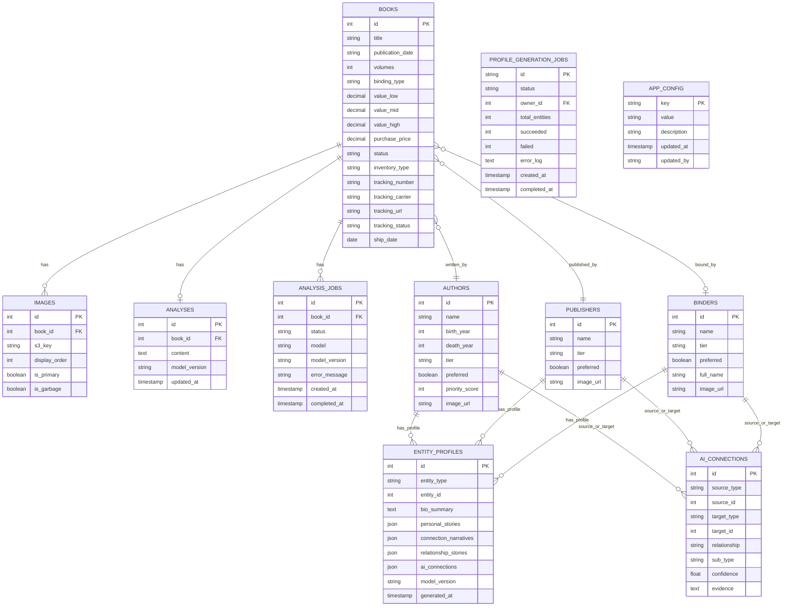
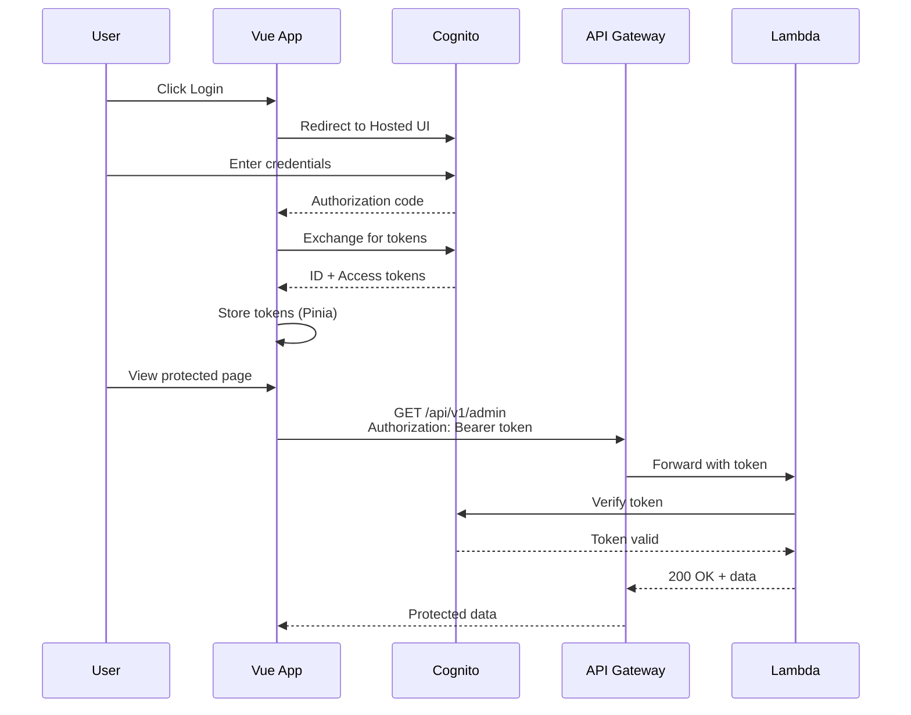

# BlueMoxon Architecture

## System Overview

BlueMoxon is a serverless book collection management application deployed on AWS with a dual-environment (staging + production) architecture managed by Terraform.

```text
                    ┌─────────────────────────────────────────────┐
                    │          Route 53 (bluemoxon.com)           │
                    └───────────────────┬─────────────────────────┘
                                        │
              ┌─────────────────────────┴─────────────────────────┐
              │                                                    │
    ┌─────────▼─────────┐                          ┌──────────────▼──────────────┐
    │    CloudFront     │                          │         CloudFront          │
    │   (Landing Site)  │                          │         (Vue 3 SPA)         │
    │ bluemoxon.com     │                          │     app.bluemoxon.com       │
    └─────────┬─────────┘                          └──────────────┬──────────────┘
              │                                                    │
    ┌─────────▼─────────┐                          ┌──────────────▼──────────────┐
    │   S3 Bucket       │                          │        S3 Bucket            │
    │ (Landing HTML)    │                          │      (Vue SPA Assets)       │
    └───────────────────┘                          └─────────────────────────────┘

              ┌────────────────────────────────────────────────────┐
              │              API Gateway HTTP API                  │
              │              api.bluemoxon.com                     │
              └───────────────────────┬────────────────────────────┘
                                      │
              ┌───────────────────────▼────────────────────────────┐
              │                  Lambda Function                    │
              │               FastAPI + Mangum                      │
              │                  Python 3.12                        │
              └───────────────────────┬────────────────────────────┘
                                      │
        ┌─────────────────────────────┼─────────────────────────────┐
        │                             │                             │
┌───────▼───────┐           ┌─────────▼─────────┐          ┌───────▼───────┐
│   Cognito     │           │   Aurora Sv2       │          │   S3 Bucket   │
│  User Pool    │           │   PostgreSQL 16    │          │ (Book Images) │
│ (MFA + Roles) │           │   (Private VPC)    │          │  + Prompts    │
└───────────────┘           └───────────────────┘          └───────────────┘
        │                             │                            │
        │                   ┌─────────▼─────────┐          ┌───────▼───────┐
        │                   │  Secrets Manager   │          │   Bedrock     │
        │                   │  (DB Credentials)  │          │ (Claude 4.5)  │
        │                   └───────────────────┘          │ Napoleon AI   │
        │                                                  └───────────────┘
        │                   ┌───────────────────┐
        │                   │  ElastiCache      │
        │                   │  Redis Serverless │
        │                   │  (Dashboard Cache)│
        │                   └───────────────────┘
```

## Environments

| Environment | Frontend | API | Purpose |
|-------------|----------|-----|---------|
| **Production** | app.bluemoxon.com | api.bluemoxon.com | Live users |
| **Staging** | staging.app.bluemoxon.com | staging.api.bluemoxon.com | Testing before prod |

Both environments are deployed via Terraform with isolated resources (separate Cognito pools, databases, S3 buckets).

## Key Decisions

| Decision | Choice | Rationale |
|----------|--------|-----------|
| Compute | AWS Lambda + Layers | Cost-effective for low traffic, layers for shared dependencies |
| Database | Aurora Serverless v2 | PostgreSQL for full-text search, scales to zero |
| Auth | Cognito + MFA | Managed auth, built-in 2FA, admin invite only |
| AI Analysis | AWS Bedrock (Opus/Sonnet/Haiku) | Napoleon valuations, entity profiles, order extraction |
| Async Jobs | SQS + Worker Lambda | Decoupled analysis generation, retry handling |
| Frontend | Vue 3 + Vite + Tailwind v4 | User preference, modern tooling, CSS-first configuration |
| Backend | FastAPI | Fast, modern Python, auto-generated docs |
| IaC | **Terraform** | Declarative, well-documented, dual-environment support |

## Terraform Modules

Infrastructure is managed via 15 Terraform modules in `infra/terraform/modules/`:



### Module Responsibilities

| Module | Resources Created |
|--------|-------------------|
| `api-gateway` | HTTP API, custom domain, routes |
| `cloudfront` | Distribution, OAC, cache policies |
| `cognito` | User pool, app client, domain |
| `db-sync-lambda` | Lambda for prod→staging data sync |
| `dns` | Route 53 A/AAAA records |
| `elasticache` | Redis Serverless cache, security group |
| `github-oidc` | OIDC provider, IAM role for GitHub Actions |
| `lambda` | Function, IAM role, VPC config |
| `landing-site` | S3 + CloudFront for marketing site |
| `rds` | Aurora cluster, subnet group, security group |
| `s3` | Buckets for frontend, images, logs |
| `secrets` | Secrets Manager secret + IAM policy |
| `vpc-networking` | VPC endpoints, NAT gateway, route tables |
| `lambda-layers` | Shared Python dependencies layer |
| `sqs` | Analysis and eval runbook job queues |
| `cleanup-lambda` | Database maintenance Lambda |
| `eval-worker-lambda` | Async analysis/eval processing |

## Lambda Architecture

BlueMoxon uses multiple Lambda functions with shared dependency layers:



### Lambda Functions

| Function | Purpose | Trigger | Memory | Timeout |
|----------|---------|---------|--------|---------|
| **API** | FastAPI REST endpoints | API Gateway | 512 MB | 30s |
| **Eval Worker** | Napoleon analysis generation | SQS | 1024 MB | 10 min |
| **Profile Worker** | Entity profile generation (BMX 3.0) | SQS | 1024 MB | 10 min |
| **Cleanup** | Database maintenance, orphan cleanup | EventBridge (daily) | 256 MB | 5 min |
| **DB Sync** | Copy prod data to staging | Manual | 512 MB | 15 min |

### Lambda Layers

Shared dependencies are packaged in a Lambda Layer to reduce deployment size and cold start time:

```text
bluemoxon-deps-layer/
├── python/
│   └── lib/
│       └── python3.12/
│           └── site-packages/
│               ├── boto3/
│               ├── pydantic/
│               ├── sqlalchemy/
│               └── ...
```

**Layer benefits:**

- Reduces API Lambda package from ~80MB to ~5MB
- Shared across all Lambdas (deploy once)
- Faster cold starts (cached by AWS)
- Independent versioning (update deps without code changes)

## SQS Job Processing

Async analysis generation uses SQS for reliability and decoupling:



### SQS Queues

| Queue | Purpose | Visibility | DLQ Retries |
|-------|---------|------------|-------------|
| `analysis-jobs` | Napoleon analysis generation | 5 min | 3 |
| `eval-runbook-jobs` | Evaluation runbook generation | 5 min | 3 |
| `profile-generation` | Entity profile generation (BMX 3.0) | 5 min | 3 |

### Job States



## Application Architecture



## Frontend Architecture

The Vue 3 frontend uses Composition API with shared composables for state management and reusable logic.

### Composable Architecture



### Key Composables

| Composable | Purpose | Features |
|------------|---------|----------|
| `useToast` | Toast notifications | Auto-dismiss, duplicate suppression, hover-to-pause |
| `useDashboardCache` | Dashboard API caching | 5-minute TTL, batch endpoint |
| `useCurrencyConversion` | Currency conversion | Memoized calculations, reactive rates |
| `useBookImages` | Image gallery state | Lightbox, reordering, lazy loading |

### Component Structure

BookDetailView was refactored (#807) into focused sub-components:

```text
BookDetailView/
├── BookDetailView.vue      # Container + routing
├── BookHeader.vue          # Title, status, metadata
├── BookImages.vue          # Gallery + lightbox
├── BookAnalysis.vue        # Napoleon analysis viewer
├── BookScoring.vue         # Investment score breakdown
└── BookActions.vue         # Status changes, edit, delete
```

## Request Flow



## CI/CD Pipeline



## Data Model



### Entity Scoring

Reference entities (Authors, Publishers, Binders) support:

- **Tiers**: TIER_1 (+15 pts), TIER_2 (+10 pts), TIER_3 (+5 pts)
- **Preferred**: +10 pts bonus for preferred entities

### Tracking Status Values

Books with `status=IN_TRANSIT` can have tracking information:

- `pending` - Label created
- `in_transit` - Package in transit
- `out_for_delivery` - Out for delivery
- `delivered` - Delivered
- `exception` - Delivery issue

## Authentication Flow



## Cost Estimate

| Service | Monthly Cost |
|---------|--------------|
| Aurora Serverless v2 (0.5-2 ACU) | $15-25 |
| Lambda + API Gateway | $1-3 |
| S3 (frontend + images) | $2-3 |
| CloudFront | $2-5 |
| Route 53 + domain | $1-2 |
| Secrets Manager | $1 |
| NAT Gateway | $5-10 |
| **Total** | **$27-49** |

## Security

- **Authentication:** Cognito with required TOTP MFA
- **Authorization:** Role-based (admin/editor/viewer)
- **Encryption:** Aurora and S3 encrypted at rest
- **Network:** Aurora in isolated subnets, Lambda in private subnets with VPC endpoints
- **Transit:** HTTPS enforced via CloudFront
- **API:** JWT validation, Pydantic input validation, rate limiting
- **IaC:** No hardcoded secrets, Secrets Manager integration

## Admin Panel

The Admin Settings page (accessible via profile dropdown for admin users) provides:

### User Management

- **Invite Users:** Send email invitations via Cognito with temporary passwords
- **Role Management:** Assign viewer/editor/admin roles
- **MFA Control:** Enable/disable MFA for users (pool-level MFA required)
- **Password Reset:** Admin can reset any user's password
- **User Impersonation:** Generate temp credentials to test as another user
- **Delete Users:** Remove users from both Cognito and database

### API Key Management

- **Create Keys:** Generate API keys for programmatic access
- **Key Security:** Keys are hashed (SHA-256) before storage; shown only once
- **Revoke Keys:** Deactivate keys without deleting records
- **Audit Trail:** Track last_used_at for each key

### Role-Based Access

| Feature | Viewer | Editor | Admin |
|---------|--------|--------|-------|
| View books/images | Yes | Yes | Yes |
| Edit books/analyses | No | Yes | Yes |
| Upload/reorder images | No | Yes | Yes |
| User management | No | No | Yes |
| API key management | No | No | Yes |

## Viewing Diagrams

These Mermaid diagrams render in:

- **GitHub**: Automatically in markdown preview
- **VS Code**: With Mermaid extension
- **Mermaid Live Editor**: <https://mermaid.live>

---

*Last Updated: February 2026*
