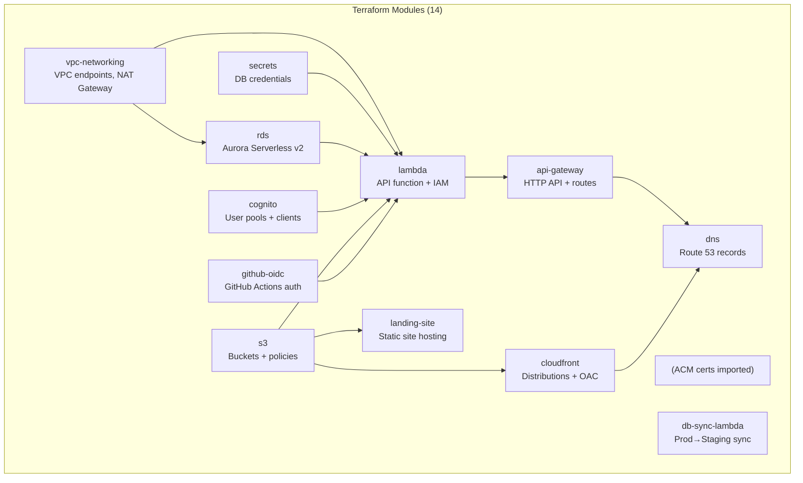
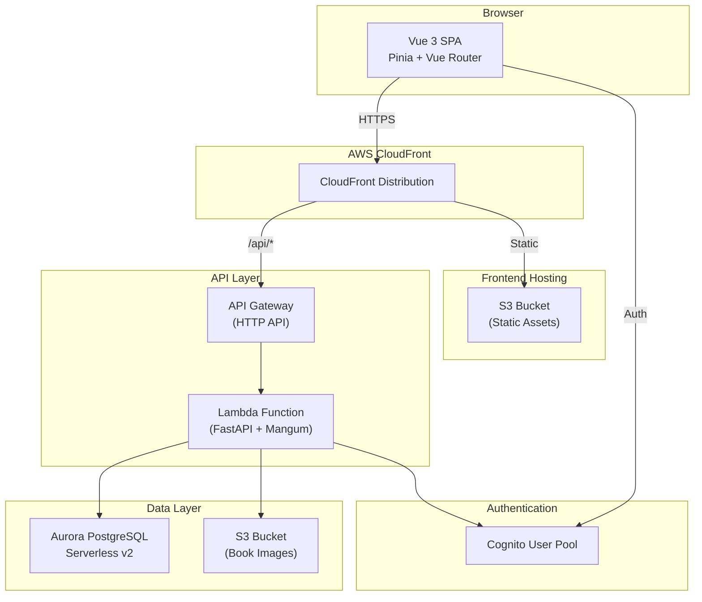
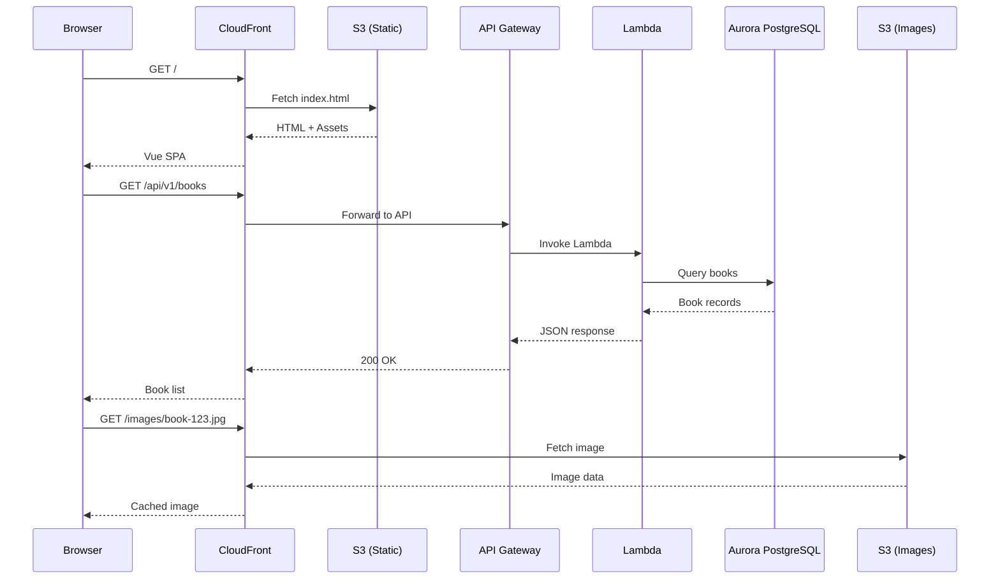
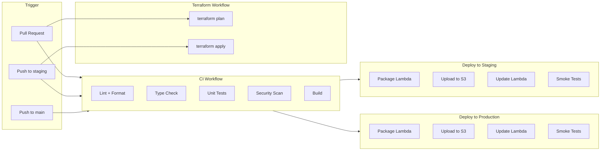
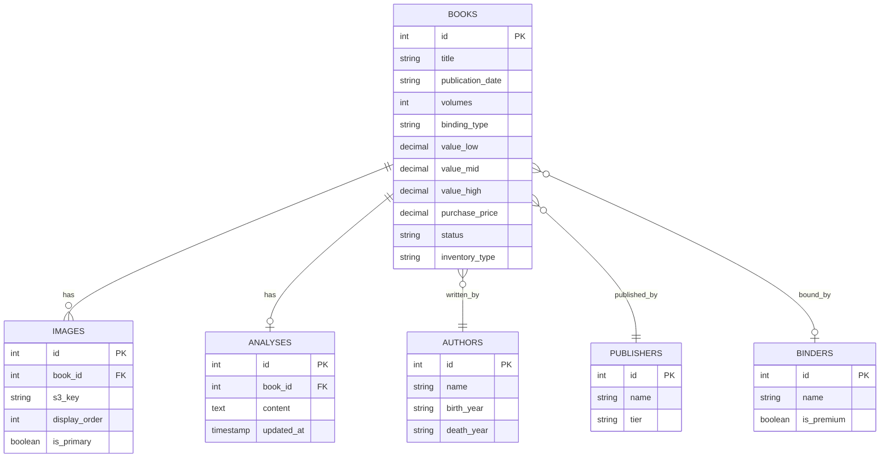
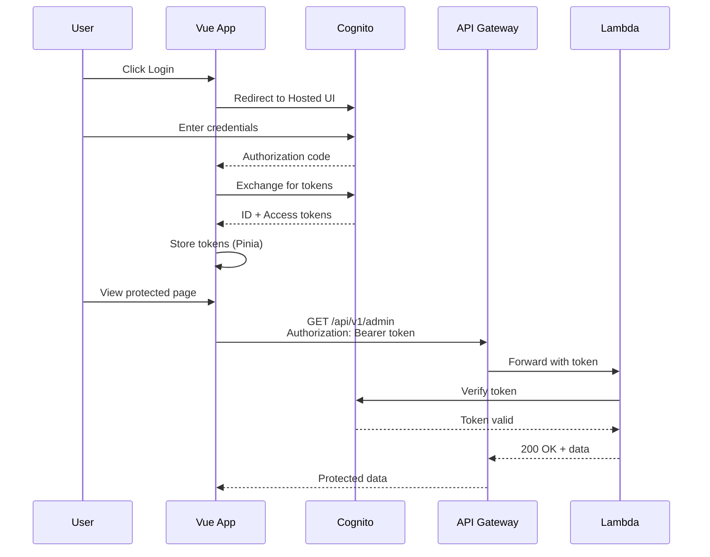

# BlueMoxon Architecture

## System Overview

BlueMoxon is a serverless book collection management application deployed on AWS with a dual-environment (staging + production) architecture managed by Terraform.

```
                    ┌─────────────────────────────────────────────┐
                    │          Route 53 (bluemoxon.com)           │
                    └───────────────────┬─────────────────────────┘
                                        │
              ┌─────────────────────────┴─────────────────────────┐
              │                                                    │
    ┌─────────▼─────────┐                          ┌──────────────▼──────────────┐
    │    CloudFront     │                          │         CloudFront          │
    │   (Landing Site)  │                          │         (Vue 3 SPA)         │
    │ bluemoxon.com     │                          │     app.bluemoxon.com       │
    └─────────┬─────────┘                          └──────────────┬──────────────┘
              │                                                    │
    ┌─────────▼─────────┐                          ┌──────────────▼──────────────┐
    │   S3 Bucket       │                          │        S3 Bucket            │
    │ (Landing HTML)    │                          │      (Vue SPA Assets)       │
    └───────────────────┘                          └─────────────────────────────┘

              ┌────────────────────────────────────────────────────┐
              │              API Gateway HTTP API                  │
              │              api.bluemoxon.com                     │
              └───────────────────────┬────────────────────────────┘
                                      │
              ┌───────────────────────▼────────────────────────────┐
              │                  Lambda Function                    │
              │               FastAPI + Mangum                      │
              │                  Python 3.12                        │
              └───────────────────────┬────────────────────────────┘
                                      │
        ┌─────────────────────────────┼─────────────────────────────┐
        │                             │                             │
┌───────▼───────┐           ┌─────────▼─────────┐          ┌───────▼───────┐
│   Cognito     │           │   Aurora Sv2       │          │   S3 Bucket   │
│  User Pool    │           │   PostgreSQL 16    │          │ (Book Images) │
│ (MFA + Roles) │           │   (Private VPC)    │          │               │
└───────────────┘           └───────────────────┘          └───────────────┘
                                      │
                            ┌─────────▼─────────┐
                            │  Secrets Manager   │
                            │  (DB Credentials)  │
                            └───────────────────┘
```

## Environments

| Environment | Frontend | API | Purpose |
|-------------|----------|-----|---------|
| **Production** | app.bluemoxon.com | api.bluemoxon.com | Live users |
| **Staging** | staging.app.bluemoxon.com | staging.api.bluemoxon.com | Testing before prod |

Both environments are deployed via Terraform with isolated resources (separate Cognito pools, databases, S3 buckets).

## Key Decisions

| Decision | Choice | Rationale |
|----------|--------|-----------|
| Compute | AWS Lambda | Cost-effective for low traffic, cold starts acceptable |
| Database | Aurora Serverless v2 | PostgreSQL for full-text search, scales to zero |
| Auth | Cognito + MFA | Managed auth, built-in 2FA, admin invite only |
| Frontend | Vue 3 + Vite | User preference, modern tooling |
| Backend | FastAPI | Fast, modern Python, auto-generated docs |
| IaC | **Terraform** | Declarative, well-documented, dual-environment support |

## Terraform Modules

Infrastructure is managed via 14 Terraform modules in `infra/terraform/modules/`:



### Module Responsibilities

| Module | Resources Created |
|--------|-------------------|
| `api-gateway` | HTTP API, custom domain, routes |
| `cloudfront` | Distribution, OAC, cache policies |
| `cognito` | User pool, app client, domain |
| `db-sync-lambda` | Lambda for prod→staging data sync |
| `dns` | Route 53 A/AAAA records |
| `github-oidc` | OIDC provider, IAM role for GitHub Actions |
| `lambda` | Function, IAM role, VPC config |
| `landing-site` | S3 + CloudFront for marketing site |
| `rds` | Aurora cluster, subnet group, security group |
| `s3` | Buckets for frontend, images, logs |
| `secrets` | Secrets Manager secret + IAM policy |
| `vpc-networking` | VPC endpoints, NAT gateway, route tables |

## Application Architecture



## Request Flow



## CI/CD Pipeline



## Data Model



## Authentication Flow



## Cost Estimate

| Service | Monthly Cost |
|---------|--------------|
| Aurora Serverless v2 (0.5-2 ACU) | $15-25 |
| Lambda + API Gateway | $1-3 |
| S3 (frontend + images) | $2-3 |
| CloudFront | $2-5 |
| Route 53 + domain | $1-2 |
| Secrets Manager | $1 |
| NAT Gateway | $5-10 |
| **Total** | **$27-49** |

## Security

- **Authentication:** Cognito with required TOTP MFA
- **Authorization:** Role-based (admin/editor/viewer)
- **Encryption:** Aurora and S3 encrypted at rest
- **Network:** Aurora in isolated subnets, Lambda in private subnets with VPC endpoints
- **Transit:** HTTPS enforced via CloudFront
- **API:** JWT validation, Pydantic input validation, rate limiting
- **IaC:** No hardcoded secrets, Secrets Manager integration

## Admin Panel

The Admin Settings page (accessible via profile dropdown for admin users) provides:

### User Management
- **Invite Users:** Send email invitations via Cognito with temporary passwords
- **Role Management:** Assign viewer/editor/admin roles
- **MFA Control:** Enable/disable MFA for users (pool-level MFA required)
- **Password Reset:** Admin can reset any user's password
- **User Impersonation:** Generate temp credentials to test as another user
- **Delete Users:** Remove users from both Cognito and database

### API Key Management
- **Create Keys:** Generate API keys for programmatic access
- **Key Security:** Keys are hashed (SHA-256) before storage; shown only once
- **Revoke Keys:** Deactivate keys without deleting records
- **Audit Trail:** Track last_used_at for each key

### Role-Based Access

| Feature | Viewer | Editor | Admin |
|---------|--------|--------|-------|
| View books/images | Yes | Yes | Yes |
| Edit books/analyses | No | Yes | Yes |
| Upload/reorder images | No | Yes | Yes |
| User management | No | No | Yes |
| API key management | No | No | Yes |

## Viewing Diagrams

These Mermaid diagrams render in:
- **GitHub**: Automatically in markdown preview
- **VS Code**: With Mermaid extension
- **Mermaid Live Editor**: https://mermaid.live

---

*Last Updated: December 2025*
