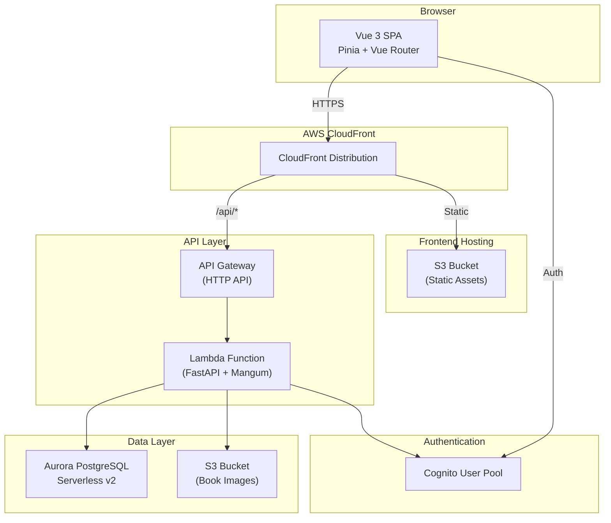
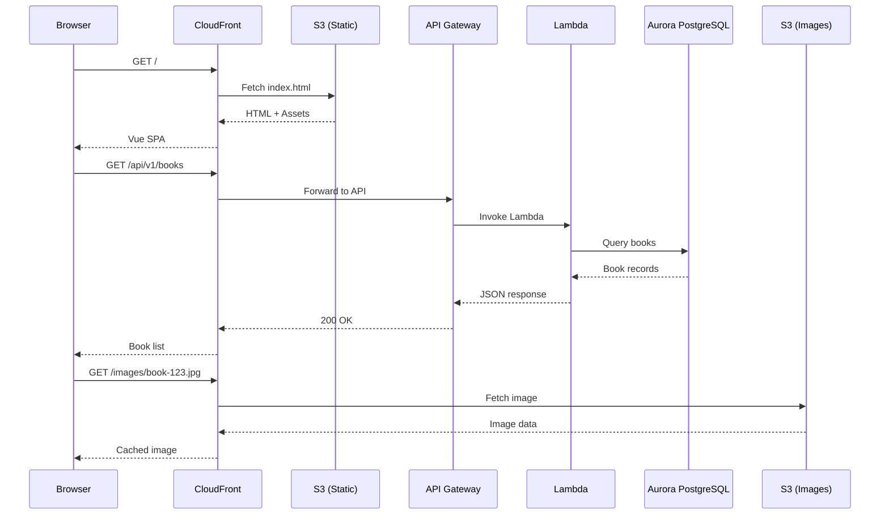
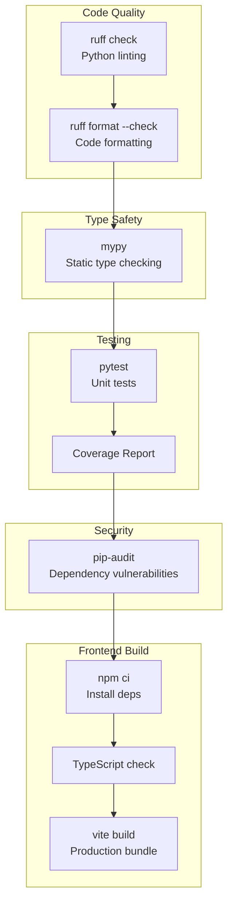
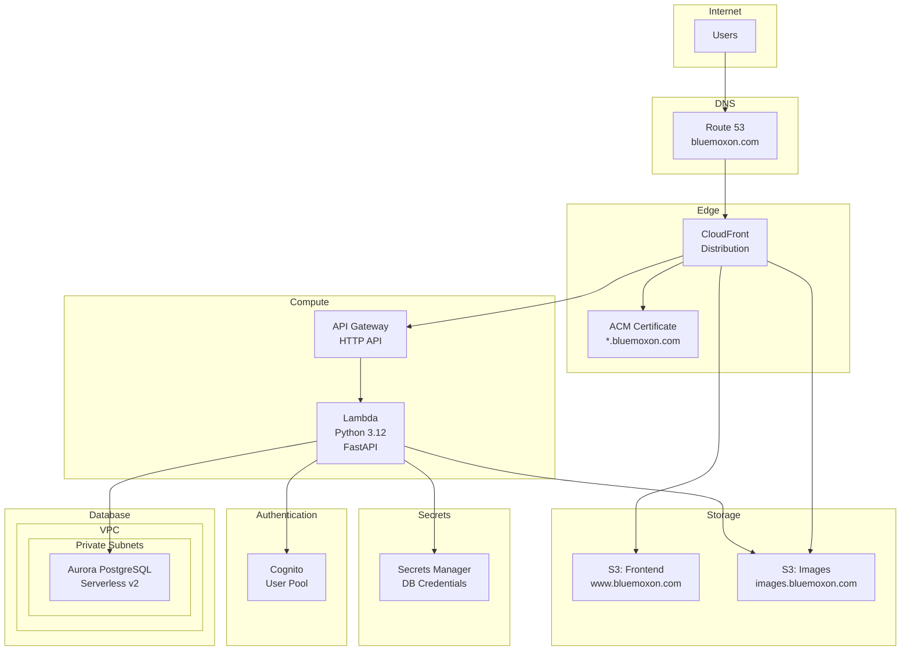
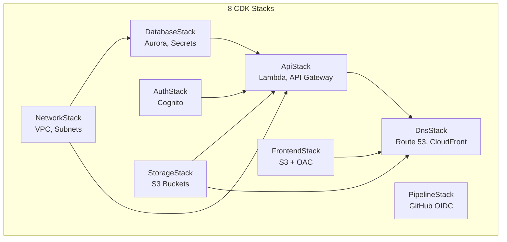
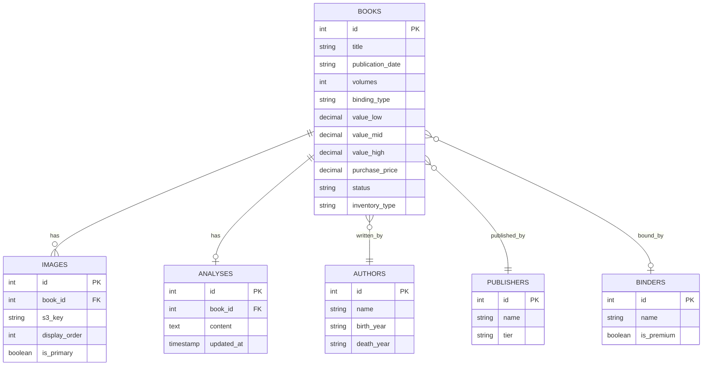
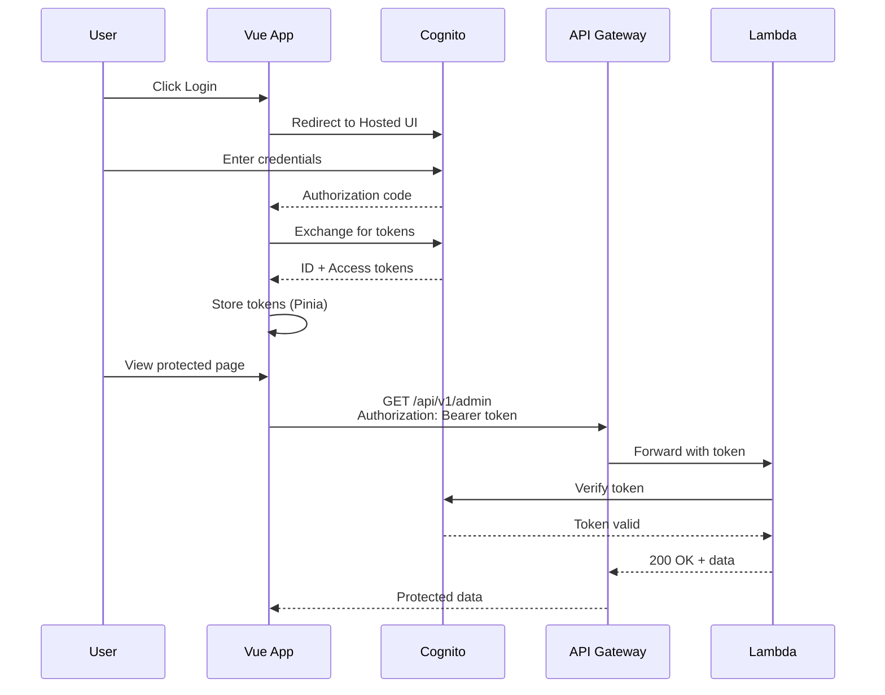

# BlueMoxon Architecture Diagrams

## 1. Application Architecture



## 2. Request Flow



## 3. CI/CD Pipeline

```mermaid
flowchart LR
    subgraph Trigger["Trigger"]
        Push["Push to main"]
        PR["Pull Request"]
    end

    subgraph CI["CI Workflow (ci.yml)"]
        Lint["Lint<br/>ruff check"]
        TypeCheck["Type Check<br/>mypy"]
        Test["Unit Tests<br/>pytest"]
        Security["Security Scan<br/>pip-audit"]
        Build["Build Frontend<br/>npm run build"]
    end

    subgraph Deploy["Deploy Workflow (deploy.yml)"]
        Package["Package Lambda<br/>zip backend"]
        CDK["CDK Deploy<br/>8 stacks"]
        Upload["Upload Frontend<br/>S3 sync"]
        Invalidate["Invalidate Cache<br/>CloudFront"]
        Smoke["Smoke Test<br/>Health check"]
    end

    subgraph AWS["AWS"]
        Prod["Production<br/>Environment"]
    end

    Push --> CI
    PR --> CI
    Lint --> TypeCheck
    TypeCheck --> Test
    Test --> Security
    Security --> Build
    Build -->|main only| Deploy
    Package --> CDK
    CDK --> Upload
    Upload --> Invalidate
    Invalidate --> Smoke
    Smoke --> Prod
```



## 4. CI Checks Detail



## 5. AWS Infrastructure



## 6. CDK Stack Dependencies



## 7. Data Model



## 8. Authentication Flow



---

## Viewing These Diagrams

These Mermaid diagrams can be rendered in:
- **GitHub**: Automatically renders in markdown preview
- **VS Code**: With Mermaid extension
- **Mermaid Live Editor**: https://mermaid.live
- **Obsidian**: Native Mermaid support
- **Notion**: Paste code blocks with mermaid language

To export as images, use:
```bash
# Install mermaid-cli
npm install -g @mermaid-js/mermaid-cli

# Convert to PNG
mmdc -i ARCHITECTURE_DIAGRAMS.md -o diagrams/
```
