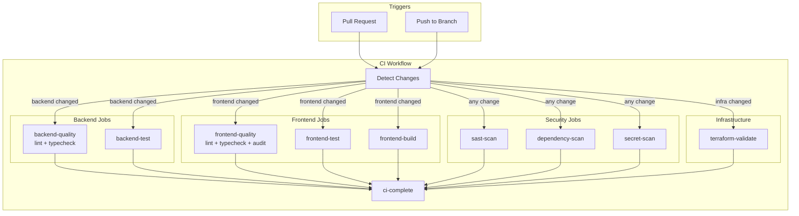
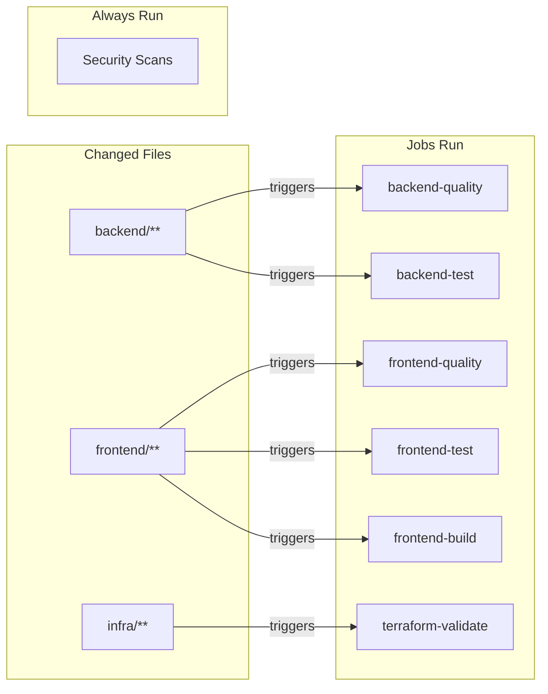
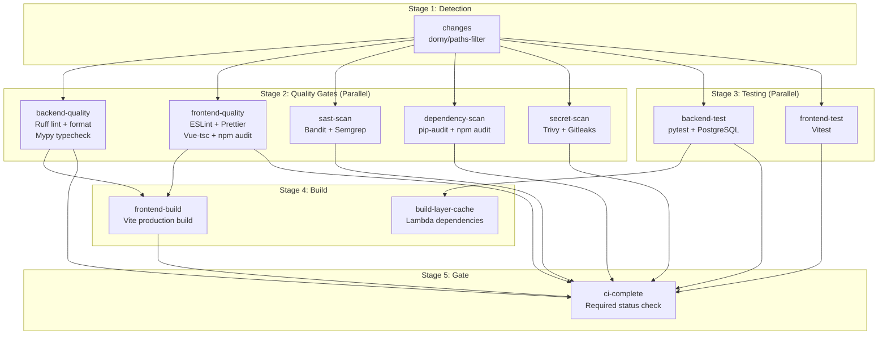
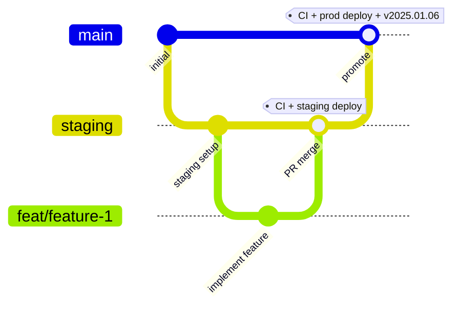
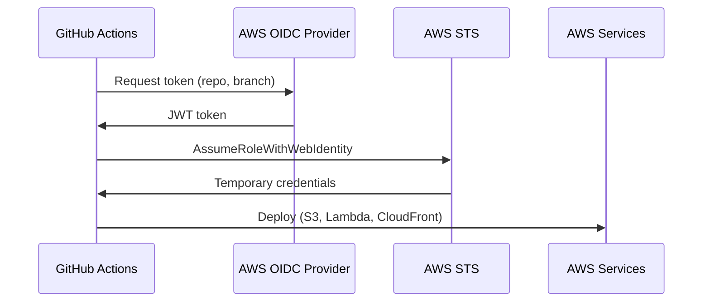

# CI/CD Pipeline

BlueMoxon uses GitHub Actions for continuous integration and deployment with a staging-first approach. The pipeline is optimized for speed through path-based filtering and parallel execution.

## Pipeline Architecture



## Path-Based Filtering

The CI workflow uses `dorny/paths-filter` to skip irrelevant jobs, reducing average CI time significantly.



**Path Filters:**
| Filter | Paths | Jobs Triggered |
|--------|-------|----------------|
| `backend` | `backend/**`, `poetry.lock`, `pyproject.toml` | backend-quality, backend-test |
| `frontend` | `frontend/**`, `package*.json` | frontend-quality, frontend-test, frontend-build |
| `infra` | `infra/**` | terraform-validate |

## CI Workflow (`ci.yml`)

Runs on all pull requests to `staging` or `main`. Jobs run in parallel where possible.



**Consolidated Jobs:**

| Job | Combines | Runs If |
|-----|----------|---------|
| `backend-quality` | lint + typecheck | backend changed |
| `frontend-quality` | lint + typecheck + npm audit | frontend changed |
| `build-layer-cache` | Lambda layer caching | backend changed |

## Deploy Workflow (`deploy.yml`)

Runs on push to `main`. Uses parallel Lambda deployment for ~50% faster deploys.

```mermaid
flowchart TB
    subgraph "Stage 1: CI"
        CI[ci workflow<br/>All quality gates]
    end

    subgraph "Stage 2: Build (Parallel)"
        BL[build-layer<br/>Lambda dependencies<br/>~60s]
        BF[build-frontend<br/>Vite build<br/>~45s]
    end

    subgraph "Stage 3: Deploy Layer"
        DL[deploy-layer<br/>Upload to S3<br/>~15s]
    end

    subgraph "Stage 4: Deploy Lambdas (Parallel)"
        DA[deploy-api-lambda<br/>Main API]
        DW[deploy-workers<br/>Analysis worker]
        DU[deploy-utility-lambdas<br/>Scraper, Archiver,<br/>Migration]
    end

    subgraph "Stage 5: Deploy Frontend"
        DF[deploy-frontend<br/>S3 + CloudFront]
    end

    subgraph "Stage 6: Validate"
        SM[smoke-test<br/>Health, API, Frontend]
        TAG[tag-release<br/>v{date}-{sha}]
    end

    CI --> BL & BF
    BL --> DL
    DL --> DA & DW & DU
    BF --> DF
    DA & DW & DU & DF --> SM
    SM --> TAG
```

**Parallel Deploy Benefits:**
- Previous: Sequential Lambda deploys (~7 min total)
- Current: Parallel deploys (~3-4 min total)
- Layer deployed once, shared across all Lambdas

## Branch Strategy



| Branch | Purpose | Protection | Deploy Target |
|--------|---------|------------|---------------|
| `main` | Production code | Requires PR + CI | app.bluemoxon.com |
| `staging` | Staging environment | Requires CI only | staging.app.bluemoxon.com |
| `feat/*` | Feature development | None | None |

### Workflow

1. Create feature branch from `staging`
2. Open PR targeting `staging`
3. CI runs, merge when passing
4. Deploy to staging automatically
5. Validate in staging environment
6. Open PR from `staging` to `main`
7. Merge to deploy to production

## AWS Authentication

We use AWS OIDC (OpenID Connect) for secure, keyless authentication. No long-lived AWS credentials are stored in GitHub.



### GitHub Secrets

| Secret | Purpose | Environment |
|--------|---------|-------------|
| `AWS_DEPLOY_ROLE_ARN` | Production deploy role ARN | production |
| `AWS_STAGING_DEPLOY_ROLE_ARN` | Staging deploy role ARN | staging |

### GitHub Environments

| Environment | Branch Restriction | Purpose |
|-------------|-------------------|---------|
| `production` | `main` only | Production deploys |
| `staging` | `staging` only | Staging deploys |

## Security Scanning

The CI pipeline includes comprehensive security scanning that **blocks deployment** on failures.

### Security Gates (All Blocking)

| Category | Tools | Blocks Deployment |
|----------|-------|-------------------|
| **SAST** | Bandit, Semgrep, Ruff (S rules) | Yes |
| **Dependency Scan** | pip-audit (Python), npm audit (Node.js) | Yes |
| **Secret Detection** | Trivy, Gitleaks | Yes |

### SAST (Static Application Security Testing)

**Bandit** - Python-specific security scanner
- Checks for common security issues (SQL injection, hardcoded passwords, etc.)
- Runs on all Python code in `app/`
- Fails on HIGH severity issues

**Semgrep** - Multi-language SAST
- Rules: `p/python`, `p/javascript`, `p/typescript`, `p/security-audit`, `p/owasp-top-ten`
- Covers Python, JavaScript/TypeScript, Vue templates
- Checks for OWASP Top 10 vulnerabilities

### Suppressing False Positives

```python
# Bandit
password = "test"  # nosec B105

# Ruff
local_path = "/tmp/test"  # noqa: S108

# Both
value = "/tmp/data"  # noqa: S108 # nosec B108
```

## Smoke Tests

After deployment, automated smoke tests verify:

1. **API Health** - `GET /api/v1/health/deep` returns 200
2. **Books API** - `GET /api/v1/books` returns valid pagination
3. **API Schema Validation** - Required fields exist on book responses
4. **Data Integrity** - Validates source_url format, purchase_price values
5. **Frontend** - App loads with expected content
6. **Images** - Image URLs return proper `Content-Type: image/*`

If smoke tests fail:
- The workflow is marked as failed
- Changes are live (no automatic rollback)
- Check `gh run view <id> --log-failed` for details
- Manual rollback may be needed

## Version System

Version is **auto-generated at deploy time**:
- Format: `YYYY.MM.DD-<short-sha>` (e.g., `2025.12.06-9b22b0a`)
- Visible via `X-App-Version` response header
- Visible at `/api/v1/health/version` endpoint
- Git tag created on successful production deploy

## Dependency Updates

Dependabot creates PRs targeting `staging` branch:

| Ecosystem | Schedule | Target Branch |
|-----------|----------|---------------|
| Python (pip) | Weekly (Monday) | staging |
| npm | Weekly (Monday) | staging |
| GitHub Actions | Weekly (Monday) | staging |

Updates flow: Dependabot PR → staging → test → promote to main

## Files

```
.github/
├── workflows/
│   ├── ci.yml              # CI checks with path filtering
│   ├── deploy.yml          # Production deploy (parallel)
│   ├── deploy-staging.yml  # Staging deploy
│   ├── deploy-site.yml     # Marketing site deploy
│   └── terraform.yml       # Infrastructure plan
├── dependabot.yml          # Dependency updates (targets staging)
```

## Troubleshooting

### CI Failing

1. Check the workflow run in GitHub Actions
2. Review specific job logs for errors
3. Common issues:
   - Lint errors: Run `poetry run ruff check . --fix` locally
   - Type errors: Run `npm run type-check` locally
   - Test failures: Run `poetry run pytest -v` locally

### Deploy Failing

1. Check OIDC role permissions in AWS IAM
2. Verify deploy role ARN secret is correct
3. Check CloudWatch logs for Lambda errors
4. Verify S3 bucket permissions

### Smoke Tests Failing

1. Wait 30-60 seconds for CloudFront propagation
2. Check API health: `curl https://api.bluemoxon.com/api/v1/health/deep | jq`
3. Check Lambda logs in CloudWatch
4. Verify database connectivity

---

## Related Documents

| Document | Purpose |
|----------|---------|
| [Validation Blueprint](VALIDATION.md) | Detailed linting, testing, formatting rules |
| [Deployment Guide](DEPLOYMENT.md) | Manual deploy procedures |
| [Infrastructure](INFRASTRUCTURE.md) | AWS resources |

---

*Last Updated: January 2026*
