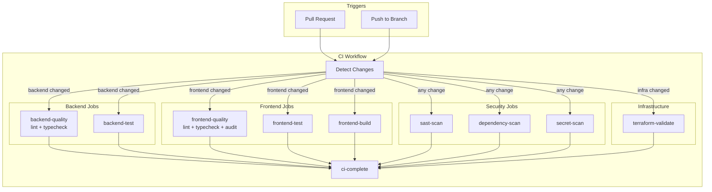
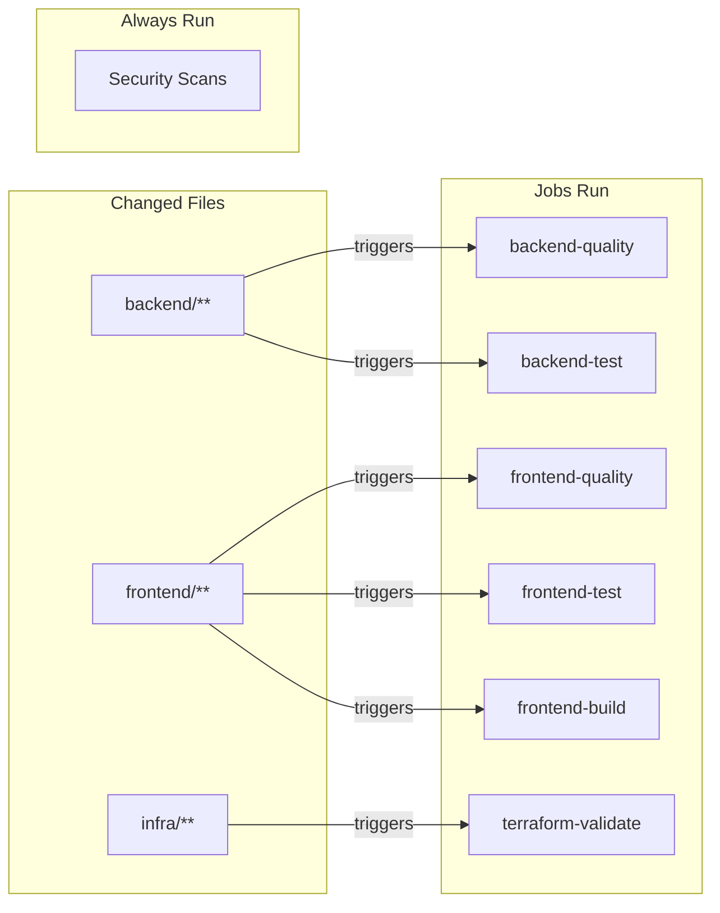
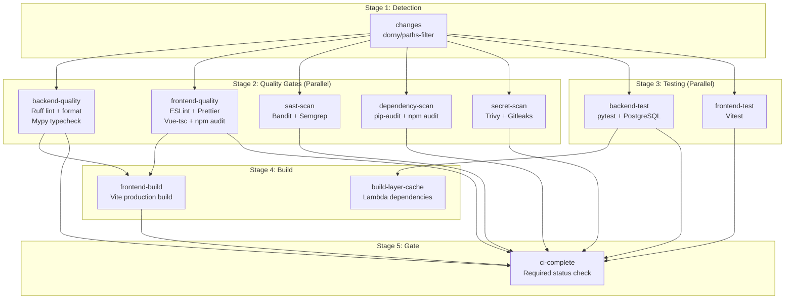
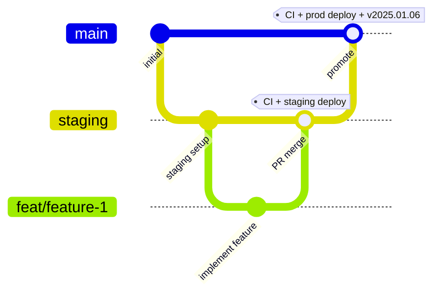
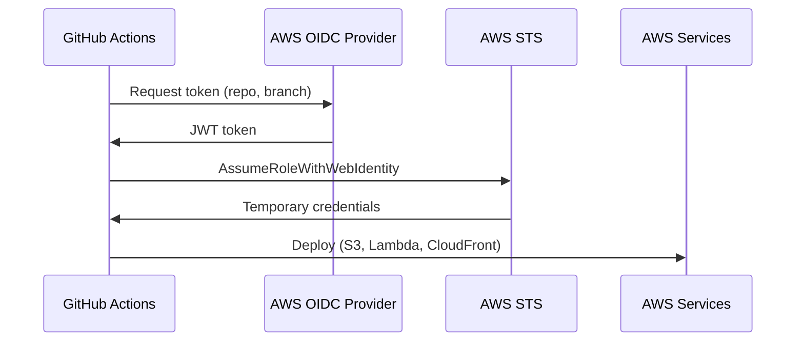
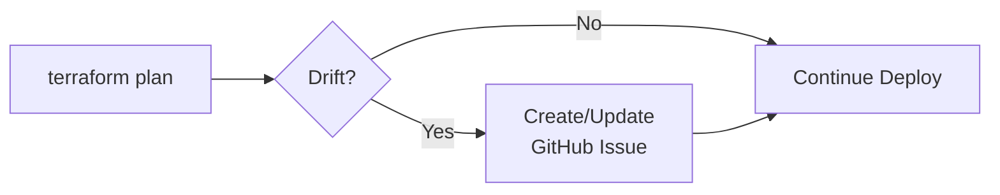

# CI/CD Pipeline

BlueMoxon uses GitHub Actions for continuous integration and deployment with a staging-first approach. The pipeline is optimized for speed through path-based filtering and parallel execution.

## Pipeline Architecture



## Path-Based Filtering

The CI workflow uses `dorny/paths-filter` to skip irrelevant jobs, reducing average CI time significantly.



**Path Filters:**
| Filter | Paths | Jobs Triggered |
|--------|-------|----------------|
| `backend` | `backend/**`, `poetry.lock`, `pyproject.toml` | backend-quality, backend-test |
| `frontend` | `frontend/**`, `package*.json` | frontend-quality, frontend-test, frontend-build |
| `infra` | `infra/**` | terraform-validate |

## CI Workflow (`ci.yml`)

Runs on all pull requests to `staging` or `main`. Jobs run in parallel where possible.



**Consolidated Jobs:**

| Job | Combines | Runs If |
|-----|----------|---------|
| `backend-quality` | lint + typecheck | backend changed |
| `frontend-quality` | lint + typecheck + npm audit | frontend changed |
| `build-layer-cache` | Lambda layer caching | backend changed |

## Deploy Workflow (`deploy.yml`)

**Unified workflow** for both staging and production - deploys based on branch:
- Push to `staging` → deploys to staging environment
- Push to `main` → deploys to production environment

Uses parallel Lambda deployment and smart caching for ~50% faster deploys.

```mermaid
flowchart TB
    subgraph "Stage 1: CI + Detection"
        CI[ci workflow<br/>All quality gates]
        CHG[changes<br/>Path-based filtering]
        CFG[configure<br/>Terraform outputs +<br/>Drift detection]
    end

    subgraph "Stage 2: Build (Parallel)"
        BL[build-layer<br/>Lambda deps<br/>Hash-cached]
        BB[build-backend<br/>Lambda package]
        BF[build-frontend<br/>Vite build]
        BS[build-scraper<br/>Docker image]
    end

    subgraph "Stage 3: Deploy API + Layer"
        DA[deploy-api-lambda<br/>Publishes layer]
    end

    subgraph "Stage 4: Deploy Lambdas (Parallel)"
        DW[deploy-worker-lambda<br/>Analysis]
        DE[deploy-eval-worker-lambda<br/>Eval Runbook]
        DC[deploy-cleanup-lambda<br/>Cleanup]
        DTD[deploy-tracking-dispatcher<br/>Tracking Dispatcher]
        DTW[deploy-tracking-worker<br/>Tracking Worker]
        DSC[deploy-scraper-lambda<br/>Scraper]
    end

    subgraph "Stage 5: Frontend + Migrations"
        DF[deploy-frontend<br/>S3 + CloudFront]
        MIG[run-migrations<br/>DB migrations]
    end

    subgraph "Stage 6: Validate"
        SM[smoke-test<br/>Health, API, Frontend,<br/>Version checks]
        TAG[tag-release<br/>v{date}-{sha}]
    end

    CI --> CHG & CFG
    CHG --> BL & BB & BF & BS
    CFG --> BL & BB & BF & BS
    BL --> DA
    BB --> DA
    DA --> DW & DE & DC & DTD & DTW
    BS --> DSC
    BF --> DF
    DA --> MIG
    DW & DE & DC & DTD & DTW & DSC & DF & MIG --> SM
    SM -->|production only| TAG
```

### Key Features

**Path-Based Filtering:**
Deploy workflow skips unchanged components:
| Path Changes | Jobs Run |
|--------------|----------|
| `backend/**` | All Lambda deploys, migrations |
| `frontend/**` | Frontend deploy only |
| `scraper/**` | Scraper Lambda only |

**Smart Layer Caching:**
- Layer is cached by `requirements.txt` hash
- Unchanged deps → reuses existing layer (saves ~60s)
- Changed deps → rebuilds and publishes new layer

**Pre-Deploy Drift Detection:**
- Runs `terraform plan` before deploying
- If drift detected → creates/updates GitHub issue with label `drift`
- Non-blocking: deployment continues (warn-only mode)

**Parallel Lambda Deploys:**
After API Lambda publishes the shared layer, 6 Lambda functions deploy in parallel:

| Lambda | Purpose |
|--------|---------|
| `deploy-worker-lambda` | AI analysis worker |
| `deploy-eval-worker-lambda` | Eval runbook generation |
| `deploy-cleanup-lambda` | Orphaned resource cleanup |
| `deploy-tracking-dispatcher` | Shipment tracking dispatcher |
| `deploy-tracking-worker` | Shipment tracking worker |
| `deploy-scraper-lambda` | Web scraper (Docker image) |

**Atomicity Checks:**
Smoke tests detect partial deploy failures - if some Lambda deploys succeeded but others failed, the workflow fails with clear diagnostics.

**Force Full Deploy:**
Manual trigger option to rebuild all components:
```bash
gh workflow run deploy.yml --ref main -f force_full_deploy=true
```

### Performance

| Metric | Before | After |
|--------|--------|-------|
| Lambda deploys | Sequential (~7 min) | Parallel (~3-4 min) |
| Layer rebuild | Always (~60s) | Cached if unchanged |
| Total deploy time | ~10 min | ~5-6 min |

## Branch Strategy



| Branch | Purpose | Protection | Deploy Target |
|--------|---------|------------|---------------|
| `main` | Production code | Requires PR + CI | app.bluemoxon.com |
| `staging` | Staging environment | Requires CI only | staging.app.bluemoxon.com |
| `feat/*` | Feature development | None | None |

### Workflow

1. Create feature branch from `staging`
2. Open PR targeting `staging`
3. CI runs, merge when passing
4. Deploy to staging automatically
5. Validate in staging environment
6. Open PR from `staging` to `main`
7. Merge to deploy to production

## AWS Authentication

We use AWS OIDC (OpenID Connect) for secure, keyless authentication. No long-lived AWS credentials are stored in GitHub.



### GitHub Secrets

| Secret | Purpose | Environment |
|--------|---------|-------------|
| `AWS_DEPLOY_ROLE_ARN` | Production deploy role ARN | production |
| `AWS_STAGING_DEPLOY_ROLE_ARN` | Staging deploy role ARN | staging |

### GitHub Environments

| Environment | Branch Restriction | Purpose |
|-------------|-------------------|---------|
| `production` | `main` only | Production deploys |
| `staging` | `staging` only | Staging deploys |

## Security Scanning

The CI pipeline includes comprehensive security scanning that **blocks deployment** on failures.

### Security Gates (All Blocking)

| Category | Tools | Blocks Deployment |
|----------|-------|-------------------|
| **SAST** | Bandit, Semgrep, Ruff (S rules) | Yes |
| **Dependency Scan** | pip-audit (Python), npm audit (Node.js) | Yes |
| **Secret Detection** | Trivy, Gitleaks | Yes |

### SAST (Static Application Security Testing)

**Bandit** - Python-specific security scanner
- Checks for common security issues (SQL injection, hardcoded passwords, etc.)
- Runs on all Python code in `app/`
- Fails on HIGH severity issues

**Semgrep** - Multi-language SAST
- Rules: `p/python`, `p/javascript`, `p/typescript`, `p/security-audit`, `p/owasp-top-ten`
- Covers Python, JavaScript/TypeScript, Vue templates
- Checks for OWASP Top 10 vulnerabilities

### Suppressing False Positives

```python
# Bandit
password = "test"  # nosec B105

# Ruff
local_path = "/tmp/test"  # noqa: S108

# Both
value = "/tmp/data"  # noqa: S108 # nosec B108
```

## Pre-Deploy Drift Detection

Before deploying, the workflow checks for infrastructure drift:



**How it works:**
1. Runs `terraform plan -detailed-exitcode` against current state
2. If changes detected (exit code 2), creates GitHub issue with:
   - Resources to add/change/destroy
   - Link to workflow run
   - Root cause investigation checklist
3. Deployment continues (warn-only mode)
4. Subsequent deploys update the existing issue with new comments

**Issue labels:** `drift`, `infra`, `priority:high`

**Resolving drift:**
```bash
cd infra/terraform
AWS_PROFILE=bmx-staging terraform apply -var-file=envs/staging.tfvars
```

## Smoke Tests

After deployment, automated smoke tests verify:

1. **Partial Deploy Detection** - Checks all deploy jobs succeeded (atomicity)
2. **API Liveness** - `GET /health` returns 200
3. **Version Validation** - API version matches expected deploy version
4. **Environment Validation** - API environment matches target (staging/production)
5. **Deep Health Check** - `GET /api/v1/health/deep` returns healthy status
6. **Books API** - `GET /api/v1/books` returns valid response
7. **Frontend Loads** - Vue app returns 200
8. **Frontend Config** - JS bundle contains correct version and Cognito client ID
9. **Image Endpoint** - Image URLs return proper `Content-Type: image/*`
10. **Worker Lambda Version** - Analysis worker reports correct version
11. **Scraper Lambda Version** - Scraper reports correct version (if deployed)

If smoke tests fail:
- The workflow is marked as failed
- Changes are live (no automatic rollback)
- Check `gh run view <id> --log-failed` for details
- Manual rollback may be needed

**Partial Deploy Handling:**
If some Lambdas succeeded but others failed, smoke tests detect this and fail with:
```
CRITICAL: Partial deploy detected - some jobs FAILED while others succeeded!
```
Run `force_full_deploy` to restore consistency.

## Version System

Version is **auto-generated at deploy time**:
- Format: `YYYY.MM.DD-<short-sha>` (e.g., `2025.12.06-9b22b0a`)
- Visible via `X-App-Version` response header
- Visible at `/api/v1/health/version` endpoint
- Git tag created on successful production deploy

## Dependency Updates

Dependabot creates PRs targeting `staging` branch:

| Ecosystem | Schedule | Target Branch |
|-----------|----------|---------------|
| Python (pip) | Weekly (Monday) | staging |
| npm | Weekly (Monday) | staging |
| GitHub Actions | Weekly (Monday) | staging |

Updates flow: Dependabot PR → staging → test → promote to main

## Files

```
.github/
├── workflows/
│   ├── ci.yml              # CI checks with path filtering
│   ├── deploy.yml          # Unified deploy (staging + production)
│   ├── deploy-site.yml     # Marketing site deploy
│   └── terraform.yml       # Infrastructure plan
├── dependabot.yml          # Dependency updates (targets staging)
```

**Note:** `deploy.yml` handles both environments - push to `staging` branch deploys to staging, push to `main` deploys to production.

## Troubleshooting

### CI Failing

1. Check the workflow run in GitHub Actions
2. Review specific job logs for errors
3. Common issues:
   - Lint errors: Run `poetry run ruff check . --fix` locally
   - Type errors: Run `npm run type-check` locally
   - Test failures: Run `poetry run pytest -v` locally

### Deploy Failing

1. Check OIDC role permissions in AWS IAM
2. Verify deploy role ARN secret is correct
3. Check CloudWatch logs for Lambda errors
4. Verify S3 bucket permissions

### Smoke Tests Failing

1. Wait 30-60 seconds for CloudFront propagation
2. Check API health: `curl https://api.bluemoxon.com/api/v1/health/deep | jq`
3. Check Lambda logs in CloudWatch
4. Verify database connectivity

---

## Related Documents

| Document | Purpose |
|----------|---------|
| [Validation Blueprint](VALIDATION.md) | Detailed linting, testing, formatting rules |
| [Deployment Guide](DEPLOYMENT.md) | Manual deploy procedures |
| [Infrastructure](INFRASTRUCTURE.md) | AWS resources |

---

*Last Updated: January 7, 2026*
