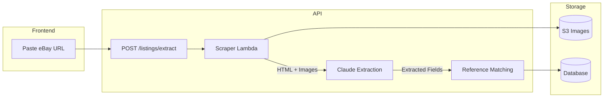
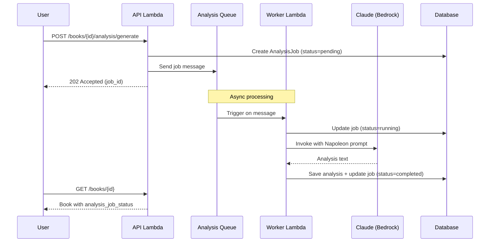
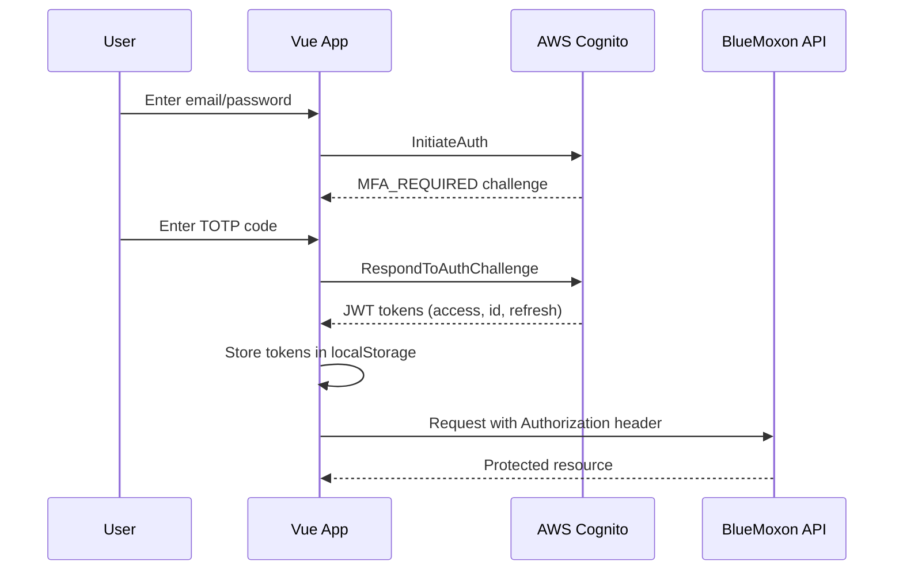

# BlueMoxon 1.2 Features

**BlueMoxon** is a collection management system for antiquarian books, featuring AI-powered valuations, acquisition tracking, and investment scoring.

## What's New in 1.2

### App Shell Architecture
- **Skeleton Loading** - Instant visual feedback while data loads
- **CSS-only Skeletons** - No JavaScript blocking for perceived performance
- **Layout Stability** - Prevents content shift as data arrives

### Dashboard Performance
- **API Batching** - Single `/dashboard/batch` endpoint replaces 6 individual calls
- **Client-side Caching** - `useDashboardCache` composable with 5-minute TTL
- **~40% Faster** - Reduced network round trips

### Vue 3 Composables
- **`useToast`** - Centralized toast notifications with duplicate suppression
- **`useDashboardCache`** - Dashboard data caching
- **`useCurrencyConversion`** - Memoized GBP/EUR to USD conversion

### BookDetailView Refactor
- Split monolithic 800+ line component into focused sub-components
- Improved code splitting and maintainability
- Better memory management for image galleries

### CI/CD Improvements
- **Path-based Filtering** - Skip irrelevant CI jobs (backend-only changes skip frontend checks)
- **Parallel Lambda Deploys** - Deploy time reduced from ~7min to ~3-4min
- **Consolidated Jobs** - Combined lint + typecheck jobs reduce setup overhead

### Code Quality
- **Pre-commit Hooks** - Ruff, ESLint, Prettier, Mypy run before commit
- **Strict TypeScript** - `@typescript-eslint/no-explicit-any` enforced

---

## What's New in 1.1

### Toast Notification System
- **Error Feedback** - API errors now display user-friendly toast notifications instead of silent failures
- **Success Confirmations** - Actions like image deletion show success toasts
- **Smart Features**:
  - Auto-dismiss after 5 seconds
  - Hover-to-pause keeps toast visible while reading
  - Duplicate suppression prevents notification spam
  - Dismiss button for immediate removal
- **Accessibility** - Uses ARIA `role="alert"` for screen readers
- **Theme-Aware** - Works in both light and dark modes

---

## Book Collection Management

### Catalog & Metadata
- Comprehensive book records with title, author, publisher, binder, publication date, and volumes
- Binding type classification and condition notes
- Multi-image support with CDN-delivered thumbnails and full-resolution views
- Fair market value (FMV) tracking with low/mid/high estimates
- Source URL linking to original listings

### Status Workflow
- **Evaluating** - Items under consideration (watchlist)
- **In Transit** - Purchased items awaiting delivery
- **On Hand** - Items in the collection
- **Sold/Removed** - Archived items

### Reference Library
- **Authors** - Searchable catalog with priority scoring and tiered classification (Tier 1-3) for strategic acquisitions
- **Publishers** - Tiered classification (Tier 1-3) for quality assessment
- **Binders** - Authenticated bindery records (Zaehnsdorf, Rivière, Bayntun, etc.) with tier bonuses

### Entity Tier System

Authors, publishers, and binders can be assigned tiers that affect book scoring:

| Tier | Quality Bonus | Examples |
|------|---------------|----------|
| **Tier 1** | +15 points | Darwin, John Murray, Zaehnsdorf |
| **Tier 2** | +10 points | Dickens, Chapman & Hall, Rivière |
| **Tier 3** | +5 points | Ruskin, Macmillan |

**Double Tier 1 Bonus:** Books with both Tier 1 publisher AND Tier 1 binder receive an additional +5 points.

Tiers are displayed in the Admin Dashboard under **Entity Tiers** tab.

---

## Acquisitions Dashboard

### Kanban Board
Three-column workflow view showing items by status:
- Watchlist items with asking prices and FMV estimates
- In-transit items with delivery dates and discount percentages
- Recently received items with investment scores

### eBay Import
- **Paste URL** - Extract listing details automatically from eBay URLs
- **AI Extraction** - Claude analyzes listing HTML to identify title, author, publisher, binder, price, and condition
- **Reference Matching** - Fuzzy matching suggests existing authors/publishers/binders
- **Duplicate Detection** - Warns when similar books already exist in collection
- **Image Capture** - Automatically downloads and stores listing images

### Order Processing
- **Paste-to-Extract** - Paste order confirmation text, AI extracts purchase price, date, and order number
- **Manual Entry** - Form-based order detail entry
- **Delivery Tracking** - Estimated delivery date with countdown

### Wayback Archive
- **Auto-Archive** - eBay listings automatically saved to Wayback Machine on acquisition
- **Manual Archive** - One-click archive button for any item with source URL
- **Status Tracking** - Visual indicator showing archive status (pending, archived, failed)

---

## AI-Powered Analysis

### Napoleon Framework
Comprehensive book valuations generated by Claude, including:
- Executive summary with key findings
- Detailed condition assessment
- Market analysis with comparable sales
- Binding elaborateness classification
- Rarity assessment
- Professional valuation methodology
- Insurance recommendations
- Preservation guidelines

### Analysis Generation
- **Auto-trigger** - Full analysis generated for items over $450
- **On-demand** - Generate analysis for any book with one click
- **Image Analysis** - Claude examines up to 10 book images for condition details
- **Source Context** - Original listing content included for accurate assessment

### Model Selection
- **Sonnet** - Fast analysis (~20-30 seconds)
- **Opus** - Premium analysis for high-value items (~40-60 seconds)

---

## Investment Scoring

### Investment Grade (0-100)
Weighted composite score factoring:
- Binding quality (bindery reputation)
- Acquisition value (discount from FMV)
- Strategic fit (collection alignment)
- Condition assessment
- Content/author significance
- Provenance

### Strategic Fit (0-7 points)
Checklist-based scoring:
- Target author match
- Tier 1 bindery
- Tier 1 publisher
- Victorian era (1837-1901)
- Single volume
- 40%+ discount from FMV
- No duplicates in collection

### Collection Impact
- Item and volume counts before/after
- Estimated collection value change
- Position in acquisition sequence

### Scoring Snapshot
All scores captured at acquisition time and stored for historical reference.

---

## Search & Browse

### Book Listing
- Paginated grid/list views
- Sort by title, author, date added, FMV, score
- Filter by status, author, publisher, binder
- Quick search across all fields

### Book Detail View
- Full metadata display
- Image gallery with lightbox
- Analysis viewer with markdown rendering
- Score breakdown visualization
- Edit and status change actions

---

## User Management

### Authentication
- Secure login via AWS Cognito
- Session management with JWT tokens

### Role-Based Access
- **Admin** - Full access including user management and spending data
- **Editor** - Add/edit books and analyses, view acquisitions
- **Viewer** - Read-only access to collection (no pricing/spending)

### API Access
- API key authentication for CLI tools and automation
- RESTful endpoints for all operations

---

## Administrative Tools

### Currency Configuration
- GBP to USD conversion rate
- EUR to USD conversion rate
- Used for normalizing international purchases

### Collection Statistics
- Total items and volumes
- Estimated collection value
- Monthly acquisition metrics
- Average discount achieved

---

## Shipment Tracking

### Package Tracking
- **Tracking Number Entry** - Add tracking number to IN_TRANSIT books
- **Carrier Auto-Detection** - Automatically identifies carrier from tracking number format:
  - USPS (20-22 digits starting with 9)
  - UPS (1Z prefix)
  - FedEx (12-15 digits)
  - Royal Mail (13 chars ending in GB)
  - DHL, Parcelforce
- **Tracking URL Generation** - Creates direct carrier tracking links
- **Status Refresh** - Fetch latest status from carrier API

### Tracking Status Display
Acquisitions Kanban board shows tracking status badges:
- 📦 **Pending** - Label created, awaiting pickup
- 🚚 **In Transit** - Package moving through carrier network
- 📬 **Out for Delivery** - Delivery expected today
- ✅ **Delivered** - Package delivered
- ⚠️ **Exception** - Delivery issue requiring attention

---

## Victorian Dark Mode

### Theme System
- **Victorian Aesthetic** - Deep burgundy, aged parchment, and antique gold color palette
- **CSS Variables** - Comprehensive custom property system for theming
- **System Preference** - Respects `prefers-color-scheme` by default
- **Manual Toggle** - Override system preference via profile menu
- **Persistent State** - Theme preference saved to localStorage

### Dark Mode Colors

| Element | Light Mode | Dark Mode |
|---------|------------|-----------|
| Background | White (#ffffff) | Deep burgundy (#1a0a0f) |
| Surface | Gray (#f8f9fa) | Dark burgundy (#2d1a20) |
| Text | Dark gray (#1f2937) | Parchment (#e8dcc8) |
| Accent | Blue (#3b82f6) | Antique gold (#c9a55c) |
| Border | Gray (#e5e7eb) | Burgundy border (#4a2a35) |

### Component Theming
All components are theme-aware:
- Dashboard cards and charts
- Data tables and forms
- Modals and overlays
- Navigation and sidebars
- Toast notifications

---

## Animation System

### Micro-Interactions
- **Hover Effects** - Subtle scale and shadow transitions
- **Click Feedback** - Button press animations
- **Loading States** - Skeleton loaders and spinners
- **Page Transitions** - Smooth route change animations

### Accessibility
- **Reduced Motion** - Respects `prefers-reduced-motion`
- **Skip Animations** - CSS class to disable animations
- **Focus Indicators** - Animated focus rings for keyboard navigation

---

## Entity Management

### Reference Data CRUD
Full create, read, update, delete for reference entities:
- **Authors** - Name, birth/death years, era, tier, preferred status
- **Publishers** - Name, tier, description, preferred status
- **Binders** - Name, full name, tier, authentication markers, preferred

### Entity Reassignment
Merge duplicate entities:
1. Select source entity (the duplicate)
2. Select target entity (the canonical version)
3. All books automatically reassigned to target
4. Source entity deleted

### Preferred Entity Bonus
Mark entities as "preferred" for +10 scoring bonus:
- Encourages acquisitions from favored publishers/binders
- Visual indicator in entity lists
- Reflected in investment scoring

---

## AI-Powered Image Analysis

### Garbage Image Detection
AI filters out non-book images during eBay import:
- **Auto-Classification** - Claude Haiku analyzes each image
- **Garbage Categories** - Detects seller logos, shipping labels, QR codes, etc.
- **Soft Delete** - Images marked `is_garbage=true` but preserved
- **Review Interface** - Admin can override classifications

### Model Version Tracking
Analyses store the AI model version used:
- **Model ID** - Full Bedrock model identifier
- **Comparison** - Compare analyses across model versions
- **Audit Trail** - Know which model generated each analysis

---

## Web Application

### Responsive Design
- Desktop-optimized dashboard layouts
- Mobile-friendly book browsing
- Touch-friendly image galleries
- **Container Queries** - Responsive thumbnails adapt to container size

### Real-time Updates
- Optimistic UI updates
- Background data synchronization
- **Toast Notifications** (v1.1)
  - Error toasts for API failures with user-friendly messages
  - Success toasts for completed actions
  - Auto-dismiss with hover-to-pause
  - Duplicate suppression within 2-second window

### Keyboard Navigation
- Shortcuts for common actions
- Form navigation support

### Frontend Stack (2026)
- **Vue 3** with Composition API
- **Tailwind CSS v4** with CSS-first configuration
- **Vite 6** build system
- **TypeScript** for type safety
