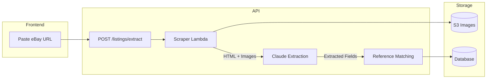
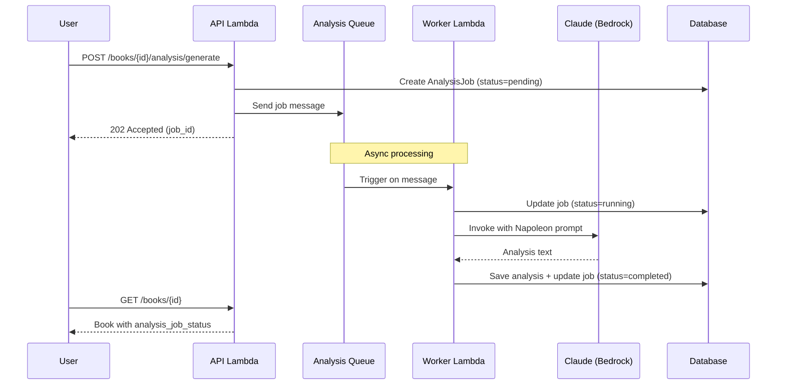
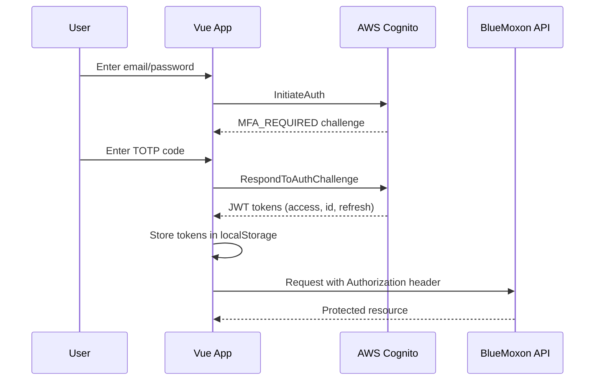

# BlueMoxon 1.0 Features

**BlueMoxon** is a collection management system for antiquarian books, featuring AI-powered valuations, acquisition tracking, and investment scoring.

---

## Book Collection Management

### Catalog & Metadata
- Comprehensive book records with title, author, publisher, binder, publication date, and volumes
- Binding type classification and condition notes
- Multi-image support with CDN-delivered thumbnails and full-resolution views
- Fair market value (FMV) tracking with low/mid/high estimates
- Source URL linking to original listings

### Status Workflow
- **Evaluating** - Items under consideration (watchlist)
- **In Transit** - Purchased items awaiting delivery
- **On Hand** - Items in the collection
- **Sold/Removed** - Archived items

### Reference Library
- **Authors** - Searchable catalog with priority scoring for target acquisitions
- **Publishers** - Tiered classification (Tier 1-3) for quality assessment
- **Binders** - Authenticated bindery records (Zaehnsdorf, Rivière, Bayntun, etc.)

---

## Acquisitions Dashboard

### Kanban Board
Three-column workflow view showing items by status:
- Watchlist items with asking prices and FMV estimates
- In-transit items with delivery dates and discount percentages
- Recently received items with investment scores

### eBay Import
- **Paste URL** - Extract listing details automatically from eBay URLs
- **AI Extraction** - Claude analyzes listing HTML to identify title, author, publisher, binder, price, and condition
- **Reference Matching** - Fuzzy matching suggests existing authors/publishers/binders
- **Duplicate Detection** - Warns when similar books already exist in collection
- **Image Capture** - Automatically downloads and stores listing images

### Order Processing
- **Paste-to-Extract** - Paste order confirmation text, AI extracts purchase price, date, and order number
- **Manual Entry** - Form-based order detail entry
- **Delivery Tracking** - Estimated delivery date with countdown

### Wayback Archive
- **Auto-Archive** - eBay listings automatically saved to Wayback Machine on acquisition
- **Manual Archive** - One-click archive button for any item with source URL
- **Status Tracking** - Visual indicator showing archive status (pending, archived, failed)

---

## AI-Powered Analysis

### Napoleon Framework
Comprehensive book valuations generated by Claude, including:
- Executive summary with key findings
- Detailed condition assessment
- Market analysis with comparable sales
- Binding elaborateness classification
- Rarity assessment
- Professional valuation methodology
- Insurance recommendations
- Preservation guidelines

### Analysis Generation
- **Auto-trigger** - Full analysis generated for items over $450
- **On-demand** - Generate analysis for any book with one click
- **Image Analysis** - Claude examines up to 10 book images for condition details
- **Source Context** - Original listing content included for accurate assessment

### Model Selection
- **Sonnet** - Fast analysis (~20-30 seconds)
- **Opus** - Premium analysis for high-value items (~40-60 seconds)

---

## Investment Scoring

### Investment Grade (0-100)
Weighted composite score factoring:
- Binding quality (bindery reputation)
- Acquisition value (discount from FMV)
- Strategic fit (collection alignment)
- Condition assessment
- Content/author significance
- Provenance

### Strategic Fit (0-7 points)
Checklist-based scoring:
- Target author match
- Tier 1 bindery
- Tier 1 publisher
- Victorian era (1837-1901)
- Single volume
- 40%+ discount from FMV
- No duplicates in collection

### Collection Impact
- Item and volume counts before/after
- Estimated collection value change
- Position in acquisition sequence

### Scoring Snapshot
All scores captured at acquisition time and stored for historical reference.

---

## Search & Browse

### Book Listing
- Paginated grid/list views
- Sort by title, author, date added, FMV, score
- Filter by status, author, publisher, binder
- Quick search across all fields

### Book Detail View
- Full metadata display
- Image gallery with lightbox
- Analysis viewer with markdown rendering
- Score breakdown visualization
- Edit and status change actions

---

## User Management

### Authentication
- Secure login via AWS Cognito
- Session management with JWT tokens

### Role-Based Access
- **Admin** - Full access including user management and spending data
- **Editor** - Add/edit books and analyses, view acquisitions
- **Viewer** - Read-only access to collection (no pricing/spending)

### API Access
- API key authentication for CLI tools and automation
- RESTful endpoints for all operations

---

## Administrative Tools

### Currency Configuration
- GBP to USD conversion rate
- EUR to USD conversion rate
- Used for normalizing international purchases

### Collection Statistics
- Total items and volumes
- Estimated collection value
- Monthly acquisition metrics
- Average discount achieved

---

## Web Application

### Responsive Design
- Desktop-optimized dashboard layouts
- Mobile-friendly book browsing
- Touch-friendly image galleries

### Real-time Updates
- Optimistic UI updates
- Background data synchronization
- Toast notifications for actions

### Keyboard Navigation
- Shortcuts for common actions
- Form navigation support
