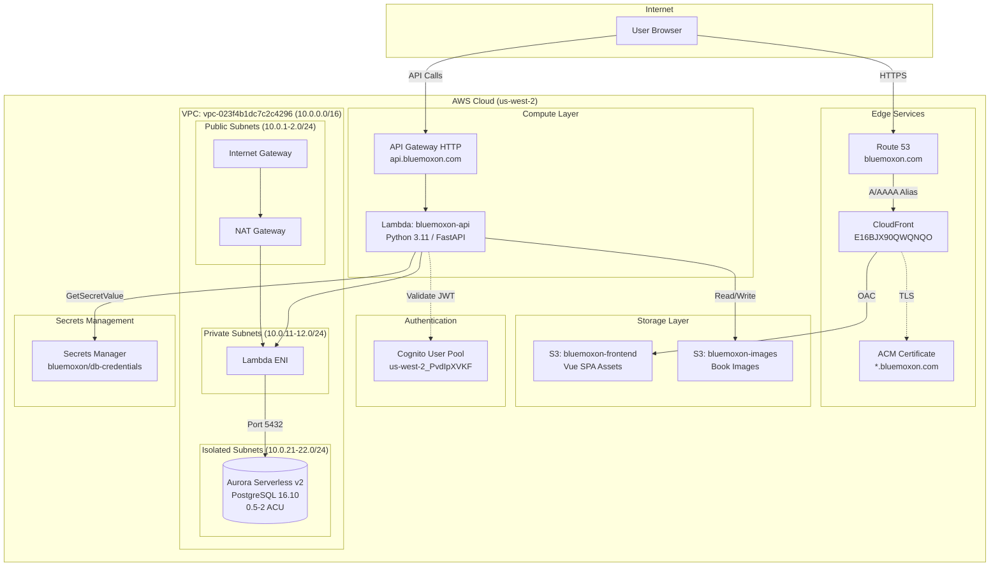
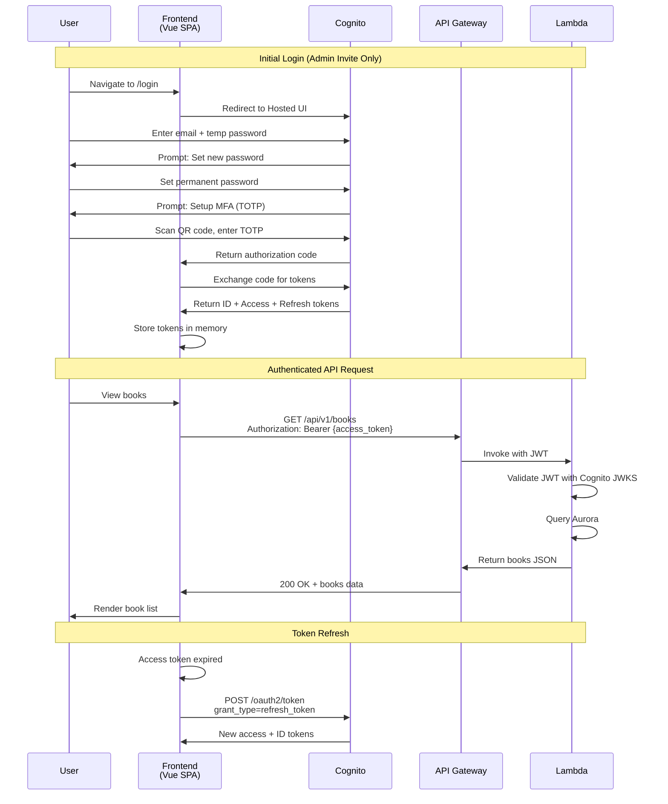
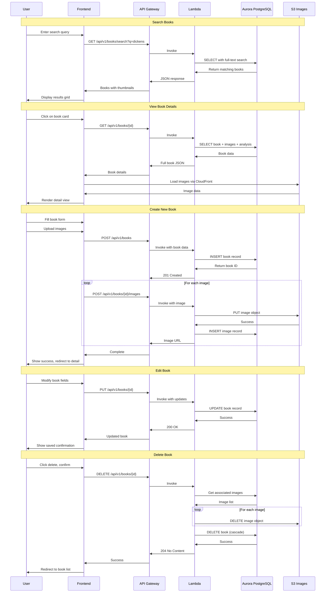

# BlueMoxon AWS Infrastructure

## Overview

BlueMoxon is deployed on AWS using a serverless architecture optimized for low-traffic applications with cost efficiency. The infrastructure was provisioned using AWS CLI on November 30, 2025.

**Region:** us-west-2 (Oregon)
**Account:** 266672885920
**Domain:** bluemoxon.com

## Architecture Diagram



## Application Flow Diagrams

### Authentication Flow



### Book Management Flows



## Resource Inventory

### Networking

| Resource | ID/ARN | Details |
|----------|--------|---------|
| VPC | `vpc-023f4b1dc7c2c4296` | CIDR: 10.0.0.0/16, DNS enabled |
| Internet Gateway | `igw-0c8c2413e3958ec04` | Attached to VPC |
| NAT Gateway | `nat-0551444ab65c31f8c` | In public-a subnet |
| Elastic IP | `eipalloc-098bcae03133fb25a` | For NAT Gateway |

**Subnets:**

| Name | ID | CIDR | AZ | Purpose |
|------|-----|------|-----|---------|
| public-a | `subnet-0b170eacdfed1ec3a` | 10.0.1.0/24 | us-west-2a | NAT Gateway |
| public-b | `subnet-04e95aa299c6e1018` | 10.0.2.0/24 | us-west-2b | Redundancy |
| private-a | `subnet-026cb4a2cf0464f88` | 10.0.11.0/24 | us-west-2a | Lambda |
| private-b | `subnet-0ffc724f850e0a438` | 10.0.12.0/24 | us-west-2b | Lambda |
| isolated-a | `subnet-037b7953df0ccd042` | 10.0.21.0/24 | us-west-2a | Aurora |
| isolated-b | `subnet-03e9217cb4472f0a0` | 10.0.22.0/24 | us-west-2b | Aurora |

**Route Tables:**

| Name | ID | Routes |
|------|-----|--------|
| public | `rtb-047fb09852afa8c21` | 0.0.0.0/0 → IGW |
| private | `rtb-03b11ae30d0b64149` | 0.0.0.0/0 → NAT |
| isolated | `rtb-082c18ad4fd08b193` | Local only |

**Security Groups:**

| Name | ID | Inbound | Outbound |
|------|-----|---------|----------|
| aurora-sg | `sg-0bdf28db1cea9797e` | 5432 from lambda-sg | None |
| lambda-sg | `sg-0ae3f0f22c08e0c62` | None | All traffic |

### Database

| Resource | Value |
|----------|-------|
| Cluster ID | `bluemoxon-cluster` |
| Instance ID | `bluemoxon-instance-1` |
| Engine | Aurora PostgreSQL 16.10 |
| Instance Class | db.serverless (0.5-2 ACU) |
| Endpoint | `bluemoxon-cluster.cluster-cp4c0cuuyq2m.us-west-2.rds.amazonaws.com` |
| Reader Endpoint | `bluemoxon-cluster.cluster-ro-cp4c0cuuyq2m.us-west-2.rds.amazonaws.com` |
| Port | 5432 |
| Database Name | `bluemoxon` |
| Subnet Group | `bluemoxon-db-subnet-group` |
| Encryption | Enabled (AWS managed key) |
| Backup Retention | 7 days |

### Authentication

| Resource | Value |
|----------|-------|
| User Pool ID | `us-west-2_PvdIpXVKF` |
| App Client ID | `3ndaok3psd2ncqfjrdb57825he` |
| Domain | `bluemoxon.auth.us-west-2.amazoncognito.com` |
| MFA | Off (can be enabled later) |
| Self-Signup | Disabled (admin invite only) |
| Password Policy | 12+ chars, upper, lower, number, symbol |

### Compute

| Resource | Value |
|----------|-------|
| Function Name | `bluemoxon-api` |
| Function ARN | `arn:aws:lambda:us-west-2:266672885920:function:bluemoxon-api` |
| Runtime | Python 3.11 |
| Handler | `app.main.handler` |
| Memory | 512 MB |
| Timeout | 30 seconds |
| Role | `bluemoxon-lambda-role` |

**Environment Variables:**

| Variable | Value |
|----------|-------|
| DATABASE_URL | `postgresql://bluemoxon_admin@{endpoint}:5432/bluemoxon` |
| SECRET_ARN | `arn:aws:secretsmanager:us-west-2:266672885920:secret:bluemoxon/db-credentials-Firmtl` |
| CORS_ORIGINS | `https://app.bluemoxon.com` |
| S3_IMAGES_BUCKET | `bluemoxon-images` |
| DEBUG | `false` |

### API Gateway

| Resource | Value |
|----------|-------|
| API ID | `h7q9ga51xa` |
| Type | HTTP API |
| Custom Domain | `api.bluemoxon.com` |
| Regional Endpoint | `d-2bb05h3tf4.execute-api.us-west-2.amazonaws.com` |
| Raw Endpoint | `https://h7q9ga51xa.execute-api.us-west-2.amazonaws.com` |
| Stage | `$default` (auto-deploy) |
| API Mapping ID | `3d0r7t` |
| ACM Certificate | `arn:aws:acm:us-west-2:266672885920:certificate/85f33a7f-bd9e-4e60-befe-95cffea5cf9a` |
| CORS | Enabled for bluemoxon.com |

### Storage

| Bucket | Purpose | Features |
|--------|---------|----------|
| `bluemoxon-frontend` | Vue SPA static files | Versioning, CloudFront OAC, serves app.bluemoxon.com |
| `bluemoxon-landing` | Landing/docs site | Versioning, CloudFront OAC, serves bluemoxon.com |
| `bluemoxon-images` | Book images | Versioning, CORS enabled |

### CDN & DNS

**App CloudFront (Vue SPA):**

| Resource | Value |
|----------|-------|
| Distribution ID | `E16BJX90QWQNQO` |
| Domain | `d2yd5bvqaomg54.cloudfront.net` |
| Aliases | `app.bluemoxon.com` |
| Origin | `bluemoxon-frontend` S3 bucket |
| Origin Access Control | `EZGSJYMZAFG0S` |

**Landing/Docs CloudFront:**

| Resource | Value |
|----------|-------|
| Distribution ID | `ES60BQB34DNYS` |
| Domain | `dui69hltsg2ds.cloudfront.net` |
| Aliases | `bluemoxon.com`, `www.bluemoxon.com` |
| Origin | `bluemoxon-landing` S3 bucket |
| Origin Access Control | `E1248OHBE9FC2Z` |

**Shared:**

| Resource | Value |
|----------|-------|
| ACM Certificate | `arn:aws:acm:us-east-1:266672885920:certificate/92395aeb-a01e-4a48-b4bd-0a9f1c04e861` |
| Route 53 Hosted Zone | `Z09346283AE9VMIQQJ8VL` |

### Secrets

| Secret | ARN |
|--------|-----|
| DB Credentials | `arn:aws:secretsmanager:us-west-2:266672885920:secret:bluemoxon/db-credentials-Firmtl` |

## Cost Estimate

| Service | Monthly Cost |
|---------|--------------|
| Aurora Serverless v2 (0.5-2 ACU) | $15-25 |
| NAT Gateway | $5-10 |
| Lambda + API Gateway | $1-3 |
| S3 (frontend + images) | $2-3 |
| CloudFront | $2-5 |
| Route 53 + domain | $1-2 |
| Secrets Manager | $1 |
| **Total** | **$27-49** |

## Deployment Commands

### Update Lambda Code

```bash
# Build deployment package (requires Docker)
docker run --rm \
  -v $(pwd)/backend:/app:ro \
  -v /tmp/lambda-deploy:/output \
  --platform linux/amd64 \
  amazonlinux:2023 \
  /bin/bash -c "
    dnf install -y python3.11 python3.11-pip zip > /dev/null 2>&1
    python3.11 -m pip install -q -t /output -r /app/requirements.txt
    cp -r /app/app /output/
  "

cd /tmp/lambda-deploy
zip -q -r /tmp/bluemoxon-api.zip . -x "*.pyc" -x "*__pycache__*"

# Upload and update Lambda
aws s3 cp /tmp/bluemoxon-api.zip s3://bluemoxon-frontend/lambda/bluemoxon-api.zip --profile bluemoxon
aws lambda update-function-code \
  --function-name bluemoxon-api \
  --s3-bucket bluemoxon-frontend \
  --s3-key lambda/bluemoxon-api.zip \
  --profile bluemoxon --region us-west-2
```

### Deploy Frontend

```bash
cd frontend
npm run build

aws s3 sync dist/ s3://bluemoxon-frontend/ --profile bluemoxon --region us-west-2
aws cloudfront create-invalidation \
  --distribution-id E16BJX90QWQNQO \
  --paths "/*" \
  --profile bluemoxon
```

### Create Admin User

```bash
aws cognito-idp admin-create-user \
  --user-pool-id us-west-2_PvdIpXVKF \
  --username admin@bluemoxon.com \
  --user-attributes Name=email,Value=admin@bluemoxon.com \
  --temporary-password "TempPass123!" \
  --profile bluemoxon --region us-west-2
```

## URLs

| Environment | URL |
|-------------|-----|
| Collection App | https://app.bluemoxon.com |
| Landing/Docs Site | https://www.bluemoxon.com |
| API | https://api.bluemoxon.com |
| API Health Check | https://api.bluemoxon.com/health |
| Books API | https://api.bluemoxon.com/api/v1/books |
| Cognito Login | https://bluemoxon.auth.us-west-2.amazoncognito.com |
| CloudFront App (raw) | https://d2yd5bvqaomg54.cloudfront.net |
| CloudFront Landing (raw) | https://dui69hltsg2ds.cloudfront.net |
| API Gateway (raw) | https://h7q9ga51xa.execute-api.us-west-2.amazonaws.com |

## Monitoring & Observability

### CloudWatch Dashboard

**Dashboard Name:** `BlueMoxon-API`
**URL:** https://us-west-2.console.aws.amazon.com/cloudwatch/home?region=us-west-2#dashboards:name=BlueMoxon-API

The dashboard displays:

| Panel | Metrics |
|-------|---------|
| API Latency | p50, p90, p99, Average (ms) |
| API Request Count | Total requests per minute |
| API Errors | 4xx and 5xx error counts |
| API Availability | Calculated availability % |
| Lambda Duration | p50, p90, p99 execution time |
| Lambda Invocations & Errors | Request and error counts |
| Lambda Concurrent Executions | Peak concurrency |
| CloudFront Requests | CDN request volume |
| CloudFront Error Rate | 4xx/5xx error percentages |

### CloudWatch Alarms

| Alarm Name | Condition | Period | Action |
|------------|-----------|--------|--------|
| `BlueMoxon-API-HighLatency` | p99 latency > 3000ms | 5 min (2 eval) | - |
| `BlueMoxon-API-5xxErrors` | 5xx errors > 5 | 5 min | - |
| `BlueMoxon-Lambda-Errors` | Errors >= 1 | 5 min | - |

To add SNS notifications to alarms:
```bash
aws cloudwatch put-metric-alarm \
  --alarm-name "BlueMoxon-API-5xxErrors" \
  --alarm-actions arn:aws:sns:us-west-2:266672885920:your-topic \
  --profile bluemoxon --region us-west-2
```

### CloudFront Access Logs

| Setting | Value |
|---------|-------|
| Log Bucket | `bluemoxon-logs` |
| Log Prefix | `cloudfront/` |
| Region | us-west-2 |

Logs include: request time, client IP, URI path, HTTP status, bytes sent, referrer, user agent.

### Health Check Endpoints

| Endpoint | Purpose | Use Case |
|----------|---------|----------|
| `GET /health` | Simple liveness | Load balancer checks |
| `GET /api/v1/health/live` | Kubernetes liveness | Container orchestration |
| `GET /api/v1/health/ready` | Readiness (DB check) | Traffic routing |
| `GET /api/v1/health/deep` | Full validation | CI/CD, monitoring |
| `GET /api/v1/health/info` | Service metadata | Debugging |

The `/deep` endpoint validates:
- Database connectivity and query execution
- S3 bucket accessibility
- Cognito user pool (if IAM permissions allow)
- Critical configuration settings

---

## Configuration File

All resource IDs are stored in: `infra/aws-resources.json`

---

*Last Updated: December 2, 2025*
