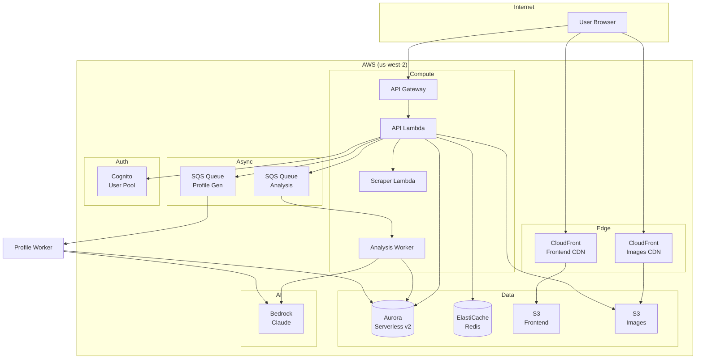
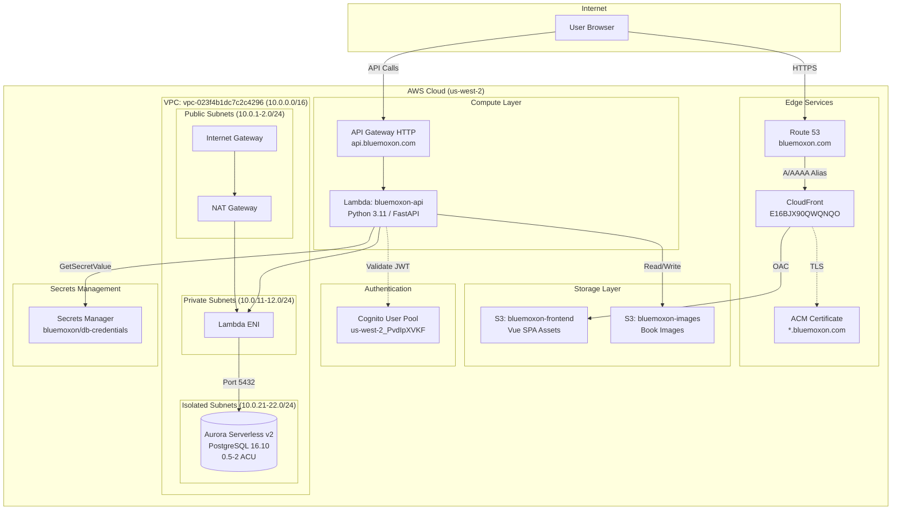
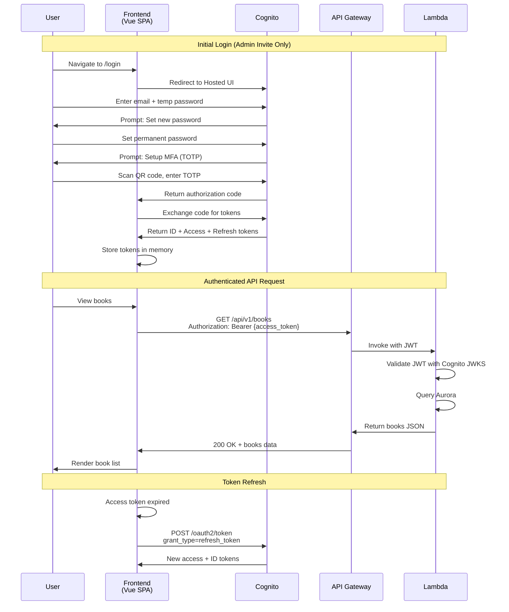
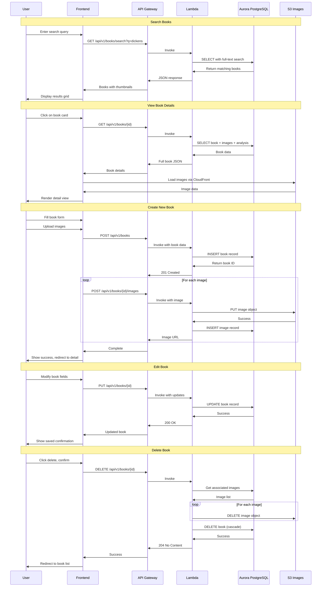

# BlueMoxon AWS Infrastructure

## Overview

BlueMoxon is deployed on AWS using a serverless architecture optimized for low-traffic applications with cost efficiency. The infrastructure is managed via **Terraform** with a dual-environment setup (staging + production).

**Environments:**

| Environment | Account | Region | Purpose |
|-------------|---------|--------|---------|
| **Production** | 266672885920 | us-west-2 | Live users |
| **Staging** | 637423662077 | us-west-2 | Testing before prod |

**Domain:** bluemoxon.com (production), staging.*.bluemoxon.com (staging)



## Infrastructure as Code

All infrastructure is managed via Terraform in `infra/terraform/`:

```text
infra/terraform/
├── main.tf              # Root module, module composition
├── variables.tf         # Input variables
├── outputs.tf           # Output values
├── envs/
│   ├── staging.tfvars   # Staging environment values
│   └── prod.tfvars      # Production environment values
└── modules/             # 15 reusable modules
    ├── api-gateway/     # HTTP API + custom domain
    ├── cloudfront/      # CDN distributions
    ├── cognito/         # User pools + clients
    ├── db-sync-lambda/  # Prod→Staging data sync
    ├── dns/             # Route 53 records
    ├── elasticache/     # Redis serverless cache
    ├── github-oidc/     # GitHub Actions auth
    ├── lambda/          # API function + IAM
    ├── landing-site/    # Marketing site
    ├── rds/             # Aurora Serverless v2
    ├── s3/              # Buckets + policies
    ├── secrets/         # DB credentials
    └── vpc-networking/  # VPC endpoints, NAT
```

## Lambda Layers

Shared Python dependencies deployed as a Lambda Layer:

```text
infra/terraform/modules/lambda-layer/
├── main.tf          # Layer version resource
├── variables.tf     # Configuration inputs
└── outputs.tf       # Layer ARN output
```

**Configuration:**

| Parameter | Value |
|-----------|-------|
| Layer Name | `bluemoxon-{env}-deps` |
| Runtime | Python 3.12 |
| Source | `s3://{artifacts-bucket}/lambda/layer.zip` |

**Benefits:**

- **Shared Dependencies** - Single layer used by API, cleanup, and worker Lambdas
- **Faster Deploys** - Code packages smaller without bundled dependencies
- **Version Immutability** - Layer versions never redeployed (CI/CD publishes new versions)
- **Cold Start Optimization** - Dependencies pre-loaded in execution environment

## Cleanup Lambda

Automated maintenance for stale data and orphaned resources:

```text
infra/terraform/modules/cleanup-lambda/
├── main.tf          # Lambda + IAM + EventBridge
├── variables.tf     # Schedule configuration
└── outputs.tf       # Function ARN
```

**Cleanup Tasks:**

| Task | Description |
|------|-------------|
| Archive Stale Evaluating | Books in EVALUATING >30 days -> archived |
| Check Source URLs | Verify eBay listings still active (25/batch) |
| Find Orphan Images | Detect S3 images without database records |
| Delete Orphans | Remove orphaned images (with job tracking) |
| Retry Archives | Retry failed archive.org submissions (max 3) |

**Configuration:**

- **Schedule**: Optional EventBridge rule (e.g., `rate(1 day)`)
- **Memory**: 256 MB
- **Timeout**: 300 seconds
- **Trigger**: Scheduled or on-demand via Admin API

## Tracking Worker

Asynchronous package tracking with circuit breaker pattern:

```text
infra/terraform/modules/tracking-worker/
├── main.tf          # Dispatcher + Worker + SQS
├── variables.tf     # Concurrency limits
└── outputs.tf       # Queue URLs
```

**Circuit Breaker (SQS-based):**

| Parameter | Value |
|-----------|-------|
| Max Retries | 3 attempts |
| Visibility Timeout | 120 seconds |
| DLQ Retention | 14 days |
| Reserved Concurrency | 10 workers |

**Benefits:**

- **Automatic Retry** - Failed tracking checks retry up to 3 times
- **Backpressure** - SQS absorbs spikes, workers process at controlled rate
- **Failure Isolation** - Bad tracking numbers move to DLQ, don't block others
- **Observability** - CloudWatch alarms on DLQ depth

## Artifacts Bucket

Central repository for Lambda deployment packages:

**Bucket Name:** `{app_name}-artifacts-{environment}`

**Structure:**

```text
s3://bluemoxon-artifacts-staging/
├── lambda/
│   ├── layer.zip        # Shared dependencies layer
│   ├── api.zip          # API Lambda code
│   ├── cleanup.zip      # Cleanup Lambda code
│   └── ...              # Other Lambda packages
```

**Features:**

- **Versioning Enabled** - Supports rollback to previous deployments
- **Private Access** - No public access, IAM-only
- **CI/CD Integration** - GitHub Actions uploads artifacts on deploy
- **Cross-Lambda Sharing** - Single source for all Lambda packages

## Image Processor Lambda

Container-based Lambda for AI-powered image processing:

```text
infra/terraform/modules/image-processor/
├── main.tf          # Lambda + SQS + IAM
├── variables.tf     # Memory, timeout config
└── outputs.tf       # Queue URL, function ARN
```

**Configuration:**

| Parameter | Value | Reason |
|-----------|-------|--------|
| Architecture | x86_64 | ARM64 has ONNX Runtime issues |
| Memory | 7168 MB | rembg model requires ~6GB |
| Timeout | 300 seconds | Large image processing |
| Reserved Concurrency | 2 | Cost control |
| Batch Size | 1 | One image per invocation |

**Container Image:**

- **Base**: AWS Lambda Python 3.12 (x86_64)
- **Pre-loaded Models**: u2net, isnet-general-use
- **Environment**: `U2NET_HOME=/opt/u2net`, `NUMBA_CACHE_DIR=/tmp`

**SQS Configuration:**

| Parameter | Value |
|-----------|-------|
| Visibility Timeout | 600 seconds |
| Message Retention | 4 days |
| DLQ Max Receives | 3 |

### Terraform Commands

| Task | Command |
|------|---------|
| Format | `terraform fmt -recursive` |
| Validate | `terraform validate` |
| Plan (staging) | `AWS_PROFILE=bmx-staging terraform plan -var-file=envs/staging.tfvars` |
| Apply (staging) | `AWS_PROFILE=bmx-staging terraform apply -var-file=envs/staging.tfvars` |
| Plan (production) | `AWS_PROFILE=bmx-prod terraform plan -var-file=envs/prod.tfvars` |
| Apply (production) | `AWS_PROFILE=bmx-prod terraform apply -var-file=envs/prod.tfvars` |
| Check drift | `terraform plan -detailed-exitcode -var-file=envs/staging.tfvars` |
| Import resource | `terraform import 'module.name.resource.name' <aws-id>` |
| Show state | `terraform state list` |

**Drift detection exit codes:** `0` = no changes, `1` = error, `2` = drift detected

### Why Infrastructure as Code Matters

- Manual changes create drift that's impossible to track
- Manual changes get lost when resources are recreated
- Rollbacks become impossible
- Staging/prod parity breaks

**The Rule:**

1. **NEVER** create/modify AWS resources manually (console or CLI)
2. **ALWAYS** add infrastructure changes to `infra/terraform/`
3. **DOCUMENT** any temporary manual fixes immediately and create a ticket to terraformize

### Exception Process (Emergency Fixes ONLY)

If you MUST make a manual change:

1. **Document BEFORE making the change** in `docs/STAGING_INFRASTRUCTURE_CHANGES.md` or `docs/PROD_INFRASTRUCTURE_CHANGES.md`
2. **Use AWS CLI** (auditable) not console clicks
3. **Create follow-up issue:** "infra: Terraformize [resource]"
4. **Notify team** in PR or Slack

### Terraform Style Requirements

**STRICTLY follow HashiCorp's official guidelines:**

- [Style Guide](https://developer.hashicorp.com/terraform/language/style)
- [Module Pattern](https://developer.hashicorp.com/terraform/tutorials/modules/pattern-module-creation)

#### File Organization (REQUIRED)

```text
modules/<module-name>/
├── main.tf          # Resources and data sources
├── variables.tf     # Input variables (ALPHABETICAL order)
├── outputs.tf       # Output values (ALPHABETICAL order)
├── versions.tf      # Provider version constraints (if needed)
└── README.md        # Module documentation
```

#### Variable Definitions (REQUIRED for ALL variables)

```hcl
variable "example_name" {
  type        = string
  description = "Human-readable description of what this variable controls"
  default     = "sensible-default"  # Optional variables MUST have defaults

  validation {  # Add validation where appropriate
    condition     = length(var.example_name) > 0
    error_message = "Example name cannot be empty."
  }
}
```

#### Naming Conventions

- **Resources**: Underscore-separated: `aws_lambda_function`, NOT `aws-lambda-function`
- **Variables**: Underscore-separated: `db_instance_class`, NOT `dbInstanceClass`
- **Do NOT include resource type in name**: `name = "api"`, NOT `name = "lambda-api"`

#### Resource Organization Order

1. `count` or `for_each` meta-arguments
2. Resource-specific non-block parameters
3. Resource-specific block parameters
4. `lifecycle` blocks (if needed)
5. `depends_on` (if required)

#### Module Design Principles

1. **Single Purpose**: Each module does ONE thing well
2. **80% Use Case**: Design for common cases, avoid edge case complexity
3. **Expose Common Args**: Only expose frequently-modified arguments
4. **Output Everything**: Export all useful values even if not immediately needed
5. **Sensible Defaults**: Required inputs have no default; optional inputs have good defaults

### Validation Testing (Destroy/Apply)

For significant infrastructure changes, validate with destroy/apply cycle in staging:

```bash
cd infra/terraform

# 1. Create RDS snapshot (data protection)
AWS_PROFILE=bmx-staging aws rds create-db-snapshot --db-instance-identifier bluemoxon-staging-db --db-snapshot-identifier pre-terraform-test-YYYYMMDD

# 2. Destroy staging infrastructure
AWS_PROFILE=bmx-staging terraform destroy -var-file=envs/staging.tfvars

# 3. Apply from scratch
AWS_PROFILE=bmx-staging terraform apply -var-file=envs/staging.tfvars

# 4. Validate services
curl -s https://staging.api.bluemoxon.com/api/v1/health/deep | jq
```

**When to use destroy/apply testing:**

- Adding new Terraform modules
- Changing VPC networking (endpoints, NAT gateway)
- Major IAM policy changes
- Before migrating configuration to production

### Pipeline Enforcement (Automated)

| Mechanism | When | Action |
|-----------|------|--------|
| **Drift Detection** | Daily 6 AM UTC | `terraform plan -detailed-exitcode`. Creates issue if drift found. |
| **CODEOWNERS** | On PR | Requires owner review for `/infra/` |
| **Terraform Validation** | On PR | Runs `fmt`, `validate`, `tflint`, `tfsec`, `checkov` |
| **PR Plan Comments** | On PR | Posts Terraform plan output as PR comment |

### Environment Separation

- Use `envs/staging.tfvars` and `envs/prod.tfvars` for environment-specific values
- NEVER hardcode environment-specific values in modules
- State files are separate: `bluemoxon/staging/terraform.tfstate` vs `bluemoxon/prod/terraform.tfstate`

### Staging/Production Divergences

**Why environments differ:** Production infrastructure was created before Terraform management. Some resources have architectural differences (e.g., OAC vs OAI for CloudFront) that make them incompatible with modules designed for staging. Rather than risk breaking production, these are managed externally.

| Flag | Staging | Prod | Reason |
|------|---------|------|--------|
| `enable_cognito` | true | **false** | Prod Cognito has existing users; managed externally |
| `enable_database` | true | **false** | Prod uses Aurora Serverless (different architecture) |
| `enable_api_gateway` | true | **false** | Prod API GW existed before Terraform; import planned |
| `enable_nat_gateway` | true | **false** | Cost optimization; prod Lambda uses VPC endpoints |
| `enable_waf` | false | **true** | Security hardening for production traffic |
| `enable_dns` | false | **true** | DNS managed from prod account (controls both envs) |
| `enable_landing_site` | false | **true** | Marketing site is production-only |

**Impact on deployments:** Code that works in staging may behave differently in production if it relies on resources managed by these flags. When making changes:

1. Check if your change touches a divergent resource (Cognito, database, API Gateway)
2. If yes, test the production behavior separately - staging won't catch issues
3. For Cognito/auth changes, verify against `cognito_user_pool_id_external` in prod.tfvars

**External resource references:** Production tfvars includes `*_external` variables pointing to resources managed outside Terraform:

- `cognito_user_pool_id_external` - Production Cognito pool
- `cognito_client_id_external` - Production app client
- `database_secret_arn` - Aurora credentials in Secrets Manager

## Architecture Diagram



## Application Flow Diagrams

### Authentication Flow



### Book Management Flows



## Resource Inventory

### Networking

| Resource | ID/ARN | Details |
|----------|--------|---------|
| VPC | `vpc-023f4b1dc7c2c4296` | CIDR: 10.0.0.0/16, DNS enabled |
| Internet Gateway | `igw-0c8c2413e3958ec04` | Attached to VPC |
| NAT Gateway | `nat-0551444ab65c31f8c` | In public-a subnet |
| Elastic IP | `eipalloc-098bcae03133fb25a` | For NAT Gateway |

**Subnets:**

| Name | ID | CIDR | AZ | Purpose |
|------|-----|------|-----|---------|
| public-a | `subnet-0b170eacdfed1ec3a` | 10.0.1.0/24 | us-west-2a | NAT Gateway |
| public-b | `subnet-04e95aa299c6e1018` | 10.0.2.0/24 | us-west-2b | Redundancy |
| private-a | `subnet-026cb4a2cf0464f88` | 10.0.11.0/24 | us-west-2a | Lambda |
| private-b | `subnet-0ffc724f850e0a438` | 10.0.12.0/24 | us-west-2b | Lambda |
| isolated-a | `subnet-037b7953df0ccd042` | 10.0.21.0/24 | us-west-2a | Aurora |
| isolated-b | `subnet-03e9217cb4472f0a0` | 10.0.22.0/24 | us-west-2b | Aurora |

**Route Tables:**

| Name | ID | Routes |
|------|-----|--------|
| public | `rtb-047fb09852afa8c21` | 0.0.0.0/0 → IGW |
| private | `rtb-03b11ae30d0b64149` | 0.0.0.0/0 → NAT |
| isolated | `rtb-082c18ad4fd08b193` | Local only |

**Security Groups:**

| Name | ID | Inbound | Outbound |
|------|-----|---------|----------|
| aurora-sg | `sg-0bdf28db1cea9797e` | 5432 from lambda-sg | None |
| lambda-sg | `sg-0ae3f0f22c08e0c62` | None | All traffic |

### Database

| Resource | Value |
|----------|-------|
| Cluster ID | `bluemoxon-cluster` |
| Instance ID | `bluemoxon-instance-1` |
| Engine | Aurora PostgreSQL 16.10 |
| Instance Class | db.serverless (0.5-2 ACU) |
| Endpoint | `bluemoxon-cluster.cluster-cp4c0cuuyq2m.us-west-2.rds.amazonaws.com` |
| Reader Endpoint | `bluemoxon-cluster.cluster-ro-cp4c0cuuyq2m.us-west-2.rds.amazonaws.com` |
| Port | 5432 |
| Database Name | `bluemoxon` |
| Subnet Group | `bluemoxon-db-subnet-group` |
| Encryption | Enabled (AWS managed key) |
| Backup Retention | 7 days |

### Authentication

| Resource | Value |
|----------|-------|
| User Pool ID | `us-west-2_PvdIpXVKF` |
| App Client ID | `3ndaok3psd2ncqfjrdb57825he` |
| Domain | `bluemoxon.auth.us-west-2.amazoncognito.com` |
| MFA | Off (can be enabled later) |
| Self-Signup | Disabled (admin invite only) |
| Password Policy | 12+ chars, upper, lower, number, symbol |

### Compute

| Resource | Value |
|----------|-------|
| Function Name | `bluemoxon-api` |
| Function ARN | `arn:aws:lambda:us-west-2:266672885920:function:bluemoxon-api` |
| Runtime | Python 3.11 |
| Handler | `app.main.handler` |
| Memory | 512 MB |
| Timeout | 30 seconds |
| Role | `bluemoxon-lambda-role` |

**Environment Variables:**

| Variable | Value |
|----------|-------|
| DATABASE_URL | `postgresql://bluemoxon_admin@{endpoint}:5432/bluemoxon` |
| SECRET_ARN | `arn:aws:secretsmanager:us-west-2:266672885920:secret:bluemoxon/db-credentials-Firmtl` |
| CORS_ORIGINS | `https://app.bluemoxon.com` |
| S3_IMAGES_BUCKET | `bluemoxon-images` |
| DEBUG | `false` |

### API Gateway

| Resource | Value |
|----------|-------|
| API ID | `h7q9ga51xa` |
| Type | HTTP API |
| Custom Domain | `api.bluemoxon.com` |
| Regional Endpoint | `d-2bb05h3tf4.execute-api.us-west-2.amazonaws.com` |
| Raw Endpoint | `https://h7q9ga51xa.execute-api.us-west-2.amazonaws.com` |
| Stage | `$default` (auto-deploy) |
| API Mapping ID | `3d0r7t` |
| ACM Certificate | `arn:aws:acm:us-west-2:266672885920:certificate/85f33a7f-bd9e-4e60-befe-95cffea5cf9a` |
| CORS | Enabled for bluemoxon.com |

### Storage

| Bucket | Purpose | Features |
|--------|---------|----------|
| `bluemoxon-frontend` | Vue SPA static files | Versioning, CloudFront OAC, serves app.bluemoxon.com |
| `bluemoxon-landing` | Landing/docs site | Versioning, CloudFront OAC, serves bluemoxon.com |
| `bluemoxon-images` | Book images | Versioning, CORS enabled |

### CDN & DNS

**App CloudFront (Vue SPA):**

| Resource | Value |
|----------|-------|
| Distribution ID | `E16BJX90QWQNQO` |
| Domain | `d2yd5bvqaomg54.cloudfront.net` |
| Aliases | `app.bluemoxon.com` |
| Origin | `bluemoxon-frontend` S3 bucket |
| Origin Access Control | `EZGSJYMZAFG0S` |

**Landing/Docs CloudFront:**

| Resource | Value |
|----------|-------|
| Distribution ID | `ES60BQB34DNYS` |
| Domain | `dui69hltsg2ds.cloudfront.net` |
| Aliases | `bluemoxon.com`, `www.bluemoxon.com` |
| Origin | `bluemoxon-landing` S3 bucket |
| Origin Access Control | `E1248OHBE9FC2Z` |

**Shared:**

| Resource | Value |
|----------|-------|
| ACM Certificate | `arn:aws:acm:us-east-1:266672885920:certificate/92395aeb-a01e-4a48-b4bd-0a9f1c04e861` |
| Route 53 Hosted Zone | `Z09346283AE9VMIQQJ8VL` |

### Secrets

| Secret | ARN |
|--------|-----|
| DB Credentials | `arn:aws:secretsmanager:us-west-2:266672885920:secret:bluemoxon/db-credentials-Firmtl` |

## Cost Estimate

| Service | Monthly Cost |
|---------|--------------|
| Aurora Serverless v2 (0.5-2 ACU) | $15-25 |
| NAT Gateway | $5-10 |
| Lambda + API Gateway | $1-3 |
| S3 (frontend + images) | $2-3 |
| CloudFront | $2-5 |
| Route 53 + domain | $1-2 |
| Secrets Manager | $1 |
| **Total** | **$27-49** |

## Deployment Commands

### Update Lambda Code

```bash
# Build deployment package (requires Docker)
docker run --rm \
  -v $(pwd)/backend:/app:ro \
  -v /tmp/lambda-deploy:/output \
  --platform linux/amd64 \
  amazonlinux:2023 \
  /bin/bash -c "
    dnf install -y python3.11 python3.11-pip zip > /dev/null 2>&1
    python3.11 -m pip install -q -t /output -r /app/requirements.txt
    cp -r /app/app /output/
  "

cd /tmp/lambda-deploy
zip -q -r /tmp/bluemoxon-api.zip . -x "*.pyc" -x "*__pycache__*"

# Upload and update Lambda
aws s3 cp /tmp/bluemoxon-api.zip s3://bluemoxon-frontend/lambda/bluemoxon-api.zip --profile bluemoxon
aws lambda update-function-code \
  --function-name bluemoxon-api \
  --s3-bucket bluemoxon-frontend \
  --s3-key lambda/bluemoxon-api.zip \
  --profile bluemoxon --region us-west-2
```

### Deploy Frontend

```bash
cd frontend
npm run build

aws s3 sync dist/ s3://bluemoxon-frontend/ --profile bluemoxon --region us-west-2
aws cloudfront create-invalidation \
  --distribution-id E16BJX90QWQNQO \
  --paths "/*" \
  --profile bluemoxon
```

### Create Admin User

```bash
aws cognito-idp admin-create-user \
  --user-pool-id us-west-2_PvdIpXVKF \
  --username admin@bluemoxon.com \
  --user-attributes Name=email,Value=admin@bluemoxon.com \
  --temporary-password "TempPass123!" \
  --profile bluemoxon --region us-west-2
```

## URLs

### Production

| Service | URL |
|---------|-----|
| Collection App | <https://app.bluemoxon.com> |
| Landing/Docs Site | <https://www.bluemoxon.com> |
| API | <https://api.bluemoxon.com> |
| API Health Check | <https://api.bluemoxon.com/api/v1/health/deep> |
| Books API | <https://api.bluemoxon.com/api/v1/books> |
| Cognito Login | <https://bluemoxon.auth.us-west-2.amazoncognito.com> |

### Staging

| Service | URL |
|---------|-----|
| Collection App | <https://staging.app.bluemoxon.com> |
| API | <https://staging.api.bluemoxon.com> |
| API Health Check | <https://staging.api.bluemoxon.com/api/v1/health/deep> |
| Cognito Login | <https://bluemoxon-staging.auth.us-west-2.amazoncognito.com> |

### Raw Endpoints (Debug)

| Service | URL |
|---------|-----|
| CloudFront App (raw) | <https://d2yd5bvqaomg54.cloudfront.net> |
| CloudFront Landing (raw) | <https://dui69hltsg2ds.cloudfront.net> |
| API Gateway Prod (raw) | <https://h7q9ga51xa.execute-api.us-west-2.amazonaws.com> |

## Monitoring & Observability

### CloudWatch Dashboard

**Dashboard Name:** `BlueMoxon-API`
**URL:** <https://us-west-2.console.aws.amazon.com/cloudwatch/home?region=us-west-2#dashboards:name=BlueMoxon-API>

The dashboard displays:

| Panel | Metrics |
|-------|---------|
| API Latency | p50, p90, p99, Average (ms) |
| API Request Count | Total requests per minute |
| API Errors | 4xx and 5xx error counts |
| API Availability | Calculated availability % |
| Lambda Duration | p50, p90, p99 execution time |
| Lambda Invocations & Errors | Request and error counts |
| Lambda Concurrent Executions | Peak concurrency |
| CloudFront Requests | CDN request volume |
| CloudFront Error Rate | 4xx/5xx error percentages |

### CloudWatch Alarms

| Alarm Name | Condition | Period | Action |
|------------|-----------|--------|--------|
| `BlueMoxon-API-HighLatency` | p99 latency > 3000ms | 5 min (2 eval) | - |
| `BlueMoxon-API-5xxErrors` | 5xx errors > 5 | 5 min | - |
| `BlueMoxon-Lambda-Errors` | Errors >= 1 | 5 min | - |

To add SNS notifications to alarms:

```bash
aws cloudwatch put-metric-alarm \
  --alarm-name "BlueMoxon-API-5xxErrors" \
  --alarm-actions arn:aws:sns:us-west-2:266672885920:your-topic \
  --profile bluemoxon --region us-west-2
```

### CloudFront Access Logs

| Setting | Value |
|---------|-------|
| Log Bucket | `bluemoxon-logs` |
| Log Prefix | `cloudfront/` |
| Region | us-west-2 |

Logs include: request time, client IP, URI path, HTTP status, bytes sent, referrer, user agent.

### Health Check Endpoints

| Endpoint | Purpose | Use Case |
|----------|---------|----------|
| `GET /health` | Simple liveness | Load balancer checks |
| `GET /api/v1/health/live` | Kubernetes liveness | Container orchestration |
| `GET /api/v1/health/ready` | Readiness (DB check) | Traffic routing |
| `GET /api/v1/health/deep` | Full validation | CI/CD, monitoring |
| `GET /api/v1/health/info` | Service metadata | Debugging |

The `/deep` endpoint validates:

- Database connectivity and query execution
- S3 bucket accessibility
- Cognito user pool (if IAM permissions allow)
- Critical configuration settings

---

## Configuration File

All resource IDs are stored in: `infra/aws-resources.json`

---

## Adding Async Workers (SQS + Lambda)

When adding a new async worker flow (SQS queue + Lambda processor), update these locations:

### Backend

- [ ] **app/config.py** - Add `<worker>_queue_name` setting with `BMX_` prefix alias
- [ ] **app/api/v1/health.py** - Add queue to `check_sqs()` function's `queues` dict
- [ ] **app/api/v1/admin.py** - Add `<worker>_queue` to `InfrastructureConfig` model and wire in `get_system_info()`

### Frontend

- [ ] **src/types/admin.ts** - Add `<worker>_queue` to `InfrastructureConfig` interface
- [ ] **src/views/AdminConfigView.vue** - Add queue display in Infrastructure section

### Infrastructure

- [ ] **infra/terraform/main.tf** - Add `BMX_<WORKER>_QUEUE_NAME` to Lambda environment variables (wire from worker module output)

### Existing Flows (Reference)

| Flow | Config | Health | Admin | Frontend |
|------|--------|--------|-------|----------|
| Analysis | `analysis_queue_name` | `check_sqs()` | `analysis_queue` | AdminConfigView |
| Eval Runbook | `eval_runbook_queue_name` | `check_sqs()` | `eval_runbook_queue` | AdminConfigView |
| Image Processing | `image_processor_queue_name` | `check_sqs()` | `image_processor_queue` | AdminConfigView |
| Profile Generation | `profile_generation_queue_name` | `check_sqs()` | `profile_generation_queue` | AdminConfigView |

---

## Related Documents

| Document | Purpose |
|----------|---------|
| [Infrastructure Governance](INFRASTRUCTURE_GOVERNANCE.md) | Terraform policies and drift detection |
| [Operations Runbook](OPERATIONS.md) | Health checks, troubleshooting |
| [CI/CD Pipeline](CI_CD.md) | Deploy workflows |

---

*Last Updated: February 2026*
