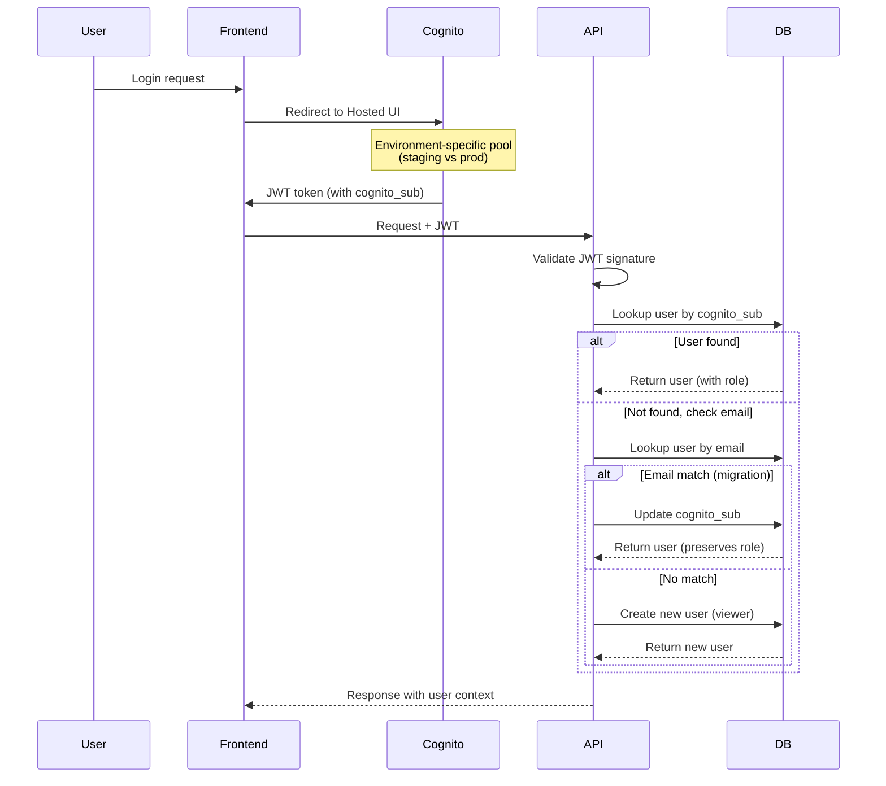

# Staging Environment Plan

## Overview

Create `staging.app.bluemoxon.com` as an isolated replica of production in a separate AWS account, with:
- Independent infrastructure (can be modified without affecting prod)
- **Separate Cognito pools per environment** (isolated user management)
- Automatic cognito_sub migration when users move between pools
- Version tracking across environments
- Cost-optimized (scales to near-zero when idle)
- Future Terraform migration path

---

## Table of Contents

1. [Version Number System](#1-version-number-system)
2. [AWS Account Setup](#2-aws-account-setup)
3. [Infrastructure Architecture](#3-infrastructure-architecture)
4. [Deploy Workflow Options](#4-deploy-workflow-options)
5. [Data Sync Strategy](#5-data-sync-strategy)
6. [Implementation Phases](#6-implementation-phases)

---

## 1. Version Number System

### Version Format

```
v{YYYY.MM.DD}.{build-number}
Example: v2025.12.05.42
```

Or semantic versioning if preferred:
```
v{major}.{minor}.{patch}
Example: v1.2.3
```

### Implementation

#### VERSION file (source of truth)
```bash
# /VERSION
1.0.0
```

#### Backend: Response Header + Endpoint

```python
# app/core/version.py
from pathlib import Path

def get_version() -> str:
    version_file = Path(__file__).parent.parent.parent / "VERSION"
    if version_file.exists():
        return version_file.read_text().strip()
    return "0.0.0-dev"

# app/main.py - Add middleware
@app.middleware("http")
async def add_version_header(request: Request, call_next):
    response = await call_next(request)
    response.headers["X-App-Version"] = get_version()
    response.headers["X-Environment"] = settings.environment
    return response

# app/api/v1/health.py - Add to health endpoint
@router.get("/version")
async def get_app_version():
    return {
        "version": get_version(),
        "environment": settings.environment,
        "git_sha": os.getenv("GIT_SHA", "unknown"),
        "deployed_at": os.getenv("DEPLOYED_AT", "unknown")
    }
```

#### Frontend: Build-time injection

```typescript
// vite.config.ts
import { readFileSync } from 'fs'

const version = readFileSync('../VERSION', 'utf-8').trim()

export default defineConfig({
  define: {
    __APP_VERSION__: JSON.stringify(version),
    __BUILD_TIME__: JSON.stringify(new Date().toISOString()),
  }
})

// src/config.ts
export const APP_VERSION = __APP_VERSION__
export const BUILD_TIME = __BUILD_TIME__

// Displayed in footer or settings page
```

#### CI/CD: Inject at build time

```yaml
# In deploy workflow
- name: Set version info
  run: |
    echo "GIT_SHA=${GITHUB_SHA::7}" >> $GITHUB_ENV
    echo "DEPLOYED_AT=$(date -u +%Y-%m-%dT%H:%M:%SZ)" >> $GITHUB_ENV
    VERSION=$(cat VERSION)
    echo "APP_VERSION=$VERSION" >> $GITHUB_ENV
```

---

## 2. AWS Account Setup

### Step 1: Create AWS Organization (if not exists)

```bash
# In prod account (becomes management account)
aws organizations create-organization --feature-set ALL
```

### Step 2: Create Staging Account

```bash
# Create linked account
aws organizations create-account \
  --email "staging@bluemoxon.com" \
  --account-name "bluemoxon-staging" \
  --iam-user-access-to-billing ALLOW

# Get account ID (takes a few minutes)
aws organizations list-accounts \
  --query "Accounts[?Name=='bluemoxon-staging'].Id" \
  --output text
```

**Alternative: Standalone account**
- Go to https://aws.amazon.com and create new account
- Use email alias: `mark+staging@yourdomain.com`

### Step 3: Initial Staging Account Setup

```bash
# Assume role into staging account (after account creation)
# Or log in directly to staging account console

# Create GitHub OIDC provider
aws iam create-open-id-connect-provider \
  --url https://token.actions.githubusercontent.com \
  --client-id-list sts.amazonaws.com \
  --thumbprint-list 6938fd4d98bab03faadb97b34396831e3780aea1

# Create deploy role (see IAM policy below)
```

### Step 4: IAM Role for GitHub Actions

```json
{
  "Version": "2012-10-17",
  "Statement": [
    {
      "Effect": "Allow",
      "Principal": {
        "Federated": "arn:aws:iam::STAGING_ACCOUNT_ID:oidc-provider/token.actions.githubusercontent.com"
      },
      "Action": "sts:AssumeRoleWithWebIdentity",
      "Condition": {
        "StringEquals": {
          "token.actions.githubusercontent.com:aud": "sts.amazonaws.com"
        },
        "StringLike": {
          "token.actions.githubusercontent.com:sub": "repo:markthebest12/bluemoxon:ref:refs/heads/staging"
        }
      }
    }
  ]
}
```

### Step 5: GitHub Secrets for Staging

Add to repository secrets:
- `AWS_STAGING_ACCOUNT_ID` - Staging account ID
- `AWS_STAGING_ROLE_ARN` - Role ARN for staging deploys

---

## 3. Infrastructure Architecture

### Staging vs Prod Comparison

| Component | Production | Staging | Cost Impact |
|-----------|------------|---------|-------------|
| Aurora Serverless v2 | 0.5-4 ACU | 0.5-1 ACU | ~$43/mo min |
| Lambda | On-demand | On-demand | Pay per use |
| NAT Gateway | Yes ($32/mo) | **No** (VPC endpoints) | -$32/mo |
| CloudFront | Standard | Standard | Minimal |
| S3 | Standard | Standard | Pay per use |
| Cognito | Prod pool | **Separate pool** | $0 (free tier) |
| Route53 | bluemoxon.com | staging subdomain | ~$0.50/mo |
| ACM | *.bluemoxon.com | Same cert (SANs) | $0 |

### Cognito Architecture (Separate Pools)

Each environment has its own Cognito user pool for complete isolation:

| Environment | User Pool ID | Client ID | Domain |
|-------------|-------------|-----------|--------|
| **Production** | `us-west-2_PvdIpXVKF` | `3ndaok3psd2ncqfjrdb57825he` | `bluemoxon.auth.us-west-2.amazoncognito.com` |
| **Staging** | `us-west-2_5pOhFH6LN` | `48ik81mrpc6anouk234sq31fbt` | `bluemoxon-staging.auth.us-west-2.amazoncognito.com` |

**Why separate pools?**
- Isolated user management per environment
- No risk of accidental cross-environment access
- Independent MFA/password policies
- Cleaner audit trails

**Cognito Sub Migration:**
When users are created in different Cognito pools, they get different `cognito_sub` values. The auth code handles this automatically:

```python
# backend/app/auth.py - cognito_sub migration logic
db_user = db.query(User).filter(User.cognito_sub == cognito_sub).first()
if not db_user:
    # Check if user exists by email (handles Cognito pool migration)
    db_user = db.query(User).filter(User.email == email).first()
    if db_user:
        # Migrate user to new Cognito sub (preserves role)
        db_user.cognito_sub = cognito_sub
        db.commit()
```

**Authentication Flow with Separate Pools:**



**Terraform Import Commands (Staging Cognito):**
```bash
cd infra/terraform
terraform init -backend-config="bucket=bluemoxon-terraform-state-staging" \
               -backend-config="key=bluemoxon/staging/terraform.tfstate"

# Import existing staging Cognito pool
terraform import 'module.cognito.aws_cognito_user_pool.this' us-west-2_5pOhFH6LN
terraform import 'module.cognito.aws_cognito_user_pool_client.this' us-west-2_5pOhFH6LN/48ik81mrpc6anouk234sq31fbt
terraform import 'module.cognito.aws_cognito_user_pool_domain.this[0]' bluemoxon-staging
```

### Network Architecture (Cost Optimized)

```
┌─────────────────────────────────────────────────────────────┐
│                    Staging VPC (10.1.0.0/16)                │
├─────────────────────────────────────────────────────────────┤
│  Public Subnets (10.1.0.0/24, 10.1.1.0/24)                 │
│  └── Internet Gateway (for Lambda responses)                │
│                                                             │
│  Private Subnets (10.1.10.0/24, 10.1.11.0/24)              │
│  └── Lambda functions                                       │
│  └── VPC Endpoints (instead of NAT):                        │
│      - com.amazonaws.us-west-2.secretsmanager               │
│      - com.amazonaws.us-west-2.s3 (gateway)                 │
│      - com.amazonaws.us-west-2.rds                          │
│                                                             │
│  Isolated Subnets (10.1.20.0/24, 10.1.21.0/24)             │
│  └── Aurora Serverless v2                                   │
└─────────────────────────────────────────────────────────────┘
```

---

## 4. Deploy Workflow Options

### Option A: GitHub Actions + CDK (Current Pattern Extended)

**Pros:**
- Minimal change from current setup
- CDK already written
- Fast to implement

**Cons:**
- CDK state in CloudFormation (harder to inspect)
- Less portable
- Drift detection is weak

```yaml
# .github/workflows/deploy-staging.yml
name: Deploy Staging

on:
  push:
    branches: [staging]

jobs:
  deploy:
    runs-on: ubuntu-latest
    environment: staging
    permissions:
      id-token: write
      contents: read

    steps:
      - uses: aws-actions/configure-aws-credentials@v4
        with:
          role-to-assume: ${{ secrets.AWS_STAGING_ROLE_ARN }}
          aws-region: us-west-2

      - name: CDK Deploy
        run: |
          cd infra
          npm ci
          npx cdk deploy --all --require-approval never \
            -c environment=staging \
            -c account=${{ secrets.AWS_STAGING_ACCOUNT_ID }}
```

### Option B: GitHub Actions + Terraform (Recommended Path)

**Pros:**
- State is inspectable (S3 + DynamoDB)
- Plan before apply (safe changes)
- Portable across clouds
- Better drift detection
- Industry standard

**Cons:**
- Need to rewrite infrastructure
- Learning curve if new to Terraform
- Two tools during migration (CDK for prod, TF for staging)

**Directory Structure:**
```
infra/
├── cdk/                    # Existing CDK (keep for prod initially)
│   └── ...
└── terraform/
    ├── modules/
    │   ├── vpc/
    │   ├── aurora/
    │   ├── lambda/
    │   ├── api-gateway/
    │   ├── cloudfront/
    │   └── s3/
    ├── environments/
    │   ├── staging/
    │   │   ├── main.tf
    │   │   ├── variables.tf
    │   │   ├── terraform.tfvars
    │   │   └── backend.tf
    │   └── prod/           # Future
    │       └── ...
    └── shared/
        └── cognito.tf      # Reference to prod Cognito
```

**Terraform Workflow:**
```yaml
# .github/workflows/deploy-staging-terraform.yml
name: Deploy Staging (Terraform)

on:
  push:
    branches: [staging]
  pull_request:
    branches: [staging]

jobs:
  terraform:
    runs-on: ubuntu-latest
    environment: ${{ github.event_name == 'push' && 'staging' || 'staging-plan' }}
    permissions:
      id-token: write
      contents: read
      pull-requests: write

    steps:
      - uses: actions/checkout@v4

      - uses: aws-actions/configure-aws-credentials@v4
        with:
          role-to-assume: ${{ secrets.AWS_STAGING_ROLE_ARN }}
          aws-region: us-west-2

      - uses: hashicorp/setup-terraform@v3
        with:
          terraform_version: 1.6.0

      - name: Terraform Init
        working-directory: infra/terraform/environments/staging
        run: terraform init

      - name: Terraform Plan
        working-directory: infra/terraform/environments/staging
        run: terraform plan -out=tfplan

      - name: Terraform Apply
        if: github.event_name == 'push'
        working-directory: infra/terraform/environments/staging
        run: terraform apply -auto-approve tfplan
```

### Option C: Terraform + Atlantis

**Pros:**
- PR-based workflow with plan comments
- Locking prevents concurrent applies
- Audit trail

**Cons:**
- Need to run Atlantis server
- Additional complexity
- Overkill for single developer

### Recommendation: Option B (Terraform + GitHub Actions)

1. **Phase 1**: Build staging with Terraform
2. **Phase 2**: Validate Terraform modules work
3. **Phase 3**: Migrate prod from CDK to Terraform
4. **Phase 4**: Decommission CDK

---

## 5. Data Sync Strategy

### Database Sync Script

```bash
#!/bin/bash
# scripts/sync-prod-to-staging.sh
# Syncs production database to staging via snapshot

set -euo pipefail

PROD_PROFILE="bluemoxon"
STAGING_PROFILE="bluemoxon-staging"
PROD_CLUSTER="bluemoxon-aurora-cluster"
STAGING_CLUSTER="bluemoxon-staging-aurora"
REGION="us-west-2"

echo "=== BlueMoxon Prod → Staging Sync ==="
echo "Started: $(date)"

# 1. Create snapshot of prod
SNAPSHOT_ID="bluemoxon-sync-$(date +%Y%m%d-%H%M%S)"
echo "Creating snapshot: $SNAPSHOT_ID"

aws rds create-db-cluster-snapshot \
  --profile "$PROD_PROFILE" \
  --region "$REGION" \
  --db-cluster-identifier "$PROD_CLUSTER" \
  --db-cluster-snapshot-identifier "$SNAPSHOT_ID"

echo "Waiting for snapshot to complete..."
aws rds wait db-cluster-snapshot-available \
  --profile "$PROD_PROFILE" \
  --region "$REGION" \
  --db-cluster-snapshot-identifier "$SNAPSHOT_ID"

# 2. Share snapshot with staging account
STAGING_ACCOUNT=$(aws sts get-caller-identity \
  --profile "$STAGING_PROFILE" \
  --query 'Account' --output text)

echo "Sharing snapshot with staging account: $STAGING_ACCOUNT"
aws rds modify-db-cluster-snapshot-attribute \
  --profile "$PROD_PROFILE" \
  --region "$REGION" \
  --db-cluster-snapshot-identifier "$SNAPSHOT_ID" \
  --attribute-name restore \
  --values-to-add "$STAGING_ACCOUNT"

# 3. Copy snapshot to staging account
echo "Copying snapshot to staging account..."
STAGING_SNAPSHOT="arn:aws:rds:$REGION:$STAGING_ACCOUNT:cluster-snapshot:$SNAPSHOT_ID-copy"

aws rds copy-db-cluster-snapshot \
  --profile "$STAGING_PROFILE" \
  --region "$REGION" \
  --source-db-cluster-snapshot-identifier "arn:aws:rds:$REGION:$(aws sts get-caller-identity --profile $PROD_PROFILE --query Account --output text):cluster-snapshot:$SNAPSHOT_ID" \
  --target-db-cluster-snapshot-identifier "$SNAPSHOT_ID-copy" \
  --kms-key-id alias/aws/rds

aws rds wait db-cluster-snapshot-available \
  --profile "$STAGING_PROFILE" \
  --region "$REGION" \
  --db-cluster-snapshot-identifier "$SNAPSHOT_ID-copy"

# 4. Delete existing staging cluster (if exists)
echo "Checking for existing staging cluster..."
if aws rds describe-db-clusters \
  --profile "$STAGING_PROFILE" \
  --region "$REGION" \
  --db-cluster-identifier "$STAGING_CLUSTER" &>/dev/null; then

  echo "Deleting existing staging cluster..."
  # Delete instances first
  INSTANCES=$(aws rds describe-db-clusters \
    --profile "$STAGING_PROFILE" \
    --region "$REGION" \
    --db-cluster-identifier "$STAGING_CLUSTER" \
    --query 'DBClusters[0].DBClusterMembers[*].DBInstanceIdentifier' \
    --output text)

  for instance in $INSTANCES; do
    aws rds delete-db-instance \
      --profile "$STAGING_PROFILE" \
      --region "$REGION" \
      --db-instance-identifier "$instance" \
      --skip-final-snapshot
  done

  # Wait for instances to be deleted
  for instance in $INSTANCES; do
    aws rds wait db-instance-deleted \
      --profile "$STAGING_PROFILE" \
      --region "$REGION" \
      --db-instance-identifier "$instance" || true
  done

  # Delete cluster
  aws rds delete-db-cluster \
    --profile "$STAGING_PROFILE" \
    --region "$REGION" \
    --db-cluster-identifier "$STAGING_CLUSTER" \
    --skip-final-snapshot

  aws rds wait db-cluster-deleted \
    --profile "$STAGING_PROFILE" \
    --region "$REGION" \
    --db-cluster-identifier "$STAGING_CLUSTER" || true
fi

# 5. Restore staging cluster from snapshot
echo "Restoring staging cluster from snapshot..."
aws rds restore-db-cluster-from-snapshot \
  --profile "$STAGING_PROFILE" \
  --region "$REGION" \
  --db-cluster-identifier "$STAGING_CLUSTER" \
  --snapshot-identifier "$SNAPSHOT_ID-copy" \
  --engine aurora-postgresql \
  --engine-version 15.4 \
  --db-subnet-group-name bluemoxon-staging-db-subnet \
  --vpc-security-group-ids sg-staging-aurora \
  --serverless-v2-scaling-configuration MinCapacity=0.5,MaxCapacity=1

aws rds wait db-cluster-available \
  --profile "$STAGING_PROFILE" \
  --region "$REGION" \
  --db-cluster-identifier "$STAGING_CLUSTER"

# 6. Create instance
echo "Creating staging instance..."
aws rds create-db-instance \
  --profile "$STAGING_PROFILE" \
  --region "$REGION" \
  --db-instance-identifier "$STAGING_CLUSTER-instance-1" \
  --db-cluster-identifier "$STAGING_CLUSTER" \
  --db-instance-class db.serverless \
  --engine aurora-postgresql

aws rds wait db-instance-available \
  --profile "$STAGING_PROFILE" \
  --region "$REGION" \
  --db-instance-identifier "$STAGING_CLUSTER-instance-1"

echo "=== Database sync complete ==="
echo "Finished: $(date)"
```

### S3 Image Sync Script

```bash
#!/bin/bash
# scripts/sync-s3-prod-to-staging.sh
# Syncs production S3 images to staging

set -euo pipefail

PROD_PROFILE="bluemoxon"
STAGING_PROFILE="bluemoxon-staging"
PROD_BUCKET="bluemoxon-images"
STAGING_BUCKET="bluemoxon-staging-images"

echo "=== BlueMoxon S3 Sync: Prod → Staging ==="
echo "Started: $(date)"

# Sync with delete (mirror exactly)
aws s3 sync \
  "s3://$PROD_BUCKET" \
  "s3://$STAGING_BUCKET" \
  --profile "$STAGING_PROFILE" \
  --source-profile "$PROD_PROFILE" \
  --delete

echo "=== S3 sync complete ==="
echo "Finished: $(date)"
```

### Combined Sync Script

```bash
#!/bin/bash
# scripts/sync-all-prod-to-staging.sh

set -euo pipefail

SCRIPT_DIR="$(cd "$(dirname "${BASH_SOURCE[0]}")" && pwd)"

echo "============================================"
echo "  BlueMoxon Full Prod → Staging Sync"
echo "============================================"
echo ""
echo "This will:"
echo "  1. Create a snapshot of prod database"
echo "  2. Restore it to staging (DESTRUCTIVE)"
echo "  3. Sync all S3 images"
echo ""
read -p "Continue? [y/N] " -n 1 -r
echo
if [[ ! $REPLY =~ ^[Yy]$ ]]; then
  echo "Aborted."
  exit 1
fi

echo ""
echo "=== Phase 1: Database Sync ==="
"$SCRIPT_DIR/sync-prod-to-staging.sh"

echo ""
echo "=== Phase 2: S3 Sync ==="
"$SCRIPT_DIR/sync-s3-prod-to-staging.sh"

echo ""
echo "============================================"
echo "  Sync Complete!"
echo "============================================"
echo ""
echo "Staging is now a replica of production."
echo "URL: https://staging.app.bluemoxon.com"
```

---

## 6. Implementation Phases

### Phase 1: Foundation (This PR)
- [ ] Add VERSION file and version system to backend/frontend
- [ ] Create staging branch
- [ ] Document AWS account creation steps
- [ ] Create branch protection rules

### Phase 2: AWS Staging Account
- [ ] Create AWS account "bluemoxon-staging"
- [ ] Set up IAM OIDC provider
- [ ] Create GitHub Actions deploy role
- [ ] Add GitHub secrets

### Phase 3: Terraform Infrastructure
- [x] Create `infra/terraform/` structure
- [x] Write VPC module (no NAT, VPC endpoints)
- [x] Write RDS module (PostgreSQL with CloudWatch logs)
- [x] Write Lambda module (with X-Ray tracing)
- [x] Write API Gateway module
- [x] Write S3 + CloudFront modules
- [x] Write Cognito module
- [x] Create staging environment config (staging.tfvars)
- [ ] Set up Terraform state backend (S3 + DynamoDB) - pending staging account bootstrap

### Phase 4: CI/CD
- [x] Create `deploy-staging.yml` workflow
- [x] Add Terraform plan on PR (via terraform.yml)
- [ ] Add Terraform apply on merge to staging (pending infra deployment)
- [x] Update smoke tests for staging

### Phase 5: Data Migration
- [ ] Run initial database sync
- [ ] Run S3 image sync
- [ ] Verify staging works end-to-end

### Phase 6: Documentation
- [ ] Update CLAUDE.md with staging workflow
- [ ] Document sync procedures
- [ ] Create staging environment guide

### Future: Production Migration
- [ ] Port Terraform modules to prod
- [ ] Test with `terraform plan` (no changes expected)
- [ ] Migrate prod to Terraform
- [ ] Decommission CDK

---

## Git Workflow

```
                    ┌─────────────┐
                    │   feature/* │
                    └──────┬──────┘
                           │ PR
                           ▼
┌──────────┐         ┌─────────────┐
│   prod   │ ◄────── │   staging   │
│  (main)  │   PR    │  (staging)  │
└──────────┘         └─────────────┘
     │                     │
     ▼                     ▼
┌──────────┐         ┌─────────────┐
│ Deploy   │         │ Deploy      │
│ Prod AWS │         │ Staging AWS │
└──────────┘         └─────────────┘
```

**Workflow:**
1. Create feature branch from `staging`
2. PR to `staging` → CI runs → merge → auto-deploy staging
3. Test in staging
4. PR from `staging` to `main` → CI runs → merge → auto-deploy prod

---

## Cost Estimate (Staging)

| Resource | Monthly Cost |
|----------|--------------|
| Aurora Serverless v2 (0.5 ACU min) | ~$43 |
| VPC Endpoints (3 endpoints) | ~$22 |
| S3 Storage (~1GB) | ~$0.02 |
| CloudFront | ~$1 |
| Route53 | ~$0.50 |
| Lambda (minimal use) | ~$0 |
| **Total** | **~$67/month** |

*Note: No NAT Gateway saves $32/month*

---

**Next Steps:** Approve this plan, then I'll start with Phase 1 (version system + staging branch setup).
