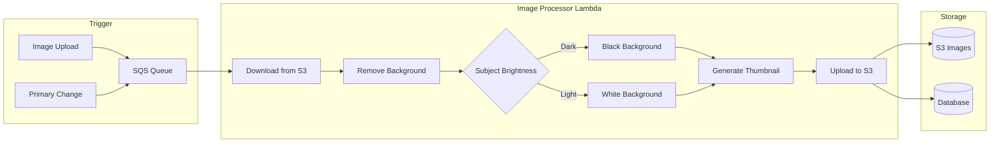
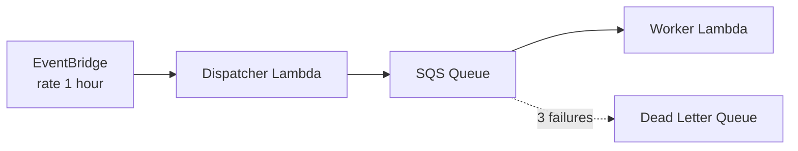

# Documentation Release v2026.01.XX Implementation Plan

> **For Claude:** REQUIRED SUB-SKILL: Use superpowers:executing-plans to implement this plan task-by-task.

**Goal:** Document all new features since v2026.01.07 for comprehensive release notes

**Architecture:** Update three documentation areas: FEATURES.md (user-facing), INFRASTRUCTURE.md (technical), and site/ (marketing)

**Tech Stack:** Markdown, HTML (marketing site)

---

## Task 1: Update FEATURES.md - Collection Spotlight

**Files:**
- Modify: `docs/FEATURES.md` (add new section after line 55)

**Step 1: Add Collection Spotlight section**

Add after "## What's New in 1.2" section (after line 55):

```markdown
### Collection Spotlight

- **Top Books Carousel** - Dashboard showcases 3 rotating high-value books
- **Smart Selection** - Fetches top 20% by value, shuffles for variety
- **Owned Books Only** - Displays ON_HAND and IN_TRANSIT items (not EVALUATING)
- **Premium Binding Badges** - Highlights authenticated binders and premium materials
- **Dual Caching** - Redis backend + localStorage frontend for performance
- **Click to View** - Each spotlight card links to detailed book view
```

**Step 2: Validate markdown**

Run: `npx markdownlint-cli2 "docs/FEATURES.md"`
Expected: No errors

**Step 3: Commit**

```bash
git add docs/FEATURES.md
git commit -m "docs: Add Collection Spotlight feature documentation"
```

---

## Task 2: Update FEATURES.md - Era Filter

**Files:**
- Modify: `docs/FEATURES.md` (add after Collection Spotlight)

**Step 1: Add Era Filter section**

```markdown
### Era Filter

- **Period Classification** - Books categorized by British literary/historical eras
- **Filter Options**:
  - Pre-Romantic (before 1800)
  - Romantic (1800-1836)
  - Victorian (1837-1901)
  - Edwardian (1902-1910)
  - Post-1910
  - Unknown (no date data)
- **Auto-Computed** - Era derived from publication year_start/year_end
- **URL State** - Filter bookmarkable via `?era=Victorian` query parameter
- **Chart Integration** - Era distribution chart links to filtered views
```

**Step 2: Validate and commit**

Run: `npx markdownlint-cli2 "docs/FEATURES.md"`

```bash
git add docs/FEATURES.md
git commit -m "docs: Add Era Filter feature documentation"
```

---

## Task 3: Update FEATURES.md - Condition Grade

**Files:**
- Modify: `docs/FEATURES.md` (add after Era Filter)

**Step 1: Add Condition Grade section**

```markdown
### Condition Grade Dropdown

- **AB Bookman Scale** - Industry-standard antiquarian grading system
- **Structured Input** - Dropdown replaces free-form text entry
- **Grade Levels**:

| Grade | Description |
|-------|-------------|
| Fine | Nearly as new, no defects |
| Near Fine | Approaching fine, very minor defects |
| Very Good | Worn but untorn, minimum for collectors |
| Good | Average used, regular wear |
| Fair | Wear and tear, but complete |
| Poor | Heavily damaged, reading copy only |

- **Legacy Support** - Existing free-form values preserved in display
- **Filter Support** - `?condition_grade=VERY_GOOD` and `?condition_grade__isnull=true`
```

**Step 2: Validate and commit**

Run: `npx markdownlint-cli2 "docs/FEATURES.md"`

```bash
git add docs/FEATURES.md
git commit -m "docs: Add Condition Grade feature documentation"
```

---

## Task 4: Update FEATURES.md - Auto-Process Images

**Files:**
- Modify: `docs/FEATURES.md` (add after Garbage Image Detection section ~line 459)

**Step 1: Add Auto-Process Images section**

```markdown
### Auto-Process Book Images

Automatic background removal and enhancement for book photographs:

- **Background Removal** - AI-powered removal using rembg (u2net model)
- **Smart Background Selection** - White or black background based on subject brightness
- **Thumbnail Generation** - 300x300px thumbnails for fast loading
- **Source Priority** - Processes title_page → binding → cover → spine
- **Carousel Management** - Processed image becomes primary, originals preserved



**Processing Configuration:**

| Parameter | Value |
|-----------|-------|
| Max Dimensions | 4096x4096 |
| Thumbnail Size | 300x300 |
| Brightness Threshold | 128 |
| Retry Attempts | 3 |
| Fallback Model | isnet-general-use |
```

**Step 2: Validate and commit**

Run: `npx markdownlint-cli2 "docs/FEATURES.md"`

```bash
git add docs/FEATURES.md
git commit -m "docs: Add Auto-Process Images feature documentation"
```

---

## Task 5: Update FEATURES.md - Real-time Exchange Rates

**Files:**
- Modify: `docs/FEATURES.md` (update Administrative Tools section ~line 321)

**Step 1: Enhance Currency Configuration section**

Replace the existing brief "Currency Configuration" section with:

```markdown
### Real-time Exchange Rates

- **Live Rates** - Fetches current GBP/EUR to USD from frankfurter.app
- **Resilient Fallback Chain**:
  1. Live API (3 retries with exponential backoff)
  2. Database-cached rates
  3. Hardcoded defaults (GBP: 1.35, EUR: 1.17)
- **Circuit Breaker** - Skips live fetch after 3 failures (1-minute cooldown)
- **15-Minute Cache** - Reduces API calls while staying current
- **Admin Override** - Manual rate updates via Admin Dashboard
- **Acquisition Forms** - Currency selector (USD/GBP/EUR) auto-converts on submit
```

**Step 2: Validate and commit**

Run: `npx markdownlint-cli2 "docs/FEATURES.md"`

```bash
git add docs/FEATURES.md
git commit -m "docs: Enhance Real-time Exchange Rates documentation"
```

---

## Task 6: Update FEATURES.md - Entity Validation

**Files:**
- Modify: `docs/FEATURES.md` (add after Entity Management section ~line 439)

**Step 1: Add Entity Validation section**

```markdown
### Entity Validation

Real-time duplicate prevention for reference data:

- **Fuzzy Matching** - Detects similar names (80% threshold)
- **Suggestions** - Shows existing entities when duplicates detected
- **Force Override** - `?force=true` bypasses validation when needed
- **Two-Phase Safety** - Validates upfront, re-checks before commit (TOCTOU protection)

**Validation Response (409 Conflict):**

```json
{
  "error": "similar_entity_exists",
  "entity_type": "publisher",
  "input": "Chapman and Hall",
  "suggestions": [
    {"id": 174, "name": "Chapman & Hall", "match": 0.92, "book_count": 15}
  ],
  "resolution": "Use existing entity or add ?force=true"
}
```
```

**Step 2: Validate and commit**

Run: `npx markdownlint-cli2 "docs/FEATURES.md"`

```bash
git add docs/FEATURES.md
git commit -m "docs: Add Entity Validation feature documentation"
```

---

## Task 7: Update FEATURES.md - CSV Export Improvements

**Files:**
- Modify: `docs/FEATURES.md` (add new section in Administrative Tools area)

**Step 1: Add CSV Export section**

```markdown
### CSV/JSON Export

- **Authenticated Export** - Requires viewer role or higher
- **CSV Format** - 16 columns matching PRIMARY_COLLECTION.csv structure
- **JSON Format** - 30+ fields with full metadata
- **Inventory Filter** - `?inventory_type=PRIMARY` (default) or other types
- **Streaming Response** - Efficient delivery for large collections
- **Composite Notes** - Combines binder, binding type, and condition in Notes column
```

**Step 2: Validate and commit**

Run: `npx markdownlint-cli2 "docs/FEATURES.md"`

```bash
git add docs/FEATURES.md
git commit -m "docs: Add CSV Export improvements documentation"
```

---

## Task 8: Update INFRASTRUCTURE.md - Lambda Layers

**Files:**
- Modify: `docs/INFRASTRUCTURE.md` (add after line 94 in modules list)

**Step 1: Add Lambda Layers documentation**

Add new section after the modules list:

```markdown
## Lambda Layers

Shared Python dependencies deployed as a Lambda Layer:

```text
infra/terraform/modules/lambda-layer/
├── main.tf          # Layer version resource
├── variables.tf     # Configuration inputs
└── outputs.tf       # Layer ARN output
```

**Configuration:**

| Parameter | Value |
|-----------|-------|
| Layer Name | `bluemoxon-{env}-deps` |
| Runtime | Python 3.12 |
| Source | `s3://{artifacts-bucket}/lambda/layer.zip` |

**Benefits:**

- **Shared Dependencies** - Single layer used by API, cleanup, and worker Lambdas
- **Faster Deploys** - Code packages smaller without bundled dependencies
- **Version Immutability** - Layer versions never redeployed (CI/CD publishes new versions)
- **Cold Start Optimization** - Dependencies pre-loaded in execution environment
```

**Step 2: Validate and commit**

Run: `npx markdownlint-cli2 "docs/INFRASTRUCTURE.md"`

```bash
git add docs/INFRASTRUCTURE.md
git commit -m "docs: Add Lambda Layers infrastructure documentation"
```

---

## Task 9: Update INFRASTRUCTURE.md - Cleanup Lambda

**Files:**
- Modify: `docs/INFRASTRUCTURE.md` (add after Lambda Layers section)

**Step 1: Add Cleanup Lambda documentation**

```markdown
## Cleanup Lambda

Automated maintenance for stale data and orphaned resources:

```text
infra/terraform/modules/cleanup-lambda/
├── main.tf          # Lambda + IAM + EventBridge
├── variables.tf     # Schedule configuration
└── outputs.tf       # Function ARN
```

**Cleanup Tasks:**

| Task | Description |
|------|-------------|
| Archive Stale Evaluating | Books in EVALUATING >30 days → archived |
| Check Source URLs | Verify eBay listings still active (25/batch) |
| Find Orphan Images | Detect S3 images without database records |
| Delete Orphans | Remove orphaned images (with job tracking) |
| Retry Archives | Retry failed archive.org submissions (max 3) |

**Configuration:**

- **Schedule**: Optional EventBridge rule (e.g., `rate(1 day)`)
- **Memory**: 256 MB
- **Timeout**: 300 seconds
- **Trigger**: Scheduled or on-demand via Admin API
```

**Step 2: Validate and commit**

Run: `npx markdownlint-cli2 "docs/INFRASTRUCTURE.md"`

```bash
git add docs/INFRASTRUCTURE.md
git commit -m "docs: Add Cleanup Lambda infrastructure documentation"
```

---

## Task 10: Update INFRASTRUCTURE.md - Tracking Worker

**Files:**
- Modify: `docs/INFRASTRUCTURE.md` (add after Cleanup Lambda section)

**Step 1: Add Tracking Worker documentation**

```markdown
## Tracking Worker

Asynchronous package tracking with circuit breaker pattern:

```text
infra/terraform/modules/tracking-worker/
├── main.tf          # Dispatcher + Worker + SQS
├── variables.tf     # Concurrency limits
└── outputs.tf       # Queue URLs
```

**Architecture:**



**Circuit Breaker (SQS-based):**

| Parameter | Value |
|-----------|-------|
| Max Retries | 3 attempts |
| Visibility Timeout | 120 seconds |
| DLQ Retention | 14 days |
| Reserved Concurrency | 10 workers |

**Benefits:**

- **Automatic Retry** - Failed tracking checks retry up to 3 times
- **Backpressure** - SQS absorbs spikes, workers process at controlled rate
- **Failure Isolation** - Bad tracking numbers move to DLQ, don't block others
- **Observability** - CloudWatch alarms on DLQ depth
```

**Step 2: Validate and commit**

Run: `npx markdownlint-cli2 "docs/INFRASTRUCTURE.md"`

```bash
git add docs/INFRASTRUCTURE.md
git commit -m "docs: Add Tracking Worker infrastructure documentation"
```

---

## Task 11: Update INFRASTRUCTURE.md - Artifacts Bucket

**Files:**
- Modify: `docs/INFRASTRUCTURE.md` (add after Tracking Worker section)

**Step 1: Add Artifacts Bucket documentation**

```markdown
## Artifacts Bucket

Central repository for Lambda deployment packages:

**Bucket Name:** `{app_name}-artifacts-{environment}`

**Structure:**

```text
s3://bluemoxon-artifacts-staging/
├── lambda/
│   ├── layer.zip        # Shared dependencies layer
│   ├── api.zip          # API Lambda code
│   ├── cleanup.zip      # Cleanup Lambda code
│   └── ...              # Other Lambda packages
```

**Features:**

- **Versioning Enabled** - Supports rollback to previous deployments
- **Private Access** - No public access, IAM-only
- **CI/CD Integration** - GitHub Actions uploads artifacts on deploy
- **Cross-Lambda Sharing** - Single source for all Lambda packages

**IAM Access:**

| Principal | Permissions |
|-----------|-------------|
| GitHub Actions (OIDC) | s3:PutObject, s3:DeleteObject |
| Lambda Functions | s3:GetObject |
| Terraform | Full bucket management |
```

**Step 2: Validate and commit**

Run: `npx markdownlint-cli2 "docs/INFRASTRUCTURE.md"`

```bash
git add docs/INFRASTRUCTURE.md
git commit -m "docs: Add Artifacts Bucket infrastructure documentation"
```

---

## Task 12: Update INFRASTRUCTURE.md - Image Processor

**Files:**
- Modify: `docs/INFRASTRUCTURE.md` (add after Artifacts Bucket section)

**Step 1: Add Image Processor Lambda documentation**

```markdown
## Image Processor Lambda

Container-based Lambda for AI-powered image processing:

```text
infra/terraform/modules/image-processor/
├── main.tf          # Lambda + SQS + IAM
├── variables.tf     # Memory, timeout config
└── outputs.tf       # Queue URL, function ARN
```

**Configuration:**

| Parameter | Value | Reason |
|-----------|-------|--------|
| Architecture | x86_64 | ARM64 has ONNX Runtime issues |
| Memory | 7168 MB | rembg model requires ~6GB |
| Timeout | 300 seconds | Large image processing |
| Reserved Concurrency | 2 | Cost control |
| Batch Size | 1 | One image per invocation |

**Container Image:**

- **Base**: AWS Lambda Python 3.12 (x86_64)
- **Pre-loaded Models**: u2net, isnet-general-use
- **Environment**: `U2NET_HOME=/opt/u2net`, `NUMBA_CACHE_DIR=/tmp`

**SQS Configuration:**

| Parameter | Value |
|-----------|-------|
| Visibility Timeout | 600 seconds |
| Message Retention | 4 days |
| DLQ Max Receives | 3 |
```

**Step 2: Validate and commit**

Run: `npx markdownlint-cli2 "docs/INFRASTRUCTURE.md"`

```bash
git add docs/INFRASTRUCTURE.md
git commit -m "docs: Add Image Processor Lambda infrastructure documentation"
```

---

## Task 13: Update Marketing Site - Features Page

**Files:**
- Modify: `site/features.html`

**Step 1: Read current features.html structure**

Run: Read `site/features.html` to understand structure

**Step 2: Add new feature sections**

Add these feature highlights (match existing HTML structure):

1. **Collection Spotlight** - "Showcase your finest acquisitions with rotating highlights"
2. **AI Image Processing** - "Automatic background removal and enhancement"
3. **Victorian Dark Mode** - "Elegant dark theme inspired by Victorian aesthetics"
4. **Interactive Analytics** - "Click any chart to filter your collection"

**Step 3: Validate HTML**

Run: `./site/test-site-content.sh` (if available)

**Step 4: Commit**

```bash
git add site/features.html
git commit -m "docs: Update marketing site features page"
```

---

## Task 14: Update Session Log

**Files:**
- Modify: `docs/sessions/session-2026-01-18-docs-release-1138.md`

**Step 1: Update progress tracking**

Mark all completed tasks and add summary of changes made.

**Step 2: Commit**

```bash
git add docs/sessions/session-2026-01-18-docs-release-1138.md
git commit -m "docs: Update session log with completion status"
```

---

## Task 15: Final Validation

**Step 1: Run full markdown lint**

Run: `npx markdownlint-cli2 "docs/**/*.md"`
Expected: No errors

**Step 2: Verify all changes**

Run: `git diff --stat HEAD~14` (or appropriate commit count)

**Step 3: Create PR for staging**

```bash
git push origin HEAD
gh pr create --base staging --title "docs: Document features for v2026.01.XX release" --body "Closes #1138

## Summary
- Added 7 new feature sections to FEATURES.md
- Added 5 infrastructure sections to INFRASTRUCTURE.md
- Updated marketing site features page

## Documentation Added
- Collection Spotlight
- Era Filter
- Condition Grade Dropdown
- Auto-Process Book Images
- Real-time Exchange Rates
- Entity Validation
- CSV Export Improvements
- Lambda Layers
- Cleanup Lambda
- Tracking Worker
- Artifacts Bucket
- Image Processor Lambda"
```

---

## Execution Notes

- Tasks 1-7 can be parallelized (all modify different sections of FEATURES.md)
- Tasks 8-12 can be parallelized (all modify different sections of INFRASTRUCTURE.md)
- Task 13 (marketing site) is independent
- Tasks 14-15 must run after all others complete
