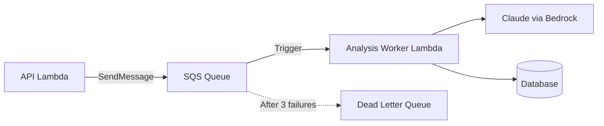

# Analysis Worker Module

Async SQS+Lambda worker for Bedrock analysis generation. Bypasses API Gateway's 29s timeout for long-running AI analysis jobs.

## Architecture



## Resources Created

| Resource | Purpose |
|----------|---------|
| `aws_sqs_queue.jobs` | Main job queue (4-day retention) |
| `aws_sqs_queue.dlq` | Dead letter queue (14-day retention) |
| `aws_lambda_function.worker` | Analysis worker function |
| `aws_iam_role.worker_exec` | Lambda execution role |
| `aws_cloudwatch_log_group.worker` | CloudWatch logs |

## Usage

```hcl
module "analysis_worker" {
  source = "./modules/analysis-worker"

  name_prefix   = "bluemoxon-staging"
  environment   = "staging"
  runtime       = "python3.12"
  handler       = "app.worker.handler"
  timeout       = 600  # 10 minutes
  memory_size   = 1024

  subnet_ids         = module.vpc.private_subnet_ids
  security_group_ids = [module.vpc.lambda_security_group_id]

  secrets_arns     = [module.secrets.database_secret_arn]
  s3_bucket_arns   = [module.s3.images_bucket_arn]
  bedrock_model_ids = local.bedrock_model_ids  # defined in locals.tf

  api_lambda_role_name = module.lambda.execution_role_name
}
```

## Key Variables

| Variable | Description | Default |
|----------|-------------|---------|
| `timeout` | Lambda timeout in seconds | 600 |
| `memory_size` | Lambda memory in MB | 1024 |
| `visibility_timeout` | SQS visibility timeout | 720 (12 min) |
| `max_receive_count` | Retries before DLQ | 3 |
| `reserved_concurrency` | Max concurrent executions | -1 (unlimited) |

## Outputs

| Output | Description |
|--------|-------------|
| `queue_url` | SQS queue URL for API to send jobs |
| `queue_arn` | SQS queue ARN |
| `dlq_url` | Dead letter queue URL |
| `function_arn` | Worker Lambda ARN |
| `execution_role_arn` | IAM role ARN |

## Job Flow

1. API receives `POST /books/{id}/analysis/generate`
2. API creates `AnalysisJob` record (status=pending)
3. API sends message to SQS queue
4. API returns 202 Accepted immediately
5. Worker Lambda triggered by SQS
6. Worker invokes Bedrock with Napoleon prompt
7. Worker saves analysis and updates job status
8. On failure, message goes to DLQ after 3 retries
