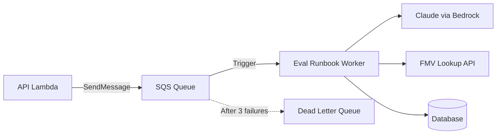

# Eval Runbook Worker Module

Async SQS+Lambda worker for eval runbook generation. Combines AI analysis with FMV price lookups, bypassing API Gateway's 29s timeout.

## Architecture



## Resources Created

| Resource | Purpose |
|----------|---------|
| `aws_sqs_queue.jobs` | Main job queue (4-day retention) |
| `aws_sqs_queue.dlq` | Dead letter queue (14-day retention) |
| `aws_lambda_function.worker` | Eval runbook worker function |
| `aws_iam_role.worker_exec` | Lambda execution role |
| `aws_cloudwatch_log_group.worker` | CloudWatch logs |

## Usage

```hcl
module "eval_runbook_worker" {
  source = "./modules/eval-runbook-worker"

  name_prefix   = "bluemoxon-staging"
  environment   = "staging"
  runtime       = "python3.12"
  handler       = "app.eval_worker.handler"
  timeout       = 600
  memory_size   = 1024

  subnet_ids         = module.vpc.private_subnet_ids
  security_group_ids = [module.vpc.lambda_security_group_id]

  secrets_arns     = [module.secrets.database_secret_arn]
  s3_bucket_arns   = [module.s3.images_bucket_arn]
  bedrock_model_ids = ["anthropic.claude-3-5-sonnet-20241022-v2:0"]

  api_lambda_role_name = module.lambda.execution_role_name
}
```

## Difference from Analysis Worker

| Aspect | Analysis Worker | Eval Runbook Worker |
|--------|----------------|---------------------|
| Purpose | Full Napoleon analysis | Pre-purchase evaluation |
| Output | Detailed markdown analysis | Eval runbook + FMV |
| Includes | Condition, market, insurance | Price recommendation |
| Trigger | On-demand or auto ($450+) | Acquisition consideration |

## Key Variables

Same as `analysis-worker` module. See that README for details.

## Outputs

| Output | Description |
|--------|-------------|
| `queue_url` | SQS queue URL for API to send jobs |
| `queue_arn` | SQS queue ARN |
| `dlq_url` | Dead letter queue URL |
| `function_arn` | Worker Lambda ARN |
| `execution_role_arn` | IAM role ARN |
