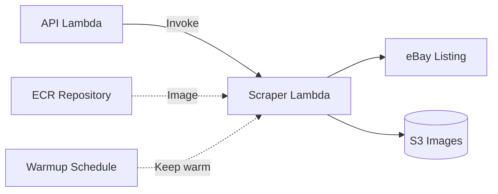

# Scraper Lambda Module

Container-based Lambda function for Playwright web scraping. Uses Docker/ECR instead of zip packages to support browser automation.

## Architecture



## Resources Created

| Resource | Purpose |
|----------|---------|
| `aws_ecr_repository.scraper` | Docker image repository |
| `aws_ecr_lifecycle_policy.scraper` | Keeps last 5 images |
| `aws_lambda_function.scraper` | Container-based Lambda |
| `aws_iam_role.scraper_exec` | Lambda execution role |
| `aws_cloudwatch_log_group.scraper` | CloudWatch logs |
| `aws_cloudwatch_event_rule.warmup` | Warmup schedule (optional) |

## Usage

```hcl
module "scraper_lambda" {
  source = "./modules/scraper-lambda"

  name_prefix   = "bluemoxon-staging"
  environment   = "staging"
  timeout       = 120
  memory_size   = 2048
  image_tag     = "latest"

  images_bucket_name = module.s3.images_bucket_name
  images_bucket_arn  = module.s3.images_bucket_arn

  enable_api_invoke_permission = true
  api_lambda_role_name         = module.lambda.execution_role_name
  api_lambda_role_arn          = module.lambda.execution_role_arn

  enable_warmup_rule = true
  warmup_schedule    = "rate(5 minutes)"
}
```

## Container Build

The scraper uses a custom Docker image with Playwright:

```dockerfile
FROM mcr.microsoft.com/playwright/python:v1.40.0-jammy

WORKDIR /app
COPY . .
RUN pip install -r requirements.txt
RUN playwright install chromium

CMD ["app.handler.handler"]
```

**CI/CD deploys container image to ECR** - Terraform manages infrastructure only.

## Key Variables

| Variable | Description | Default |
|----------|-------------|---------|
| `timeout` | Lambda timeout in seconds | 120 |
| `memory_size` | Lambda memory in MB | 2048 |
| `image_tag` | ECR image tag | latest |
| `enable_warmup_rule` | Keep container warm | false |
| `warmup_schedule` | EventBridge rate | rate(5 minutes) |
| `provisioned_concurrency` | Warm instances | 0 |

## Outputs

| Output | Description |
|--------|-------------|
| `function_arn` | Scraper Lambda ARN |
| `function_name` | Scraper Lambda name |
| `ecr_repository_url` | ECR repo URL for CI/CD |
| `execution_role_arn` | IAM role ARN |

## Warmup Strategy

Cold starts for container Lambdas can be 10-15 seconds. Options:

1. **EventBridge warmup** (default) - Periodic invocation with `{"warmup": true}`
2. **Provisioned concurrency** - Guaranteed warm instances (more expensive)

The scraper handler checks for warmup payloads and returns early.

## Rate Limiting

eBay may rate-limit or block scraping. The scraper:

- Adds random delays between requests
- Uses browser fingerprint rotation
- Returns graceful errors for rate limits
- Logs blocking patterns for monitoring
